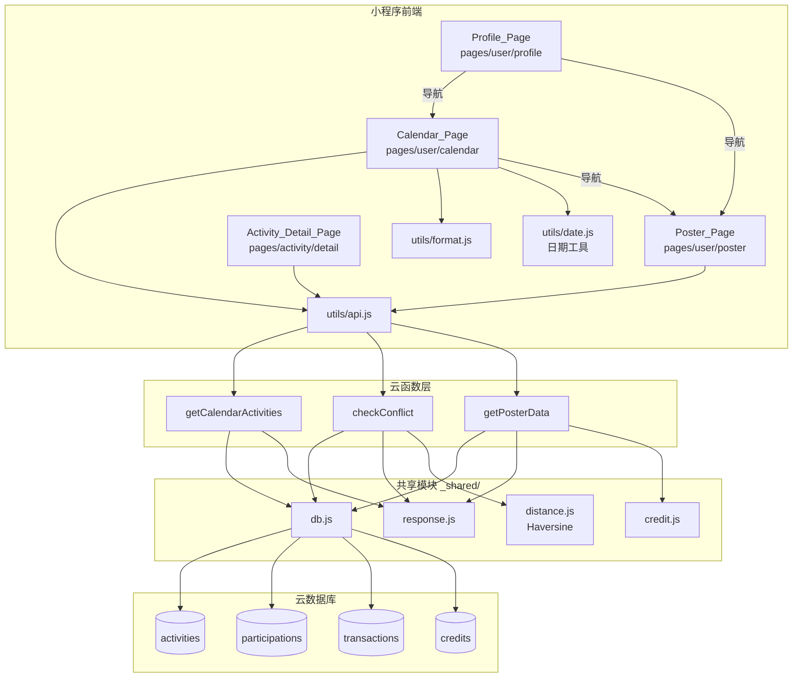
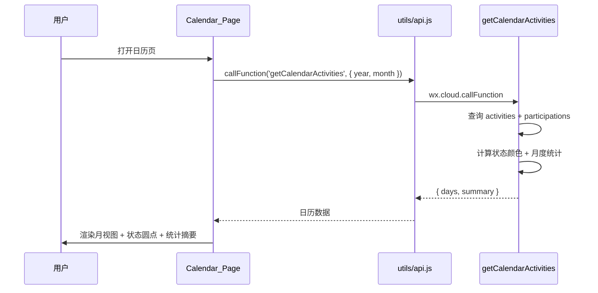
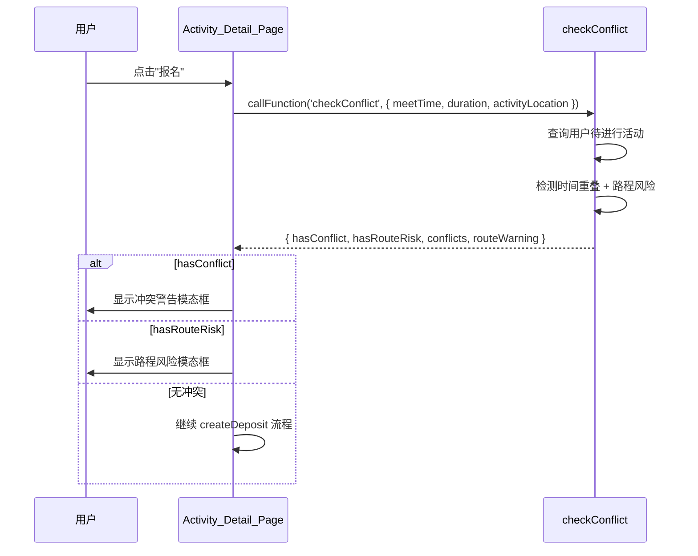

# 设计文档 - 活动日历与信用海报

## 概述

本设计文档描述"不鸽令"微信小程序中活动日历（契约日程）和信用海报（守约月报）两大功能模块的技术实现方案。

本 Spec 涵盖：
1. **getCalendarActivities 云函数**：查询用户月度活动数据，按日期分组并计算状态颜色和月度统计
2. **checkConflict 云函数**：检测活动时间冲突和路程风险
3. **getPosterData 云函数**：计算海报所需的统计数据（日历点、击败百分比、文案）
4. **Calendar_Page（pages/user/calendar/calendar）**：月视图日历页面
5. **Poster_Page（pages/user/poster/poster）**：Canvas 海报生成与分享页面
6. **活动详情页冲突检测集成**：报名前调用 checkConflict
7. **个人中心导航更新**：新增日历和海报入口

技术栈：微信云函数（Node.js）+ wx-server-sdk + 云数据库 + 微信小程序（WXML/WXSS/JS）+ Canvas 2D API。

依赖关系：
- Spec 1（project-scaffold）：`utils/api.js`、`utils/location.js`、全局样式 CSS 变量
- Spec 2（activity-crud）：活动数据模型、`_shared/db.js`、`_shared/response.js`、`getActivityDetail`
- Spec 3（activity-pages）：`utils/format.js`（formatDeposit、formatMeetTime）、`utils/status.js`、活动详情页
- Spec 6（credit-system）：`_shared/credit.js`（getCredit）、`getCreditInfo`、`getMyActivities`

## 架构



### 日历数据流



### 冲突检测数据流



### 关键设计决策

1. **_shared/distance.js 共享 Haversine**：checkConflict 和 autoArbitrate（Spec 7）都需要距离计算，将 Haversine 公式提取到 `_shared/distance.js` 共享模块。
2. **日历状态颜色映射为纯函数**：`mapCalendarStatus` 作为可独立测试的纯函数，接收活动状态和参与状态，返回颜色标识。
3. **getPosterData 复用日历查询逻辑**：海报数据的日历点和统计数据与 getCalendarActivities 逻辑重叠，提取共享的查询和聚合函数到 `_shared/calendar.js`。
4. **Canvas 2D API**：使用新版 Canvas 2D API（`type="2d"`）替代旧版 `wx.createCanvasContext`，性能更好且支持更多特性。
5. **日期工具模块**：新建 `utils/date.js` 提供 `getMonthDays`、`isToday`、`isSameMonth`、`formatDateKey` 等日历专用日期函数。
6. **冲突检测时机**：在 createDeposit 调用之前执行，避免用户已支付后才发现冲突。冲突仅为警告，用户确认后仍可继续。

## 组件与接口

### _shared/distance.js 共享模块

```javascript
/**
 * Haversine 公式计算两点间球面距离
 * @param {number} lat1 - 纬度1（度）
 * @param {number} lon1 - 经度1（度）
 * @param {number} lat2 - 纬度2（度）
 * @param {number} lon2 - 经度2（度）
 * @returns {number} 距离（米）
 */
function haversineDistance(lat1, lon1, lat2, lon2) {
  const R = 6371000
  const dLat = (lat2 - lat1) * Math.PI / 180
  const dLon = (lon2 - lon1) * Math.PI / 180
  const a = Math.sin(dLat / 2) ** 2 +
    Math.cos(lat1 * Math.PI / 180) * Math.cos(lat2 * Math.PI / 180) *
    Math.sin(dLon / 2) ** 2
  const c = 2 * Math.atan2(Math.sqrt(a), Math.sqrt(1 - a))
  return R * c
}

module.exports = { haversineDistance }
```

### _shared/calendar.js 共享模块

```javascript
const { getDb, COLLECTIONS } = require('./db')

/**
 * 日历状态颜色映射（纯函数）
 * @param {string} activityStatus - 活动状态
 * @param {string} participationStatus - 参与状态
 * @param {Date|string} meetTime - 见面时间
 * @param {string} role - 用户角色 'initiator' | 'participant'
 * @returns {string} 日历状态：'verified' | 'upcoming' | 'breached' | 'cancelled'
 */
function mapCalendarStatus(activityStatus, participationStatus, meetTime, role) {
  // 绿色：参与状态为 verified 或 refunded
  if (participationStatus === 'verified' || participationStatus === 'refunded') {
    return 'verified'
  }
  // 红色：参与状态为 breached 或 settled
  if (participationStatus === 'breached' || participationStatus === 'settled') {
    return 'breached'
  }
  // 灰色：活动状态为 expired 或 cancelled
  if (activityStatus === 'expired' || activityStatus === 'cancelled') {
    return 'cancelled'
  }
  // 黄色：活动状态为 confirmed 且参与状态为 approved/paid 且 meetTime 在未来
  if (activityStatus === 'confirmed' &&
      (participationStatus === 'approved' || participationStatus === 'paid') &&
      new Date(meetTime) > new Date()) {
    return 'upcoming'
  }
  // 发起人视角：活动 confirmed 且 meetTime 在未来
  if (role === 'initiator' && activityStatus === 'confirmed' && new Date(meetTime) > new Date()) {
    return 'upcoming'
  }
  // 发起人视角：活动 verified
  if (role === 'initiator' && activityStatus === 'verified') {
    return 'verified'
  }
  // 发起人视角：活动 settled
  if (role === 'initiator' && activityStatus === 'settled') {
    return 'breached'
  }
  // 默认灰色
  return 'cancelled'
}

/**
 * 日历状态到颜色的映射
 */
const CALENDAR_COLORS = {
  verified: '#10B981',
  upcoming: '#F59E0B',
  breached: '#EF4444',
  cancelled: '#9CA3AF'
}

/**
 * 查询用户某月的所有活动（发起人 + 参与者）
 * @param {object} db - 数据库实例
 * @param {string} openId - 用户 openId
 * @param {number} year - 年份
 * @param {number} month - 月份 (1-12)
 * @returns {Promise<Array>} 活动列表（含角色和参与状态）
 */
async function queryMonthActivities(db, openId, year, month) {
  const startDate = new Date(year, month - 1, 1)
  const endDate = new Date(year, month, 1)

  // 查询发起人活动
  const initiatorResult = await db.collection(COLLECTIONS.ACTIVITIES)
    .where({
      initiatorId: openId,
      meetTime: db.command.gte(startDate).and(db.command.lt(endDate))
    })
    .get()

  // 查询参与者活动
  const participations = await db.collection(COLLECTIONS.PARTICIPATIONS)
    .where({
      participantId: openId,
      createdAt: db.command.gte(startDate).and(db.command.lt(endDate))
    })
    .get()

  let participantActivities = []
  if (participations.data.length > 0) {
    const activityIds = participations.data.map(p => p.activityId)
    const activitiesResult = await db.collection(COLLECTIONS.ACTIVITIES)
      .where({ _id: db.command.in(activityIds) })
      .get()

    const activityMap = {}
    activitiesResult.data.forEach(a => { activityMap[a._id] = a })

    participantActivities = participations.data
      .filter(p => activityMap[p.activityId])
      .map(p => ({
        ...activityMap[p.activityId],
        participationStatus: p.status,
        role: 'participant'
      }))
  }

  const initiatorActivities = initiatorResult.data.map(a => ({
    ...a,
    participationStatus: a.status,
    role: 'initiator'
  }))

  return [...initiatorActivities, ...participantActivities]
}

module.exports = { mapCalendarStatus, CALENDAR_COLORS, queryMonthActivities }
```

### getCalendarActivities 云函数

```javascript
// cloudfunctions/getCalendarActivities/index.js
const cloud = require('wx-server-sdk')
cloud.init({ env: cloud.DYNAMIC_CURRENT_ENV })

const { getDb, COLLECTIONS } = require('../_shared/db')
const { successResponse, errorResponse } = require('../_shared/response')
const { mapCalendarStatus, queryMonthActivities } = require('../_shared/calendar')

exports.main = async (event, context) => {
  const { OPENID } = cloud.getWXContext()
  const { year, month } = event
  const db = getDb()

  // 1. 参数校验
  if (!year || !month || month < 1 || month > 12) {
    return errorResponse(1001, '参数校验失败：year 和 month 必填且 month 范围 1-12')
  }

  try {
    // 2. 查询月度活动
    const activities = await queryMonthActivities(db, OPENID, year, month)

    // 3. 按日期分组 + 计算状态
    const days = {}
    let totalActivities = 0
    let verifiedCount = 0
    let breachedCount = 0
    let plannedExpense = 0

    activities.forEach(activity => {
      const dateKey = formatDateKey(activity.meetTime)
      const calendarStatus = mapCalendarStatus(
        activity.status, activity.participationStatus, activity.meetTime, activity.role
      )

      if (!days[dateKey]) days[dateKey] = []
      days[dateKey].push({
        activityId: activity._id,
        title: activity.title,
        meetTime: activity.meetTime,
        location: activity.location,
        status: calendarStatus,
        role: activity.role,
        depositTier: activity.depositTier
      })

      totalActivities++
      if (calendarStatus === 'verified') verifiedCount++
      if (calendarStatus === 'breached') breachedCount++
      if (calendarStatus === 'upcoming') plannedExpense += activity.depositTier || 0
    })

    // 4. 计算守约率
    const completed = verifiedCount + breachedCount
    const complianceRate = completed > 0 ? Math.round(verifiedCount / completed * 100) : 0

    // 5. 查询本月补偿金额
    const startDate = new Date(year, month - 1, 1)
    const endDate = new Date(year, month, 1)
    const compensationResult = await db.collection(COLLECTIONS.TRANSACTIONS)
      .where({
        type: 'split_initiator',
        status: 'success',
        createdAt: db.command.gte(startDate).and(db.command.lt(endDate))
      })
      .get()

    // 过滤出属于当前用户的补偿（需关联活动查发起人）
    let totalCompensation = 0
    compensationResult.data.forEach(txn => {
      totalCompensation += txn.amount || 0
    })

    return successResponse({
      days,
      summary: {
        totalActivities,
        verifiedCount,
        breachedCount,
        complianceRate,
        totalCompensation,
        plannedExpense
      }
    })
  } catch (err) {
    return errorResponse(5001, err.message)
  }
}

function formatDateKey(dateValue) {
  const d = new Date(dateValue)
  const y = d.getFullYear()
  const m = String(d.getMonth() + 1).padStart(2, '0')
  const day = String(d.getDate()).padStart(2, '0')
  return `${y}-${m}-${day}`
}
```

### checkConflict 云函数

```javascript
// cloudfunctions/checkConflict/index.js
const cloud = require('wx-server-sdk')
cloud.init({ env: cloud.DYNAMIC_CURRENT_ENV })

const { getDb, COLLECTIONS } = require('../_shared/db')
const { successResponse, errorResponse } = require('../_shared/response')
const { haversineDistance } = require('../_shared/distance')

/**
 * 检测两个时间段是否重叠（纯函数）
 * @param {number} start1 - 时间段1开始（毫秒时间戳）
 * @param {number} end1 - 时间段1结束
 * @param {number} start2 - 时间段2开始
 * @param {number} end2 - 时间段2结束
 * @returns {boolean}
 */
function hasTimeOverlap(start1, end1, start2, end2) {
  return start1 < end2 && start2 < end1
}

/**
 * 计算两个时间段之间的间隔（分钟）（纯函数）
 * 若重叠返回 0
 * @param {number} start1 - 时间段1开始
 * @param {number} end1 - 时间段1结束
 * @param {number} start2 - 时间段2开始
 * @param {number} end2 - 时间段2结束
 * @returns {number} 间隔分钟数
 */
function getGapMinutes(start1, end1, start2, end2) {
  if (hasTimeOverlap(start1, end1, start2, end2)) return 0
  const gap = Math.min(Math.abs(start2 - end1), Math.abs(start1 - end2))
  return gap / (60 * 1000)
}

exports.main = async (event, context) => {
  const { OPENID } = cloud.getWXContext()
  const { meetTime, duration = 120, activityLocation } = event
  const db = getDb()

  if (!meetTime || !activityLocation) {
    return errorResponse(1001, '参数校验失败：meetTime 和 activityLocation 必填')
  }

  try {
    const newStart = new Date(meetTime).getTime()
    const newEnd = newStart + duration * 60 * 1000
    const now = new Date()

    // 查询用户待进行的活动（发起人）
    const initiatorActivities = await db.collection(COLLECTIONS.ACTIVITIES)
      .where({
        initiatorId: OPENID,
        status: db.command.in(['confirmed', 'pending']),
        meetTime: db.command.gt(now)
      })
      .get()

    // 查询用户待进行的活动（参与者）
    const participations = await db.collection(COLLECTIONS.PARTICIPATIONS)
      .where({
        participantId: OPENID,
        status: db.command.in(['paid', 'approved'])
      })
      .get()

    let participantActivities = []
    if (participations.data.length > 0) {
      const activityIds = participations.data.map(p => p.activityId)
      const result = await db.collection(COLLECTIONS.ACTIVITIES)
        .where({
          _id: db.command.in(activityIds),
          status: db.command.in(['confirmed', 'pending']),
          meetTime: db.command.gt(now)
        })
        .get()
      participantActivities = result.data
    }

    const allActivities = [...initiatorActivities.data, ...participantActivities]

    let hasConflict = false
    let hasRouteRisk = false
    const conflicts = []
    let routeWarning = null

    allActivities.forEach(existing => {
      const existStart = new Date(existing.meetTime).getTime()
      const existEnd = existStart + 120 * 60 * 1000

      if (hasTimeOverlap(newStart, newEnd, existStart, existEnd)) {
        hasConflict = true
        conflicts.push({
          activityId: existing._id,
          title: existing.title,
          meetTime: existing.meetTime
        })
      } else {
        const gap = getGapMinutes(newStart, newEnd, existStart, existEnd)
        if (gap < 60 && existing.location) {
          const dist = haversineDistance(
            activityLocation.latitude, activityLocation.longitude,
            existing.location.latitude, existing.location.longitude
          )
          if (dist > 5000) {
            hasRouteRisk = true
            routeWarning = `与"${existing.title}"相隔${(dist / 1000).toFixed(1)}km，仅间隔${Math.round(gap)}分钟`
          }
        }
      }
    })

    return successResponse({ hasConflict, hasRouteRisk, conflicts, routeWarning })
  } catch (err) {
    return errorResponse(5001, err.message)
  }
}

module.exports = { hasTimeOverlap, getGapMinutes }
```

### getPosterData 云函数

```javascript
// cloudfunctions/getPosterData/index.js
const cloud = require('wx-server-sdk')
cloud.init({ env: cloud.DYNAMIC_CURRENT_ENV })

const { getDb, COLLECTIONS } = require('../_shared/db')
const { successResponse, errorResponse } = require('../_shared/response')
const { getCredit } = require('../_shared/credit')
const { mapCalendarStatus, queryMonthActivities } = require('../_shared/calendar')

/**
 * 生成海报文案（纯函数）
 * @param {number} verifiedCount - 守约次数
 * @param {number} breachedCount - 违约次数
 * @param {number} month - 月份
 * @returns {string}
 */
function generateSlogan(verifiedCount, breachedCount, month) {
  const monthNames = ['一', '二', '三', '四', '五', '六', '七', '八', '九', '十', '十一', '十二']
  const monthName = monthNames[month - 1] || String(month)

  if (verifiedCount > 0 && breachedCount === 0) {
    return `${monthName}月份，我在线下守约 ${verifiedCount} 次，从未放鸽子。`
  }
  if (verifiedCount > 0 && breachedCount > 0) {
    return `${monthName}月份，我在线下守约 ${verifiedCount} 次，违约 ${breachedCount} 次。`
  }
  if (verifiedCount === 0 && breachedCount === 0) {
    return `${monthName}月份，期待我的第一次线下守约。`
  }
  return `${monthName}月份，我需要更加努力守约。`
}

exports.main = async (event, context) => {
  const { OPENID } = cloud.getWXContext()
  const { year, month } = event
  const db = getDb()

  if (!year || !month || month < 1 || month > 12) {
    return errorResponse(1001, '参数校验失败')
  }

  try {
    // 1. 查询月度活动
    const activities = await queryMonthActivities(db, OPENID, year, month)

    // 2. 计算日历点和统计
    const calendarDots = {}
    let verifiedCount = 0
    let breachedCount = 0

    activities.forEach(activity => {
      const d = new Date(activity.meetTime)
      const dayNum = String(d.getDate())
      const status = mapCalendarStatus(
        activity.status, activity.participationStatus, activity.meetTime, activity.role
      )

      // 优先级：verified > breached > upcoming > cancelled
      const priority = { verified: 3, breached: 2, upcoming: 1, cancelled: 0 }
      const colorMap = { verified: 'green', breached: 'red', upcoming: 'yellow', cancelled: 'grey' }

      if (!calendarDots[dayNum] || priority[status] > priority[calendarDots[dayNum]]) {
        calendarDots[dayNum] = colorMap[status]
      }

      if (status === 'verified') verifiedCount++
      if (status === 'breached') breachedCount++
    })

    // 3. 获取信用分
    const credit = await getCredit(OPENID)

    // 4. 计算击败百分比
    const totalUsers = await db.collection(COLLECTIONS.CREDITS).count()
    const lowerUsers = await db.collection(COLLECTIONS.CREDITS)
      .where({ score: db.command.lt(credit.score) })
      .count()
    const beatPercent = totalUsers.total > 0
      ? Math.round(lowerUsers.total / totalUsers.total * 100)
      : 0

    // 5. 生成文案
    const slogan = generateSlogan(verifiedCount, breachedCount, month)

    return successResponse({
      calendarDots,
      verifiedCount,
      breachedCount,
      creditScore: credit.score,
      beatPercent,
      slogan
    })
  } catch (err) {
    return errorResponse(5001, err.message)
  }
}

module.exports = { generateSlogan }
```

### utils/date.js 日期工具模块

```javascript
/**
 * 获取某月的天数
 * @param {number} year
 * @param {number} month - 1-12
 * @returns {number}
 */
function getMonthDays(year, month) {
  return new Date(year, month, 0).getDate()
}

/**
 * 获取某月第一天是星期几（0=周日, 1=周一, ..., 6=周六）
 * @param {number} year
 * @param {number} month - 1-12
 * @returns {number}
 */
function getFirstDayOfWeek(year, month) {
  return new Date(year, month - 1, 1).getDay()
}

/**
 * 判断是否为今天
 * @param {number} year
 * @param {number} month - 1-12
 * @param {number} day
 * @returns {boolean}
 */
function isToday(year, month, day) {
  const now = new Date()
  return now.getFullYear() === year && now.getMonth() + 1 === month && now.getDate() === day
}

/**
 * 格式化日期为 YYYY-MM-DD
 * @param {number} year
 * @param {number} month
 * @param {number} day
 * @returns {string}
 */
function formatDateKey(year, month, day) {
  return `${year}-${String(month).padStart(2, '0')}-${String(day).padStart(2, '0')}`
}

module.exports = { getMonthDays, getFirstDayOfWeek, isToday, formatDateKey }
```


### Calendar_Page 日历页面

```javascript
// pages/user/calendar/calendar.js
const { callFunction } = require('../../../utils/api')
const { formatDeposit, formatMeetTime } = require('../../../utils/format')
const { getMonthDays, getFirstDayOfWeek, isToday, formatDateKey } = require('../../../utils/date')

Page({
  data: {
    year: 0,
    month: 0,
    days: {},                // 日期 → 活动列表映射
    summary: null,           // 月度统计
    calendarGrid: [],        // 日历网格数据
    selectedDate: '',        // 当前选中日期 YYYY-MM-DD
    selectedActivities: [],  // 选中日期的活动列表
    todayActivities: [],     // 今日任务列表
    loading: true
  },

  onLoad() {
    const now = new Date()
    this.setData({
      year: now.getFullYear(),
      month: now.getMonth() + 1
    })
    this.loadCalendarData()
  },

  // 加载日历数据
  async loadCalendarData() {
    this.setData({ loading: true })
    try {
      const res = await callFunction('getCalendarActivities', {
        year: this.data.year,
        month: this.data.month
      })
      const { days, summary } = res.data
      this.setData({ days, summary, loading: false })
      this.buildCalendarGrid()
      this.loadTodayActivities()
    } catch (err) {
      this.setData({ loading: false })
      wx.showToast({ title: '加载失败', icon: 'none' })
    }
  },

  // 构建日历网格
  buildCalendarGrid() {
    const { year, month, days } = this.data
    const totalDays = getMonthDays(year, month)
    const firstDay = getFirstDayOfWeek(year, month)

    const grid = []
    // 填充前置空白
    for (let i = 0; i < firstDay; i++) {
      grid.push({ day: 0, dateKey: '', dots: [], isToday: false })
    }
    // 填充日期
    for (let d = 1; d <= totalDays; d++) {
      const dateKey = formatDateKey(year, month, d)
      const activities = days[dateKey] || []
      const dots = activities.map(a => a.status)
      grid.push({
        day: d,
        dateKey,
        dots,
        isToday: isToday(year, month, d)
      })
    }
    this.setData({ calendarGrid: grid })
  },

  // 加载今日任务
  loadTodayActivities() {
    const now = new Date()
    const todayKey = formatDateKey(now.getFullYear(), now.getMonth() + 1, now.getDate())
    const todayActivities = (this.data.days[todayKey] || [])
      .filter(a => a.status === 'upcoming')
    this.setData({ todayActivities })
  },

  // 切换月份
  onSwipeLeft() {
    let { year, month } = this.data
    month++
    if (month > 12) { month = 1; year++ }
    this.setData({ year, month, selectedDate: '', selectedActivities: [] })
    this.loadCalendarData()
  },

  onSwipeRight() {
    let { year, month } = this.data
    month--
    if (month < 1) { month = 12; year-- }
    this.setData({ year, month, selectedDate: '', selectedActivities: [] })
    this.loadCalendarData()
  },

  // 点击日期
  onDateTap(e) {
    const { dateKey } = e.currentTarget.dataset
    const activities = this.data.days[dateKey] || []
    this.setData({ selectedDate: dateKey, selectedActivities: activities })
  },

  // 复制微信号
  onCopyWechat(e) {
    const { wechatId } = e.currentTarget.dataset
    wx.setClipboardData({ data: wechatId })
  },

  // 跳转海报页
  goToPoster() {
    wx.navigateTo({
      url: `/pages/user/poster/poster?year=${this.data.year}&month=${this.data.month}`
    })
  }
})
```

### Poster_Page 海报页面

```javascript
// pages/user/poster/poster.js
const { callFunction } = require('../../../utils/api')

Page({
  data: {
    year: 0,
    month: 0,
    posterData: null,
    canvasReady: false,
    saving: false
  },

  onLoad(options) {
    const now = new Date()
    this.setData({
      year: Number(options.year) || now.getFullYear(),
      month: Number(options.month) || now.getMonth() + 1
    })
    this.loadPosterData()
  },

  async loadPosterData() {
    try {
      const res = await callFunction('getPosterData', {
        year: this.data.year,
        month: this.data.month
      })
      this.setData({ posterData: res.data })
      // 等待 Canvas 节点就绪后绘制
      this.drawPoster()
    } catch (err) {
      wx.showToast({ title: '加载失败', icon: 'none' })
    }
  },

  // Canvas 2D 绘制海报
  drawPoster() {
    const query = wx.createSelectorQuery()
    query.select('#posterCanvas')
      .fields({ node: true, size: true })
      .exec((res) => {
        const canvas = res[0].node
        const ctx = canvas.getContext('2d')
        const dpr = wx.getSystemInfoSync().pixelRatio
        canvas.width = res[0].width * dpr
        canvas.height = res[0].height * dpr
        ctx.scale(dpr, dpr)

        this._canvas = canvas
        this._ctx = ctx

        const { posterData, year, month } = this.data
        const width = res[0].width
        const height = res[0].height

        // 1. 背景
        ctx.fillStyle = '#FFFFFF'
        ctx.fillRect(0, 0, width, height)

        // 2. 标题
        ctx.fillStyle = '#1A1A2E'
        ctx.font = 'bold 18px sans-serif'
        ctx.textAlign = 'center'
        ctx.fillText(`${year}年${month}月 守约月报`, width / 2, 40)

        // 3. 日历缩略图（简化版网格 + 颜色点）
        this.drawCalendarThumbnail(ctx, posterData.calendarDots, width, year, month)

        // 4. 统计文案
        ctx.fillStyle = '#1A1A2E'
        ctx.font = '14px sans-serif'
        ctx.textAlign = 'center'
        ctx.fillText(posterData.slogan, width / 2, 260)

        // 5. 契约分
        ctx.font = 'bold 24px sans-serif'
        ctx.fillStyle = '#FF6B35'
        ctx.fillText(`契约分：${posterData.creditScore}`, width / 2, 300)

        // 6. 击败百分比
        ctx.font = '14px sans-serif'
        ctx.fillStyle = '#6B7280'
        ctx.fillText(`击败了 ${posterData.beatPercent}% 的人`, width / 2, 330)

        // 7. 品牌标识
        ctx.font = 'bold 16px sans-serif'
        ctx.fillStyle = '#FF6B35'
        ctx.fillText('── 不鸽令 ──', width / 2, 370)
        ctx.font = '12px sans-serif'
        ctx.fillStyle = '#9CA3AF'
        ctx.fillText('这就是我的契约精神。', width / 2, 395)

        this.setData({ canvasReady: true })
      })
  },

  // 绘制日历缩略图
  drawCalendarThumbnail(ctx, calendarDots, canvasWidth, year, month) {
    const colorMap = {
      green: '#10B981',
      yellow: '#F59E0B',
      red: '#EF4444',
      grey: '#9CA3AF'
    }
    const gridLeft = 30
    const gridTop = 70
    const cellSize = (canvasWidth - 60) / 7
    const daysInMonth = new Date(year, month, 0).getDate()
    const firstDay = new Date(year, month - 1, 1).getDay()

    for (let d = 1; d <= daysInMonth; d++) {
      const idx = firstDay + d - 1
      const col = idx % 7
      const row = Math.floor(idx / 7)
      const cx = gridLeft + col * cellSize + cellSize / 2
      const cy = gridTop + row * cellSize + cellSize / 2

      // 日期数字
      ctx.fillStyle = '#1A1A2E'
      ctx.font = '10px sans-serif'
      ctx.textAlign = 'center'
      ctx.fillText(String(d), cx, cy)

      // 颜色点
      const dotColor = calendarDots[String(d)]
      if (dotColor && colorMap[dotColor]) {
        ctx.beginPath()
        ctx.arc(cx, cy + 8, 3, 0, 2 * Math.PI)
        ctx.fillStyle = colorMap[dotColor]
        ctx.fill()
      }
    }
  },

  // 保存图片到相册
  async savePoster() {
    if (!this._canvas) return
    this.setData({ saving: true })
    try {
      const tempFilePath = await new Promise((resolve, reject) => {
        wx.canvasToTempFilePath({
          canvas: this._canvas,
          success: res => resolve(res.tempFilePath),
          fail: reject
        })
      })
      await new Promise((resolve, reject) => {
        wx.saveImageToPhotosAlbum({
          filePath: tempFilePath,
          success: resolve,
          fail: reject
        })
      })
      wx.showToast({ title: '已保存到相册', icon: 'success' })
    } catch (err) {
      if (err.errMsg && err.errMsg.includes('auth deny')) {
        wx.showModal({
          title: '提示',
          content: '需要相册权限才能保存图片，请前往设置页开启',
          confirmText: '去设置',
          success: (res) => {
            if (res.confirm) wx.openSetting()
          }
        })
      } else {
        wx.showToast({ title: '保存失败', icon: 'none' })
      }
    }
    this.setData({ saving: false })
  },

  // 分享到朋友圈
  onShareAppMessage() {
    return {
      title: `${this.data.posterData?.slogan || '我的守约月报'}`,
      path: `/pages/user/poster/poster?year=${this.data.year}&month=${this.data.month}`
    }
  }
})
```

### 活动详情页冲突检测集成

在 Spec 3 的活动详情页中，报名按钮点击处理增加冲突检测逻辑：

```javascript
// pages/activity/detail/detail.js 中新增方法
async goJoinWithConflictCheck() {
  const { activity } = this.data

  try {
    // 1. 调用冲突检测
    const conflictRes = await callFunction('checkConflict', {
      meetTime: activity.meetTime,
      activityLocation: {
        latitude: activity.location.latitude,
        longitude: activity.location.longitude
      }
    })

    const { hasConflict, hasRouteRisk, conflicts, routeWarning } = conflictRes.data

    // 2. 时间冲突警告
    if (hasConflict) {
      const confirmed = await showConflictModal(conflicts)
      if (!confirmed) return
    }

    // 3. 路程风险警告
    if (hasRouteRisk && routeWarning) {
      const confirmed = await showRouteRiskModal(routeWarning)
      if (!confirmed) return
    }

    // 4. 继续报名流程（调用 createDeposit）
    this.proceedToDeposit()
  } catch (err) {
    // 冲突检测失败不阻塞报名
    this.proceedToDeposit()
  }
}

function showConflictModal(conflicts) {
  return new Promise(resolve => {
    wx.showModal({
      title: '契约冲突',
      content: '契约冲突！您在那段时间已有一场不鸽令，强行加入若无法准时到达，将损失两份押金。',
      confirmText: '仍然报名',
      cancelText: '取消',
      success: res => resolve(res.confirm)
    })
  })
}

function showRouteRiskModal(routeWarning) {
  return new Promise(resolve => {
    wx.showModal({
      title: '行程过紧',
      content: `${routeWarning}，鸽子风险极高！`,
      confirmText: '仍然报名',
      cancelText: '取消',
      success: res => resolve(res.confirm)
    })
  })
}
```

### 个人中心导航更新

在 Spec 6 的个人中心页面中新增两个导航入口：

```javascript
// pages/user/profile/profile.js 新增方法
goToCalendar() {
  wx.navigateTo({ url: '/pages/user/calendar/calendar' })
},
goToPoster() {
  const now = new Date()
  wx.navigateTo({
    url: `/pages/user/poster/poster?year=${now.getFullYear()}&month=${now.getMonth() + 1}`
  })
}
```

## 数据模型

### 云函数请求/响应数据结构

**getCalendarActivities 请求：**

```javascript
{ year: Number, month: Number }
```

**getCalendarActivities 响应：**

```javascript
{
  code: 0,
  data: {
    days: {
      "2026-03-26": [{
        activityId: String,
        title: String,
        meetTime: String,
        location: { name: String, latitude: Number, longitude: Number },
        status: String,  // 'verified' | 'upcoming' | 'breached' | 'cancelled'
        role: String,    // 'initiator' | 'participant'
        depositTier: Number
      }]
    },
    summary: {
      totalActivities: Number,
      verifiedCount: Number,
      breachedCount: Number,
      complianceRate: Number,  // 0-100
      totalCompensation: Number,  // 分
      plannedExpense: Number      // 分
    }
  }
}
```

**checkConflict 请求：**

```javascript
{
  meetTime: String,           // ISO 8601
  duration: Number,           // 分钟，默认 120
  activityLocation: { latitude: Number, longitude: Number }
}
```

**checkConflict 响应：**

```javascript
{
  code: 0,
  data: {
    hasConflict: Boolean,
    hasRouteRisk: Boolean,
    conflicts: [{ activityId: String, title: String, meetTime: String }],
    routeWarning: String | null
  }
}
```

**getPosterData 请求：**

```javascript
{ year: Number, month: Number }
```

**getPosterData 响应：**

```javascript
{
  code: 0,
  data: {
    calendarDots: { "1": "green", "5": "red" },
    verifiedCount: Number,
    breachedCount: Number,
    creditScore: Number,
    beatPercent: Number,  // 0-100
    slogan: String
  }
}
```

### 页面间数据传递

| 来源页 | 目标页 | 传递方式 | 参数 |
|--------|--------|----------|------|
| Profile_Page | Calendar_Page | wx.navigateTo | 无（默认当前月） |
| Profile_Page | Poster_Page | wx.navigateTo query | year, month |
| Calendar_Page | Poster_Page | wx.navigateTo query | year, month |

### 数据库索引需求

| 集合 | 索引字段 | 用途 |
|------|----------|------|
| activities | initiatorId + meetTime | getCalendarActivities 发起人月度查询 |
| participations | participantId + createdAt | getCalendarActivities 参与者月度查询 |
| activities | status + meetTime | checkConflict 待进行活动查询 |
| transactions | type + status + createdAt | 月度补偿金额查询 |
| credits | score | getPosterData 击败百分比计算 |


## 正确性属性

*属性（Property）是指在系统所有合法执行中都应成立的特征或行为——本质上是对系统应做之事的形式化陈述。属性是连接人类可读规格说明与机器可验证正确性保证之间的桥梁。*

基于需求验收标准的分析，以下属性可通过属性基测试（Property-Based Testing）验证：

### Property 1: 日历状态颜色映射完整性

*For any* 活动状态（activityStatus）和参与状态（participationStatus）的合法组合，`mapCalendarStatus` 应满足：
- 当 participationStatus 为 'verified' 或 'refunded' 时，返回 'verified'
- 当 participationStatus 为 'breached' 或 'settled' 时，返回 'breached'
- 当 activityStatus 为 'expired' 或 'cancelled' 时，返回 'cancelled'
- 当 activityStatus 为 'confirmed' 且 participationStatus 为 'approved' 或 'paid' 且 meetTime 在未来时，返回 'upcoming'
- 返回值始终为 'verified'、'upcoming'、'breached'、'cancelled' 之一

**Validates: Requirements 1.2, 1.3, 1.4, 1.5**

### Property 2: 日期分组键格式正确性

*For any* 合法的 Date 对象，`formatDateKey` 应返回 YYYY-MM-DD 格式的字符串，其中年份为 4 位数字、月份和日期为 2 位零填充数字，且解析回 Date 后应与原始日期的年、月、日一致（往返一致性）。

**Validates: Requirements 1.1**

### Property 3: 守约率计算正确性

*For any* 非负整数 verifiedCount 和 breachedCount，守约率计算应满足：
- 当 verifiedCount + breachedCount > 0 时，complianceRate = round(verifiedCount / (verifiedCount + breachedCount) * 100)
- 当 verifiedCount + breachedCount === 0 时，complianceRate = 0
- complianceRate 始终在 0-100 范围内

**Validates: Requirements 1.6, 1.7**

### Property 4: 时间段重叠检测正确性

*For any* 两个时间段 [start1, end1] 和 [start2, end2]（其中 start < end），`hasTimeOverlap` 应满足：
- 对称性：hasTimeOverlap(A, B) === hasTimeOverlap(B, A)
- 包含关系：若 A 完全包含 B，则返回 true
- 不相交：若 end1 <= start2 或 end2 <= start1，则返回 false
- 相邻不重叠：若 end1 === start2，则返回 false

**Validates: Requirements 2.2**

### Property 5: 时间段间隔计算正确性

*For any* 两个不重叠的时间段，`getGapMinutes` 应返回两个时间段之间的间隔分钟数（非负值）；对于重叠的时间段，应返回 0。

**Validates: Requirements 2.3**

### Property 6: Haversine 距离计算基本性质

*For any* 两组合法经纬度坐标 (lat1, lon1) 和 (lat2, lon2)（纬度 -90 到 90，经度 -180 到 180），`haversineDistance` 应满足：
- 非负性：距离 >= 0
- 同点为零：haversineDistance(A, A) === 0
- 对称性：haversineDistance(A, B) === haversineDistance(B, A)

**Validates: Requirements 2.4**

### Property 7: 月份切换逻辑正确性

*For any* 合法的 (year, month) 组合（month 1-12），向前切换应满足：month === 12 时变为 (year+1, 1)，否则变为 (year, month+1)；向后切换应满足：month === 1 时变为 (year-1, 12)，否则变为 (year, month-1)。切换后 month 始终在 1-12 范围内。

**Validates: Requirements 3.3**

### Property 8: 海报文案生成正确性

*For any* 非负整数 verifiedCount、breachedCount 和合法月份 month（1-12），`generateSlogan` 应满足：
- 当 verifiedCount > 0 且 breachedCount === 0 时，返回的字符串包含"从未放鸽子"和 verifiedCount 的数值
- 当 breachedCount > 0 时，返回的字符串包含 verifiedCount 和 breachedCount 的数值
- 返回值始终为非空字符串
- 返回值始终包含月份的中文名称

**Validates: Requirements 4.3, 4.4**

### Property 9: 击败百分比计算正确性

*For any* 非负整数 lowerCount 和 totalCount（lowerCount <= totalCount），beatPercent 计算应满足：
- 当 totalCount > 0 时，beatPercent = round(lowerCount / totalCount * 100)
- 当 totalCount === 0 时，beatPercent = 0
- beatPercent 始终在 0-100 范围内

**Validates: Requirements 4.2**

### Property 10: 日历天数计算正确性

*For any* 合法的 year 和 month（1-12），`getMonthDays` 应返回该月的正确天数（28-31），且对于闰年 2 月应返回 29，非闰年 2 月应返回 28。

**Validates: Requirements 3.3**

## 错误处理

### 统一错误码体系

| 错误码 | 含义 | 触发场景 |
|--------|------|----------|
| 0 | 成功 | 所有操作正常完成 |
| 1001 | 参数校验失败 | year/month 缺失或不合法、meetTime/activityLocation 缺失 |
| 5001 | 系统内部错误 | 数据库查询失败、未预期异常 |

### 各模块错误处理策略

| 模块 | 错误场景 | 处理方式 |
|------|----------|----------|
| getCalendarActivities | year/month 参数无效 | 返回 `{ code: 1001, message: '参数校验失败' }` |
| getCalendarActivities | 数据库查询失败 | 返回 `{ code: 5001, message: err.message }` |
| checkConflict | meetTime/activityLocation 缺失 | 返回 `{ code: 1001, message: '参数校验失败' }` |
| checkConflict | 数据库查询失败 | 返回 `{ code: 5001, message: err.message }` |
| getPosterData | year/month 参数无效 | 返回 `{ code: 1001, message: '参数校验失败' }` |
| getPosterData | getCredit 调用失败 | 返回 `{ code: 5001, message: err.message }` |
| Calendar_Page | getCalendarActivities 调用失败 | 显示 Toast "加载失败"，保持页面可用 |
| Calendar_Page | 月份切换加载失败 | 显示 Toast "加载失败"，保持当前月数据 |
| Poster_Page | getPosterData 调用失败 | 显示 Toast "加载失败" |
| Poster_Page | Canvas 绘制失败 | 显示 Toast "海报生成失败" |
| Poster_Page | 保存图片权限被拒 | 弹出模态框引导用户前往设置页开启权限 |
| Poster_Page | 保存图片失败（其他原因） | 显示 Toast "保存失败" |
| Activity_Detail_Page | checkConflict 调用失败 | 不阻塞报名流程，直接继续 createDeposit |

## 测试策略

### 测试框架选择

- **单元测试**：Jest（与 Spec 1-6 保持一致）
- **属性基测试**：fast-check（JavaScript 生态最成熟的 PBT 库，与 Jest 无缝集成）
- **Mock 方案**：Jest 内置 mock 功能，用于模拟 `wx-server-sdk`、数据库操作

### 可测试模块拆分

为提高可测试性，核心业务逻辑拆分为纯函数：

| 模块 | 文件 | 可测试纯函数 |
|------|------|------------|
| 日历状态映射 | `_shared/calendar.js` | `mapCalendarStatus(activityStatus, participationStatus, meetTime, role)` |
| 日期格式化 | `getCalendarActivities/index.js` | `formatDateKey(dateValue)` |
| 守约率计算 | `getCalendarActivities/index.js` | 内联公式，可提取为 `calculateComplianceRate(verified, breached)` |
| 时间重叠检测 | `checkConflict/index.js` | `hasTimeOverlap(start1, end1, start2, end2)` |
| 时间间隔计算 | `checkConflict/index.js` | `getGapMinutes(start1, end1, start2, end2)` |
| Haversine 距离 | `_shared/distance.js` | `haversineDistance(lat1, lon1, lat2, lon2)` |
| 海报文案生成 | `getPosterData/index.js` | `generateSlogan(verifiedCount, breachedCount, month)` |
| 日期工具 | `utils/date.js` | `getMonthDays(year, month)`、`getFirstDayOfWeek(year, month)`、`isToday(year, month, day)`、`formatDateKey(year, month, day)` |

### 属性基测试配置

- 每个属性测试最少运行 100 次迭代
- 每个测试用注释标注对应的设计属性编号
- 标注格式：`Feature: activity-calendar-poster, Property {N}: {属性标题}`

### 双重测试策略

- **单元测试**：验证具体示例（如特定日期的状态映射、特定坐标的距离计算）、边界情况（如 verifiedCount=0 且 breachedCount=0 的守约率、12月→1月的月份切换、闰年2月天数）和错误条件（如参数缺失返回 1001）
- **属性基测试**：验证跨所有输入的通用属性（如状态映射完整性、时间重叠对称性、Haversine 对称性、文案生成规则）
- 两者互补，单元测试捕获具体 bug，属性测试验证通用正确性

### 测试文件组织

```
tests/
├── shared/
│   ├── calendar.test.js      # mapCalendarStatus 属性测试 + 单元测试
│   └── distance.test.js      # haversineDistance 属性测试 + 单元测试
├── cloudfunctions/
│   ├── getCalendarActivities.test.js  # formatDateKey、complianceRate 测试
│   ├── checkConflict.test.js          # hasTimeOverlap、getGapMinutes 属性测试
│   └── getPosterData.test.js          # generateSlogan 属性测试
└── utils/
    └── date.test.js           # getMonthDays、isToday 属性测试
```
