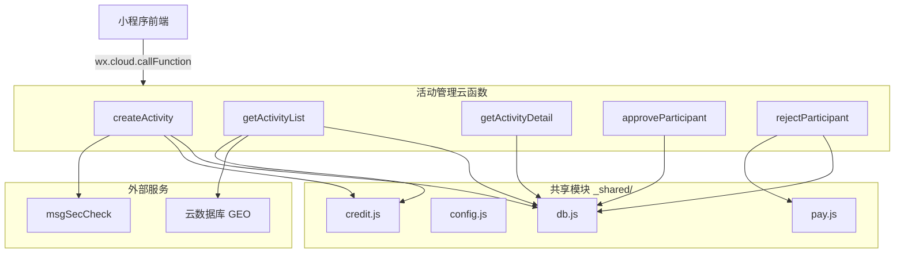

# 设计文档 - 活动 CRUD 云函数

## 概述

本设计文档描述"不鸽令"微信小程序活动管理后端的 5 个核心云函数实现方案。这些云函数构成活动生命周期的基础操作：创建、列表查询、详情查看、审批参与者和拒绝参与者。

技术栈：微信云函数（Node.js）+ wx-server-sdk + 云数据库 GEO 查询。

依赖 Spec 1（project-scaffold）提供的共享模块：`_shared/db.js`（数据库实例和集合常量）、`_shared/config.js`（环境变量）、`_shared/credit.js`（信用分操作）、`_shared/pay.js`（支付退款操作）。

## 架构



### 云函数统一结构

每个云函数遵循相同的入口模式：

```javascript
const cloud = require('wx-server-sdk')
cloud.init({ env: cloud.DYNAMIC_CURRENT_ENV })

const { getDb, COLLECTIONS } = require('../_shared/db')

exports.main = async (event, context) => {
  const wxContext = cloud.getWXContext()
  const openId = wxContext.OPENID
  const db = getDb()
  
  try {
    // 1. 参数校验
    // 2. 业务逻辑
    // 3. 返回结果
    return { code: 0, message: 'success', data: { ... } }
  } catch (err) {
    return { code: 5001, message: err.message, data: null }
  }
}
```

### 关键设计决策

1. **参数校验前置**：所有云函数在执行业务逻辑前先完成参数校验，快速失败。
2. **统一错误码**：复用 API 文档定义的错误码体系（0/1001/1002/1003/1004/2001/2002/5001）。
3. **GEO Point 存储格式**：`location` 字段使用云数据库 `db.Geo.Point(longitude, latitude)` 格式存储，以支持 2dsphere 索引查询。
4. **信用分查询复用**：通过 `_shared/credit.js` 的 `getCredit` 和 `checkAccess` 方法查询信用分，避免重复逻辑。
5. **退款异步容错**：`rejectParticipant` 中退款调用失败不阻塞状态更新，记录退款失败日志后返回成功，由后续补偿机制处理。

## 组件与接口

### 参数校验模块

每个云函数内部实现参数校验逻辑。为减少重复代码，抽取通用校验辅助函数：

```javascript
// cloudfunctions/_shared/validator.js

/**
 * 校验必填字符串字段
 * @param {*} value - 待校验值
 * @param {string} fieldName - 字段名
 * @param {number} minLen - 最小长度
 * @param {number} maxLen - 最大长度
 * @returns {{ valid: boolean, error?: string }}
 */
function validateString(value, fieldName, minLen, maxLen) { }

/**
 * 校验枚举值
 * @param {*} value - 待校验值
 * @param {string} fieldName - 字段名
 * @param {Array} allowedValues - 允许的枚举值
 * @returns {{ valid: boolean, error?: string }}
 */
function validateEnum(value, fieldName, allowedValues) { }

/**
 * 校验整数范围
 * @param {*} value - 待校验值
 * @param {string} fieldName - 字段名
 * @param {number} min - 最小值
 * @param {number} max - 最大值
 * @returns {{ valid: boolean, error?: string }}
 */
function validateIntRange(value, fieldName, min, max) { }

/**
 * 校验 location 对象
 * @param {*} location - 待校验的位置对象
 * @returns {{ valid: boolean, error?: string }}
 */
function validateLocation(location) { }

/**
 * 校验 ISO 8601 时间字符串，并检查是否晚于当前时间指定小时数
 * @param {*} value - 待校验值
 * @param {string} fieldName - 字段名
 * @param {number} minHoursFromNow - 距当前时间的最小小时数
 * @returns {{ valid: boolean, error?: string }}
 */
function validateFutureTime(value, fieldName, minHoursFromNow) { }
```

### createActivity 云函数

```javascript
// cloudfunctions/createActivity/index.js
exports.main = async (event, context) => {
  // 1. 获取调用者 openId
  // 2. 参数校验（title, depositTier, maxParticipants, location, meetTime, identityHint, wechatId）
  // 3. 调用 msgSecCheck 检查 title 和 identityHint
  // 4. 查询信用分 → 低于 60 拒绝，低于 80 检查当日创建次数
  // 5. 构建活动记录，location 转为 db.Geo.Point 格式
  // 6. 写入 activities 集合
  // 7. 返回 activityId
}
```

**depositTier 枚举常量**：

```javascript
const DEPOSIT_TIERS = [990, 1990, 2990, 3990, 4990]
```

**信用分检查逻辑**：

```javascript
async function checkCreditForCreate(db, openId) {
  const credit = await getCredit(openId)
  if (!credit || credit.score < 60) {
    return { allowed: false, code: 2002, message: '信用分不足，无法创建活动' }
  }
  if (credit.score < 80) {
    // 查询当日创建数量
    const today = new Date()
    today.setHours(0, 0, 0, 0)
    const count = await db.collection(COLLECTIONS.ACTIVITIES)
      .where({ initiatorId: openId, createdAt: db.command.gte(today) })
      .count()
    if (count.total >= 1) {
      return { allowed: false, code: 2002, message: '低信用用户每日限创建1次活动' }
    }
  }
  return { allowed: true }
}
```

### getActivityList 云函数

```javascript
// cloudfunctions/getActivityList/index.js
exports.main = async (event, context) => {
  // 1. 参数校验（latitude, longitude 必填；radius, page, pageSize 可选）
  // 2. 构建 GEO 查询：以 (longitude, latitude) 为圆心，radius 为半径
  // 3. 添加 status='pending' 过滤条件
  // 4. 使用 aggregate + geoNear 实现距离计算和排序
  // 5. 分页处理（skip + limit）
  // 6. 批量查询发起人信用分
  // 7. 组装返回数据
}
```

**GEO 聚合查询**：

```javascript
const result = await db.collection(COLLECTIONS.ACTIVITIES).aggregate()
  .geoNear({
    distanceField: 'distance',
    spherical: true,
    near: db.Geo.Point(longitude, latitude),
    maxDistance: radius,
    query: { status: 'pending' }
  })
  .sort({ distance: 1 })
  .skip((page - 1) * pageSize)
  .limit(pageSize)
  .end()
```

### getActivityDetail 云函数

```javascript
// cloudfunctions/getActivityDetail/index.js
exports.main = async (event, context) => {
  // 1. 参数校验（activityId 必填）
  // 2. 查询活动记录
  // 3. 查询发起人信用分
  // 4. 查询调用者的参与记录（myParticipation）
  // 5. 判断 wechatId 解锁条件：
  //    - 调用者有 approved 状态的参与记录
  //    - 且距 meetTime ≤ 2 小时
  // 6. 组装返回数据
}
```

**wechatId 解锁逻辑**：

```javascript
function shouldUnlockWechatId(participation, meetTime) {
  if (!participation || participation.status !== 'approved') return false
  const now = new Date()
  const meet = new Date(meetTime)
  const twoHoursMs = 2 * 60 * 60 * 1000
  return (meet.getTime() - now.getTime()) <= twoHoursMs
}
```

### approveParticipant 云函数

```javascript
// cloudfunctions/approveParticipant/index.js
exports.main = async (event, context) => {
  // 1. 参数校验（activityId, participationId 必填）
  // 2. 查询活动记录，校验存在性
  // 3. 校验调用者是发起人（openId === initiatorId）
  // 4. 查询参与记录，校验存在性和状态为 'paid'
  // 5. 校验 currentParticipants < maxParticipants
  // 6. 更新参与记录 status → 'approved'
  // 7. 活动 currentParticipants + 1
  // 8. 若活动 status 为 'pending'，更新为 'confirmed'
  // 9. 返回成功
}
```

### rejectParticipant 云函数

```javascript
// cloudfunctions/rejectParticipant/index.js
exports.main = async (event, context) => {
  // 1. 参数校验（activityId, participationId 必填）
  // 2. 查询活动记录，校验存在性
  // 3. 校验调用者是发起人
  // 4. 查询参与记录，校验存在性和状态为 'paid'
  // 5. 更新参与记录 status → 'rejected'
  // 6. 调用 pay.refund() 触发全额退款
  // 7. 返回成功
}
```

## 数据模型

### activities 集合

| 字段 | 类型 | 说明 |
|------|------|------|
| _id | string | 活动唯一 ID（云数据库自动生成） |
| initiatorId | string | 发起人 openId |
| title | string | 活动主题（2-50 字符） |
| depositTier | number | 鸽子费档位（分）：990/1990/2990/3990/4990 |
| maxParticipants | number | 最大参与人数（1-20） |
| currentParticipants | number | 当前已通过人数，初始为 0 |
| location | GeoPoint | `db.Geo.Point(longitude, latitude)`，附带 `name` 和 `address` 字段 |
| locationName | string | 地点名称 |
| locationAddress | string | 地点地址 |
| meetTime | Date | 约定见面时间 |
| identityHint | string | 接头特征（2-100 字符） |
| wechatId | string | 发起人微信号（加密存储） |
| status | string | 活动状态：`pending`/`confirmed`/`verified`/`expired`/`settled` |
| createdAt | Date | 创建时间（服务器时间） |

**注意**：`location` 字段存储为 GeoPoint 用于 GEO 索引查询，`locationName` 和 `locationAddress` 作为独立字段存储以便直接读取，避免 GeoPoint 结构中嵌套非标准字段。

### participations 集合（本 Spec 读写相关字段）

| 字段 | 类型 | 说明 |
|------|------|------|
| _id | string | 参与记录 ID |
| activityId | string | 关联活动 ID |
| participantId | string | 参与者 openId |
| status | string | `paid`/`approved`/`rejected`/`verified`/`breached`/`refunded` |
| depositAmount | number | 实际支付金额（分） |
| paymentId | string | 微信支付订单号 |
| createdAt | Date | 创建时间 |

### credits 集合（本 Spec 仅读取）

| 字段 | 类型 | 说明 |
|------|------|------|
| _id | string | 用户 openId |
| score | number | 当前信用分 |
| status | string | `active`/`restricted`/`banned` |

### 数据库索引

| 集合 | 索引字段 | 索引类型 | 用途 |
|------|----------|----------|------|
| activities | location | 2dsphere | GEO 范围查询 |
| activities | status + meetTime | 复合索引 | 状态+时间过滤 |
| participations | activityId + status | 复合索引 | 按活动查参与记录 |


## 正确性属性

*正确性属性是一种在系统所有有效执行中都应成立的特征或行为——本质上是关于系统应该做什么的形式化陈述。属性是人类可读规范与机器可验证正确性保证之间的桥梁。*

### Property 1: createActivity 参数校验正确性

*For any* 参数组合，当所有字段满足约束条件（title 2-50 字符、depositTier 为 990/1990/2990/3990/4990 之一、maxParticipants 1-20 整数、location 包含 name/address/latitude/longitude、meetTime 晚于当前 2 小时、identityHint 2-100 字符、wechatId 非空）时校验应通过；当任一字段不满足约束时校验应返回错误码 1001。

**Validates: Requirements 1.2, 1.3, 1.4**

### Property 2: 信用分创建限制

*For any* 用户信用分和当日创建次数组合：信用分 < 60 时应拒绝创建（返回 2002）；信用分在 [60, 80) 区间且当日已创建 ≥ 1 次时应拒绝创建（返回 2002）；信用分 ≥ 80 或信用分在 [60, 80) 且当日未创建时应允许创建。

**Validates: Requirements 1.8, 1.9**

### Property 3: 活动记录创建完整性

*For any* 合法的活动创建参数，创建成功后的活动记录应包含所有传入字段，且 `status` 为 `pending`、`currentParticipants` 为 0、`createdAt` 为服务器时间、`location` 为 GeoPoint 格式。

**Validates: Requirements 1.10, 1.11**

### Property 4: GEO 查询仅返回 pending 活动

*For any* 活动列表查询结果，返回的每条活动记录的 `status` 字段应为 `pending`，且活动地点与查询圆心的距离应不超过指定的 `radius`。

**Validates: Requirements 2.3**

### Property 5: 活动列表按距离升序排列

*For any* 活动列表查询结果（长度 ≥ 2），列表中第 i 条记录的 `distance` 应小于等于第 i+1 条记录的 `distance`。

**Validates: Requirements 2.4**

### Property 6: 分页逻辑正确性

*For any* 总数据量 total、页码 page 和每页条数 pageSize，返回的数据条数应为 `min(pageSize, total - (page-1)*pageSize)` 且不小于 0，`hasMore` 应等于 `page * pageSize < total`。

**Validates: Requirements 2.5, 2.7**

### Property 7: wechatId 条件解锁

*For any* 调用者参与状态和当前时间组合，当且仅当调用者的参与记录状态为 `approved` 且距 `meetTime` 不超过 2 小时时，返回的 `wechatId` 应为非 null 值；其他所有情况 `wechatId` 应为 `null`。

**Validates: Requirements 3.5, 3.6**

### Property 8: myParticipation 条件返回

*For any* 调用者和活动组合，当调用者在该活动的 participations 集合中存在记录时，返回的 `myParticipation` 应包含 `_id`、`status`、`createdAt` 字段；当不存在记录时，`myParticipation` 应为 `null`。

**Validates: Requirements 3.7, 3.8**

### Property 9: 发起人权限校验

*For any* 调用者 openId 和活动 initiatorId 组合，当 openId 与 initiatorId 不匹配时，approveParticipant 和 rejectParticipant 应返回错误码 1002；当匹配时应继续执行后续逻辑。

**Validates: Requirements 4.4, 5.4**

### Property 10: 参与记录状态前置校验

*For any* 参与记录状态值，当状态不为 `paid` 时，approveParticipant 和 rejectParticipant 应返回错误码 1004；当状态为 `paid` 时应继续执行后续逻辑。

**Validates: Requirements 4.6, 5.6**

### Property 11: approve 操作状态变更

*For any* 合法的 approve 操作（发起人调用、参与记录状态为 paid、人数未满），操作后参与记录的 `status` 应为 `approved`，活动的 `currentParticipants` 应增加 1。若操作前活动 `status` 为 `pending`，操作后应变为 `confirmed`。

**Validates: Requirements 4.8, 4.9**

### Property 12: reject 操作状态变更

*For any* 合法的 reject 操作（发起人调用、参与记录状态为 paid），操作后参与记录的 `status` 应为 `rejected`，且退款方法应被调用。

**Validates: Requirements 5.7, 5.8**

## 错误处理

### 统一错误码体系

| 错误码 | 含义 | 触发场景 |
|--------|------|----------|
| 0 | 成功 | 所有操作正常完成 |
| 1001 | 参数校验失败 | 必填参数缺失、类型错误、值超出范围 |
| 1002 | 权限不足 | 非发起人调用 approve/reject |
| 1003 | 资源不存在 | activityId 或 participationId 无对应记录 |
| 1004 | 状态不允许 | 参与记录状态非 paid、参与人数已满 |
| 2001 | 内容安全未通过 | msgSecCheck 检测到违规内容 |
| 2002 | 信用分不足 | 信用分 < 60 禁止创建，< 80 限制次数 |
| 5001 | 系统内部错误 | 未预期的异常 |

### 各云函数错误处理策略

| 云函数 | 错误场景 | 处理方式 |
|--------|----------|----------|
| createActivity | msgSecCheck 调用失败 | 返回 5001，记录错误日志 |
| createActivity | 信用分查询失败 | 返回 5001，记录错误日志 |
| createActivity | 数据库写入失败 | 返回 5001，记录错误日志 |
| getActivityList | GEO 聚合查询失败 | 返回 5001，记录错误日志 |
| getActivityDetail | 信用分查询失败 | 降级处理，initiatorCredit 返回 null |
| approveParticipant | 数据库更新失败 | 返回 5001，记录错误日志 |
| rejectParticipant | 退款调用失败 | 状态仍更新为 rejected，记录退款失败日志，由补偿机制重试 |

### 统一错误响应格式

```javascript
function errorResponse(code, message) {
  return { code, message, data: null }
}

function successResponse(data) {
  return { code: 0, message: 'success', data }
}
```

## 测试策略

### 测试框架选择

- **单元测试**：Jest（与 Spec 1 保持一致）
- **属性基测试**：fast-check（JavaScript 生态最成熟的 PBT 库）
- **Mock 方案**：Jest 内置 mock 功能，用于模拟 `wx-server-sdk`、`cloud.openapi`、数据库操作

### 测试架构

由于云函数依赖 `wx-server-sdk` 和云数据库，测试需要：

1. **Mock wx-server-sdk**：模拟 `cloud.init()`、`cloud.getWXContext()`、`cloud.openapi.security.msgSecCheck()`
2. **Mock 数据库操作**：模拟 `db.collection().add()`、`.where().get()`、`.aggregate().geoNear()` 等
3. **Mock 共享模块**：模拟 `_shared/credit.js` 和 `_shared/pay.js` 的方法

### 可测试模块拆分

为提高可测试性，将核心业务逻辑从云函数入口中拆分为独立的纯函数模块：

| 模块 | 文件 | 可测试函数 |
|------|------|------------|
| 参数校验 | `_shared/validator.js` | `validateString`, `validateEnum`, `validateIntRange`, `validateLocation`, `validateFutureTime` |
| 信用分检查 | createActivity 内部 | `checkCreditForCreate(score, todayCount)` |
| wechatId 解锁 | getActivityDetail 内部 | `shouldUnlockWechatId(participation, meetTime)` |
| 分页计算 | `_shared/pagination.js` | `paginate(total, page, pageSize)` |

### 属性基测试配置

- 每个属性测试最少运行 100 次迭代
- 每个测试用注释标注对应的设计属性编号
- 标注格式：`Feature: activity-crud, Property {N}: {属性标题}`

### 双重测试策略

- **单元测试**：验证具体示例（如特定错误码返回）、边界情况（如 meetTime 恰好 2 小时）和错误条件（如资源不存在）
- **属性基测试**：验证跨所有输入的通用属性（如参数校验、权限校验、状态变更）
- 两者互补，单元测试捕获具体 bug，属性测试验证通用正确性
