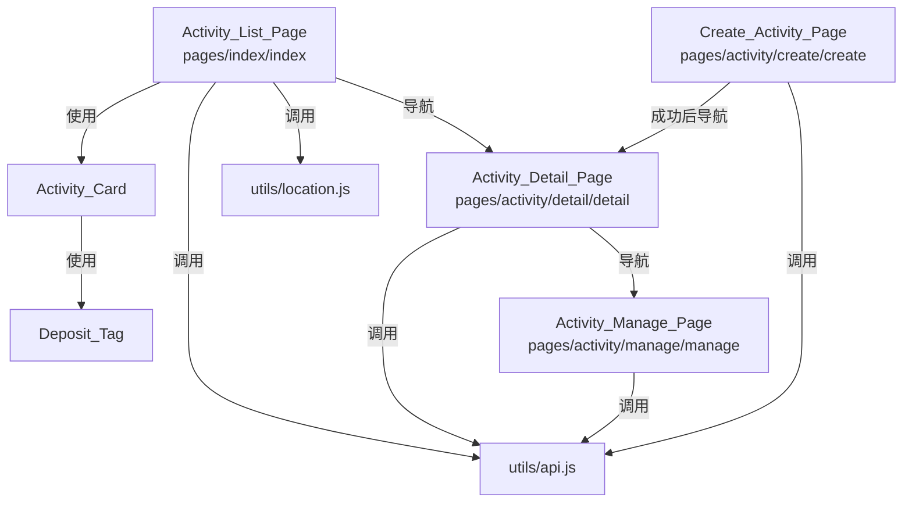
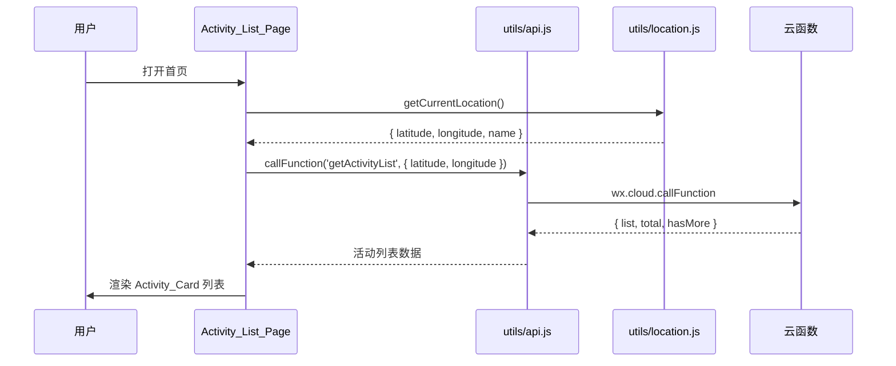

# 设计文档 - 活动页面与组件

## 概述

本设计文档描述"不鸽令"微信小程序中活动管理前端的 4 个页面和 2 个组件的技术实现方案。所有页面基于 Spec 1 提供的项目脚手架（全局样式 CSS 变量、`utils/api.js`、`utils/location.js`、`utils/auth.js`）和 Spec 2 提供的后端云函数（`createActivity`、`getActivityList`、`getActivityDetail`、`approveParticipant`、`rejectParticipant`）。

前端采用微信小程序原生开发（WXML + WXSS + JS），不引入额外框架。

## 架构

### 页面与组件关系



### 数据流



## 组件与接口

### 1. Deposit_Tag 组件

**路径：** `miniprogram/components/deposit-tag/deposit-tag`

**属性接口：**

| 属性 | 类型 | 必填 | 说明 |
|------|------|------|------|
| amount | Number | 是 | 金额（分），如 990、1990 |

**内部逻辑：**

```javascript
// 格式化金额：分 → 元
function formatDeposit(amountInCents) {
  return '¥' + (amountInCents / 100).toFixed(1)
}
```

**样式：** 主色背景（#FF6B35）、白色文字、8rpx 圆角、内边距 4rpx 12rpx、字号 22rpx Medium

---

### 2. Activity_Card 组件

**路径：** `miniprogram/components/activity-card/activity-card`

**属性接口：**

| 属性 | 类型 | 必填 | 说明 |
|------|------|------|------|
| activity | Object | 是 | 活动数据对象 |

**activity 对象结构：**

```javascript
{
  activityId: String,
  title: String,
  depositTier: Number,       // 分
  currentParticipants: Number,
  maxParticipants: Number,
  distance: Number,           // 米
  meetTime: String,           // ISO 8601
  initiatorCredit: Number
}
```

**事件接口：**

| 事件 | 参数 | 说明 |
|------|------|------|
| tap | { activityId } | 用户点击卡片时触发 |

**内部辅助函数：**

```javascript
// 格式化距离
function formatDistance(meters) {
  if (meters < 1000) return Math.round(meters) + 'm'
  return (meters / 1000).toFixed(1) + 'km'
}

// 格式化时间为友好显示
function formatMeetTime(isoString) {
  const date = new Date(isoString)
  const today = new Date()
  if (isSameDay(date, today)) return '今天 ' + formatHHMM(date)
  if (isSameDay(date, tomorrow(today))) return '明天 ' + formatHHMM(date)
  return formatMMDD(date) + ' ' + formatHHMM(date)
}
```

**样式：** 白色卡片背景、16rpx 圆角、24rpx 内边距、20rpx 卡片间距、阴影效果

---

### 3. Activity_List_Page

**路径：** `miniprogram/pages/index/index`

**页面配置（index.json）：**

```json
{
  "usingComponents": {
    "activity-card": "/components/activity-card/activity-card"
  },
  "enablePullDownRefresh": true
}
```

**页面数据模型：**

```javascript
Page({
  data: {
    locationName: '',        // 当前位置名称
    latitude: 0,
    longitude: 0,
    activityList: [],        // 活动列表
    page: 1,
    hasMore: true,
    loading: false,
    isEmpty: false
  }
})
```

**生命周期与方法：**

| 方法 | 触发 | 逻辑 |
|------|------|------|
| onLoad | 页面加载 | 调用 initLocation() |
| onPullDownRefresh | 下拉刷新 | 重置 page=1，重新加载 |
| onReachBottom | 触底 | 若 hasMore，page++，追加加载 |
| initLocation | 内部 | 调用 location.getCurrentLocation()，设置位置数据，调用 loadActivities() |
| refreshLocation | 点击刷新 | 同 initLocation |
| loadActivities | 内部 | 调用 api.callFunction('getActivityList', ...)，更新列表 |
| onCardTap | 卡片点击 | wx.navigateTo 到详情页 |

**分页策略：** 首次加载 page=1，触底时 page++，下拉刷新重置 page=1 并清空列表。

---

### 4. Create_Activity_Page

**路径：** `miniprogram/pages/activity/create/create`

**页面数据模型：**

```javascript
Page({
  data: {
    title: '',
    location: null,          // { name, address, latitude, longitude }
    meetTime: '',            // ISO 字符串
    maxParticipants: 3,      // 默认 3 人
    depositTier: 0,          // 选中的档位（分）
    identityHint: '',
    wechatId: '',
    depositTiers: [990, 1990, 2990, 3990, 4990],
    submitting: false,
    // 时间选择器辅助
    minDate: '',             // 当前时间 + 2h
    dateRange: []
  }
})
```

**表单校验函数：**

```javascript
function validateForm(data) {
  const errors = []
  if (!data.title || data.title.length < 2 || data.title.length > 50) {
    errors.push('活动主题需 2-50 个字符')
  }
  if (!data.location) {
    errors.push('请选择活动地点')
  }
  if (!data.meetTime) {
    errors.push('请选择见面时间')
  }
  if (!data.depositTier) {
    errors.push('请选择鸽子费档位')
  }
  if (!data.identityHint || data.identityHint.length < 2 || data.identityHint.length > 100) {
    errors.push('接头特征需 2-100 个字符')
  }
  if (!data.wechatId) {
    errors.push('请输入微信号')
  }
  return errors
}
```

**关键方法：**

| 方法 | 触发 | 逻辑 |
|------|------|------|
| chooseLocation | 点击地点 | 调用 wx.chooseLocation，设置 location |
| onTimeChange | 时间选择 | 设置 meetTime |
| onDepositSelect | 选择档位 | 设置 depositTier |
| adjustParticipants | 步进器 | 增减 maxParticipants（1-20 范围） |
| submitForm | 提交 | 校验 → loading → callFunction → 导航/toast |

**错误处理映射：**

| 错误码 | 处理 |
|--------|------|
| 2001 | wx.showToast({ title: '内容包含违规信息，请修改', icon: 'none' }) |
| 2002 | wx.showToast({ title: res.message, icon: 'none' }) |
| 其他 | wx.showToast({ title: '发布失败，请重试', icon: 'none' }) |

---

### 5. Activity_Detail_Page

**路径：** `miniprogram/pages/activity/detail/detail`

**页面数据模型：**

```javascript
Page({
  data: {
    activityId: '',
    activity: null,          // 完整活动数据
    myParticipation: null,   // 当前用户参与记录
    isInitiator: false,      // 是否为发起人
    showWechatCopy: false,   // 是否显示复制微信按钮
    depositDisplay: '',      // 格式化后的金额
    loading: true
  }
})
```

**按钮状态决策逻辑：**

```javascript
function getActionState(activity, myParticipation, isInitiator) {
  if (isInitiator) return 'manage'           // 显示"管理活动"
  if (myParticipation) return 'status'       // 显示参与状态
  return 'join'                               // 显示"支付报名"
}
```

**契约声明文案：** 硬编码在 WXML 中，使用浅黄色背景（#FEF3C7）+ 1rpx 边框（#F59E0B）。

**关键方法：**

| 方法 | 触发 | 逻辑 |
|------|------|------|
| onLoad(options) | 页面加载 | 获取 activityId，调用 loadDetail() |
| loadDetail | 内部 | callFunction('getActivityDetail')，判断角色和按钮状态 |
| copyWechatId | 点击复制 | wx.setClipboardData({ data: wechatId }) |
| goManage | 点击管理 | wx.navigateTo 到管理页 |
| goJoin | 点击报名 | TODO: Spec 4 实现支付流程 |

---

### 6. Activity_Manage_Page

**路径：** `miniprogram/pages/activity/manage/manage`

**页面数据模型：**

```javascript
Page({
  data: {
    activityId: '',
    activity: null,
    participations: [],      // 参与记录列表
    loading: true
  }
})
```

**关键方法：**

| 方法 | 触发 | 逻辑 |
|------|------|------|
| onLoad(options) | 页面加载 | 获取 activityId，调用 loadData() |
| loadData | 内部 | 并行加载活动详情和参与者列表 |
| approveParticipant | 点击同意 | callFunction('approveParticipant')，成功后刷新列表 |
| rejectParticipant | 点击拒绝 | callFunction('rejectParticipant')，成功后刷新列表 |

**参与者列表数据来源：** 通过 getActivityDetail 返回的数据中获取参与者信息。若后端未直接返回参与者列表，管理页需额外调用或由 getActivityDetail 在发起人视角下返回完整参与者列表。

---

### 7. 状态标签映射

所有页面共用的状态标签配置：

```javascript
const STATUS_MAP = {
  pending:   { label: '待组队', bgColor: '#FEF3C7', textColor: '#D97706' },
  confirmed: { label: '已成行', bgColor: '#DBEAFE', textColor: '#2563EB' },
  verified:  { label: '已核销', bgColor: '#D1FAE5', textColor: '#059669' },
  expired:   { label: '已超时', bgColor: '#FEE2E2', textColor: '#DC2626' },
  settled:   { label: '已结算', bgColor: '#E5E7EB', textColor: '#6B7280' }
}
```

此映射可抽取为 `utils/status.js` 共享模块，供详情页和管理页引用。

## 数据模型

### 页面间数据传递

| 来源页 | 目标页 | 传递方式 | 参数 |
|--------|--------|----------|------|
| Activity_List_Page | Activity_Detail_Page | URL query | activityId |
| Create_Activity_Page | Activity_Detail_Page | wx.redirectTo query | activityId |
| Activity_Detail_Page | Activity_Manage_Page | URL query | activityId |

### 云函数请求/响应数据结构

**getActivityList 请求：**

```javascript
{
  latitude: Number,
  longitude: Number,
  page: Number,       // 默认 1
  pageSize: Number    // 默认 20
}
```

**getActivityList 响应：**

```javascript
{
  code: 0,
  data: {
    list: [{
      activityId: String,
      title: String,
      depositTier: Number,
      maxParticipants: Number,
      currentParticipants: Number,
      location: { name: String, latitude: Number, longitude: Number },
      distance: Number,
      meetTime: String,
      initiatorCredit: Number,
      status: String
    }],
    total: Number,
    hasMore: Boolean
  }
}
```

**createActivity 请求：**

```javascript
{
  title: String,
  depositTier: Number,        // 990/1990/2990/3990/4990
  maxParticipants: Number,    // 1-20
  location: { name: String, address: String, latitude: Number, longitude: Number },
  meetTime: String,           // ISO 8601
  identityHint: String,
  wechatId: String
}
```

**getActivityDetail 响应核心字段：**

```javascript
{
  code: 0,
  data: {
    activityId: String,
    title: String,
    depositTier: Number,
    maxParticipants: Number,
    currentParticipants: Number,
    location: { name: String, address: String, latitude: Number, longitude: Number },
    meetTime: String,
    identityHint: String,
    initiatorCredit: Number,
    status: String,
    wechatId: String | null,
    myParticipation: Object | null
  }
}
```

### 表单数据 → API 请求映射

Create_Activity_Page 表单数据到 createActivity 请求的映射：

```javascript
function buildCreateRequest(formData) {
  return {
    title: formData.title.trim(),
    depositTier: formData.depositTier,
    maxParticipants: formData.maxParticipants,
    location: {
      name: formData.location.name,
      address: formData.location.address,
      latitude: formData.location.latitude,
      longitude: formData.location.longitude
    },
    meetTime: formData.meetTime,
    identityHint: formData.identityHint.trim(),
    wechatId: formData.wechatId.trim()
  }
}
```


## 正确性属性

*属性（Property）是指在系统所有合法执行中都应成立的特征或行为——本质上是对系统应做之事的形式化陈述。属性是连接人类可读规格说明与机器可验证正确性保证之间的桥梁。*

### Property 1: 押金金额格式化正确性

*For any* 正整数 amountInCents（代表分为单位的金额），formatDeposit(amountInCents) 的返回值应以"¥"开头，且"¥"后的数值应等于 amountInCents / 100 并保留一位小数。

**Validates: Requirements 6.2**

### Property 2: 表单校验完整性

*For any* 表单数据对象，若其中任一必填字段为空或超出长度限制（title 不在 2-50 字符、identityHint 不在 2-100 字符、location 为 null、meetTime 为空、depositTier 为 0、wechatId 为空），validateForm 应返回非空错误数组；若所有字段均合法，validateForm 应返回空数组。

**Validates: Requirements 2.5, 7.1, 7.2, 7.3, 7.4, 7.5, 7.6**

### Property 3: 按钮状态决策正确性

*For any* (isInitiator, myParticipation) 组合，getActionState 应满足：当 isInitiator 为 true 时返回 'manage'；当 isInitiator 为 false 且 myParticipation 不为 null 时返回 'status'；当 isInitiator 为 false 且 myParticipation 为 null 时返回 'join'。

**Validates: Requirements 3.5, 3.6, 3.7**

### Property 4: 分页状态管理正确性

*For any* 初始 page 值和 hasMore 布尔值，当 hasMore 为 true 时触底加载应使 page 递增 1；当 hasMore 为 false 时触底加载不应改变 page 值且不应发起请求。

**Validates: Requirements 1.6**

### Property 5: 最小可选时间计算正确性

*For any* 当前时间 now，计算出的最小可选见面时间 minTime 应满足 minTime - now >= 2 小时（7200000 毫秒），且 minTime - now < 2 小时 + 1 分钟（确保精度合理）。

**Validates: Requirements 2.3**

### Property 6: 状态标签映射完整性

*For any* 有效状态值（pending/confirmed/verified/expired/settled），STATUS_MAP 应返回包含 label（非空字符串）、bgColor（有效十六进制颜色）、textColor（有效十六进制颜色）的完整配置对象。

**Validates: Requirements 8.1, 8.2, 8.3, 8.4, 8.5**

### Property 7: 参与者操作按钮显示规则

*For any* 参与记录对象，当且仅当其 status 为 'paid' 时，shouldShowActions 返回 true；其他任何状态（approved/verified/breached/refunded/rejected）均返回 false。

**Validates: Requirements 4.4**

## 错误处理

### 网络与 API 错误

| 场景 | 处理方式 |
|------|----------|
| 位置获取失败（用户拒绝授权） | 显示提示引导用户开启位置权限，列表显示空状态 |
| getActivityList 调用失败 | 显示 toast "加载失败，请重试"，保留当前列表数据 |
| getActivityDetail 调用失败 | 显示 toast "加载失败"，页面显示加载失败状态 |
| createActivity 返回 2001 | 显示 toast "内容包含违规信息，请修改" |
| createActivity 返回 2002 | 显示 toast 展示服务端返回的具体信息 |
| approveParticipant/rejectParticipant 失败 | 显示 toast 展示错误信息，不改变当前列表状态 |
| wx.chooseLocation 取消或失败 | 不更新地点字段，保持原状态 |

### 数据异常

| 场景 | 处理方式 |
|------|----------|
| activityId 参数缺失 | 显示错误提示并返回上一页 |
| 活动不存在（1003） | 显示 toast "活动不存在"并返回上一页 |
| depositTier 值不在预设范围 | 使用 formatDeposit 兜底显示，不崩溃 |
| myParticipation 为 null | 正常显示报名按钮 |

## 测试策略

### 属性基测试

使用 **fast-check** 库配合 **Jest** 进行属性基测试。每个属性测试运行最少 100 次迭代。

**可测试的纯函数（从页面逻辑中抽取）：**

| 函数 | 所在模块 | 测试属性 |
|------|----------|----------|
| formatDeposit(amountInCents) | utils/format.js | Property 1 |
| validateForm(data) | pages/activity/create/validate.js | Property 2 |
| getActionState(isInitiator, myParticipation) | pages/activity/detail/helpers.js | Property 3 |
| getMinMeetTime(now) | pages/activity/create/helpers.js | Property 5 |
| STATUS_MAP | utils/status.js | Property 6 |
| shouldShowActions(participation) | pages/activity/manage/helpers.js | Property 7 |

**测试标签格式：** `Feature: activity-pages, Property N: {property_text}`

### 单元测试

单元测试覆盖以下场景：

- formatDeposit 的边界值：0、990、4990
- validateForm 的各字段独立校验错误消息
- 错误码 2001/2002 的 toast 处理
- 空列表状态渲染
- wechatId 为 null 时隐藏复制按钮
- 分页 page=1 首次加载和 hasMore=false 停止加载

### 测试文件组织

```
tests/
├── utils/
│   ├── format.test.js          # formatDeposit 属性测试 + 单元测试
│   └── status.test.js          # STATUS_MAP 属性测试
├── pages/
│   ├── create/
│   │   ├── validate.test.js    # validateForm 属性测试
│   │   └── helpers.test.js     # getMinMeetTime 属性测试
│   ├── detail/
│   │   └── helpers.test.js     # getActionState 属性测试
│   └── manage/
│       └── helpers.test.js     # shouldShowActions 属性测试
└── components/
    └── deposit-tag.test.js     # Deposit_Tag 组件测试
```
