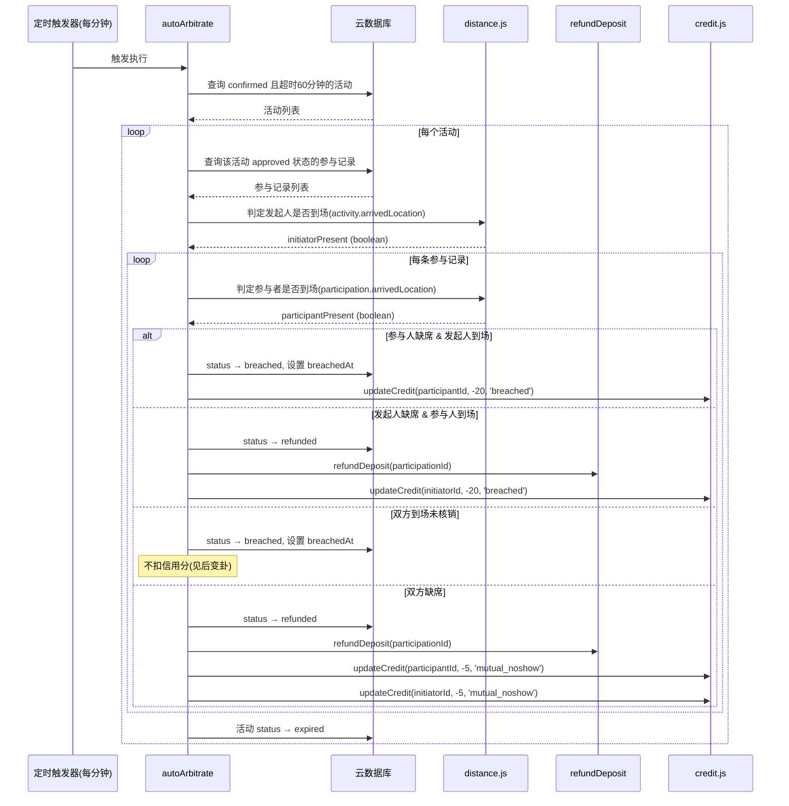
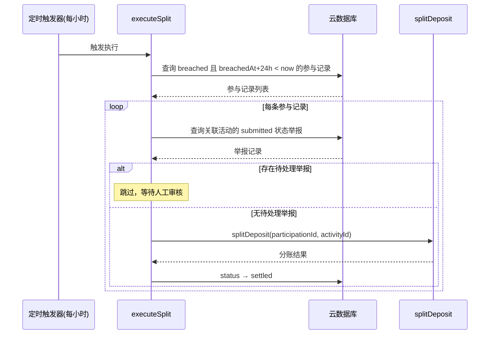
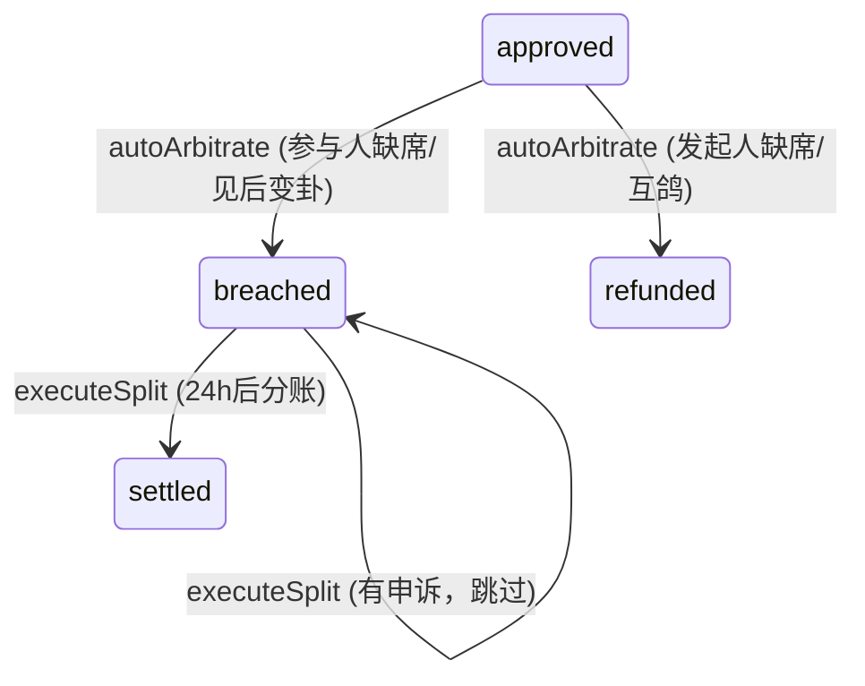

# 设计文档 - 自动仲裁系统

## 概述

本设计文档描述"不鸽令"微信小程序自动仲裁系统的完整实现方案，包含 2 个定时触发云函数（autoArbitrate、executeSplit）及其配套的距离计算工具模块。

自动仲裁系统是契约引擎的最终裁决环节，负责在活动超时 60 分钟后根据双方 LBS 到达记录自动判定违约方，并执行相应的退款、分账标记和信用分扣减操作。分账操作设有 24 小时申诉缓冲期，由 executeSplit 在缓冲期满后执行实际分账。

技术栈：微信云函数（Node.js）+ wx-server-sdk + 云数据库 + 定时触发器。

依赖关系：
- Spec 1（project-scaffold）：`_shared/db.js`、`_shared/config.js`
- Spec 2（activity-crud）：活动和参与记录数据模型、`_shared/response.js`
- Spec 4（payment-settlement）：refundDeposit 云函数（全额退款）、splitDeposit 云函数（3/7 分账）
- Spec 5（verification-qrcode）：reportArrival 写入的到达记录（arrivedAt、arrivedLocation）
- Spec 6（credit-system）：`_shared/credit.js`（updateCredit 信用分扣减）

## 架构

```mermaid
graph TD
    subgraph Triggers[定时触发器]
        T1[每分钟触发]
        T2[每小时触发]
    end

    subgraph CloudFunctions[仲裁云函数]
        AA[autoArbitrate<br/>超时仲裁]
        ES[executeSplit<br/>缓冲期分账]
    end

    subgraph Shared[共享模块 _shared/]
        DB[db.js]
        CFG[config.js]
        CRD[credit.js<br/>updateCredit]
        DIST[distance.js<br/>calculateDistance / isPresent]
    end

    subgraph ExternalCF[依赖云函数 Spec 4]
        RD[refundDeposit]
        SD[splitDeposit]
    end

    subgraph Database[云数据库]
        ACT[(activities)]
        PAR[(participations)]
        RPT[(reports)]
    end

    T1 --> AA
    T2 --> ES

    AA --> DB
    AA --> CRD
    AA --> DIST
    AA --> RD
    AA --> ACT
    AA --> PAR

    ES --> DB
    ES --> SD
    ES --> PAR
    ES --> RPT
end
```

### 仲裁流程时序图



### 分账执行流程



### 关键设计决策

1. **距离计算提取到 `_shared/distance.js`**：Haversine 公式在 Spec 5 的 reportArrival 中已有内联实现，但自动仲裁也需要使用。将其提取到共享模块中，供两处复用，同时便于独立测试。
2. **发起人到场判定仅执行一次**：每个活动的发起人到场状态对所有参与记录共享，避免重复计算。在处理活动时先判定发起人状态，再逐条处理参与记录。
3. **退款立即执行，分账延迟执行**：退款场景（发起人缺席、互鸽）无争议，立即调用 refundDeposit；分账场景（参与人缺席、见后变卦）标记 `breached` + `breachedAt`，由 executeSplit 在 24 小时后执行。
4. **逐条处理 + 错误隔离**：每条参与记录独立处理，单条失败不影响其他记录。活动级别同理，单个活动处理失败不影响其他活动。
5. **幂等性保障**：autoArbitrate 仅处理 `approved` 状态的参与记录，已处理的记录状态变为 `breached`/`refunded` 后不会被重复处理。executeSplit 仅处理 `breached` 状态的记录，分账后更新为 `settled`。
6. **调用云函数而非直接引用 pay.js**：refundDeposit 和 splitDeposit 内部包含完整的流水记录和状态更新逻辑，通过 `cloud.callFunction` 调用保持接口一致性。

## 组件与接口

### _shared/distance.js 距离计算模块

```javascript
// cloudfunctions/_shared/distance.js

/**
 * Haversine 公式计算两点间球面距离
 * @param {number} lat1 - 纬度1
 * @param {number} lon1 - 经度1
 * @param {number} lat2 - 纬度2
 * @param {number} lon2 - 经度2
 * @returns {number} 距离（米）
 */
function calculateDistance(lat1, lon1, lat2, lon2) {
  const R = 6371000 // 地球半径（米）
  const dLat = (lat2 - lat1) * Math.PI / 180
  const dLon = (lon2 - lon1) * Math.PI / 180
  const a = Math.sin(dLat / 2) ** 2 +
    Math.cos(lat1 * Math.PI / 180) * Math.cos(lat2 * Math.PI / 180) *
    Math.sin(dLon / 2) ** 2
  const c = 2 * Math.atan2(Math.sqrt(a), Math.sqrt(1 - a))
  return R * c
}

/**
 * 判定用户是否到场
 * @param {object|null} arrivedLocation - 到达位置 { latitude, longitude }，可能为 null
 * @param {Date|null} arrivedAt - 到达时间，可能为 null
 * @param {object} activityLocation - 活动地点 { latitude, longitude }
 * @param {number} threshold - 距离阈值（米），默认 1000
 * @returns {boolean} 是否到场
 */
function isPresent(arrivedLocation, arrivedAt, activityLocation, threshold = 1000) {
  if (!arrivedAt || !arrivedLocation) return false
  const distance = calculateDistance(
    arrivedLocation.latitude, arrivedLocation.longitude,
    activityLocation.latitude, activityLocation.longitude
  )
  return distance <= threshold
}

module.exports = { calculateDistance, isPresent }
```

### autoArbitrate 云函数

```javascript
// cloudfunctions/autoArbitrate/index.js
const cloud = require('wx-server-sdk')
cloud.init({ env: cloud.DYNAMIC_CURRENT_ENV })

const { getDb, COLLECTIONS } = require('../_shared/db')
const { updateCredit } = require('../_shared/credit')
const { isPresent } = require('../_shared/distance')

/**
 * 判定单条参与记录的仲裁结果
 * @param {boolean} participantPresent - 参与者是否到场
 * @param {boolean} initiatorPresent - 发起人是否到场
 * @returns {{ verdict: string, participationStatus: string, creditActions: Array }}
 *   verdict: 'participant_breached' | 'initiator_breached' | 'present_unverified' | 'mutual_noshow'
 *   participationStatus: 'breached' | 'refunded'
 *   creditActions: [{ userId, delta, reason }]
 */
function determineVerdict(participantPresent, initiatorPresent) {
  if (!participantPresent && initiatorPresent) {
    // 场景A：参与人缺席
    return {
      verdict: 'participant_breached',
      participationStatus: 'breached',
      creditActions: [] // participantId 由调用方填入
    }
  }
  if (participantPresent && !initiatorPresent) {
    // 场景B：发起人缺席
    return {
      verdict: 'initiator_breached',
      participationStatus: 'refunded',
      creditActions: []
    }
  }
  if (participantPresent && initiatorPresent) {
    // 场景C：双方到场未核销（见后变卦）
    return {
      verdict: 'present_unverified',
      participationStatus: 'breached',
      creditActions: [] // 不扣信用分
    }
  }
  // 场景D：双方缺席（互鸽）
  return {
    verdict: 'mutual_noshow',
    participationStatus: 'refunded',
    creditActions: []
  }
}

exports.main = async (event, context) => {
  const db = getDb()
  const now = new Date()
  const timeoutThreshold = new Date(now.getTime() - 60 * 60 * 1000) // 60分钟前

  // 1. 查询所有超时未核销的 confirmed 活动
  //    条件: status === 'confirmed' && meetTime <= timeoutThreshold
  // 2. 遍历每个活动:
  //    a. 查询该活动所有 approved 状态的参与记录
  //    b. 若无 approved 参与记录 → 直接更新活动 status 为 expired
  //    c. 判定发起人是否到场: isPresent(activity.arrivedLocation, activity.arrivedAt, activity.location)
  //    d. 遍历每条参与记录:
  //       - 判定参与者是否到场: isPresent(p.arrivedLocation, p.arrivedAt, activity.location)
  //       - 调用 determineVerdict 获取裁决结果
  //       - 更新参与记录状态
  //       - 若 verdict 为 breached 类: 设置 breachedAt
  //       - 若 verdict 为 refunded 类: 调用 refundDeposit
  //       - 执行信用分操作
  //    e. 更新活动 status 为 expired
  // 3. 错误处理: 每条记录/每个活动独立 try-catch
}
```

**refundDeposit 调用方式**：

```javascript
await cloud.callFunction({
  name: 'refundDeposit',
  data: { participationId: participation._id }
})
```

**updateCredit 调用方式**：

```javascript
const { updateCredit } = require('../_shared/credit')
await updateCredit(userId, delta, reason)
```

### executeSplit 云函数

```javascript
// cloudfunctions/executeSplit/index.js
const cloud = require('wx-server-sdk')
cloud.init({ env: cloud.DYNAMIC_CURRENT_ENV })

const { getDb, COLLECTIONS } = require('../_shared/db')

exports.main = async (event, context) => {
  const db = getDb()
  const now = new Date()
  const appealDeadline = new Date(now.getTime() - 24 * 60 * 60 * 1000) // 24小时前

  // 1. 查询所有 breached 且 breachedAt <= appealDeadline 的参与记录
  // 2. 遍历每条参与记录:
  //    a. 查询 reports 集合中是否存在该活动的 submitted 状态举报
  //    b. 若存在 → 跳过
  //    c. 若不存在 → 调用 splitDeposit 云函数
  //    d. 分账成功后更新参与记录 status 为 settled
  // 3. 错误处理: 每条记录独立 try-catch，失败保持 breached 等待下次重试
}
```

**splitDeposit 调用方式**：

```javascript
await cloud.callFunction({
  name: 'splitDeposit',
  data: { participationId: participation._id, activityId: participation.activityId }
})
```

### 定时触发器配置

**autoArbitrate/config.json**：

```json
{
  "triggers": [
    {
      "name": "autoArbitrateTimer",
      "type": "timer",
      "config": "0 */1 * * * * *"
    }
  ]
}
```

**executeSplit/config.json**：

```json
{
  "triggers": [
    {
      "name": "executeSplitTimer",
      "type": "timer",
      "config": "0 0 */1 * * * *"
    }
  ]
}
```

## 数据模型

### activities 集合（本 Spec 读写字段）

| 字段 | 类型 | 说明 | 读/写 | 操作时机 |
|------|------|------|-------|----------|
| _id | string | 活动 ID | 读 | 查询超时活动 |
| initiatorId | string | 发起人 openId | 读 | 信用分扣减 |
| status | string | 活动状态 | 读/写 | 查询 `confirmed`，更新为 `expired` |
| meetTime | Date | 约定见面时间 | 读 | 判断是否超时 |
| location | object | `{ latitude, longitude, ... }` | 读 | 距离计算 |
| arrivedAt | Date | 发起人到达时间 | 读 | 判定发起人是否到场 |
| arrivedLocation | object | `{ latitude, longitude }` | 读 | 判定发起人是否到场 |

### participations 集合（本 Spec 读写字段）

| 字段 | 类型 | 说明 | 读/写 | 操作时机 |
|------|------|------|-------|----------|
| _id | string | 参与记录 ID | 读 | 遍历处理 |
| activityId | string | 关联活动 ID | 读 | 关联查询 |
| participantId | string | 参与者 openId | 读 | 信用分扣减 |
| status | string | 参与状态 | 读/写 | 查询 `approved`/`breached`，更新为 `breached`/`refunded`/`settled` |
| arrivedAt | Date | 参与者到达时间 | 读 | 判定参与者是否到场 |
| arrivedLocation | object | `{ latitude, longitude }` | 读 | 判定参与者是否到场 |
| breachedAt | Date | 违约判定时间 | 写 | autoArbitrate 设置，executeSplit 读取判断缓冲期 |

**参与记录状态流转（本 Spec 涉及）**：



### reports 集合（本 Spec 仅读取）

| 字段 | 类型 | 说明 | 读/写 | 操作时机 |
|------|------|------|-------|----------|
| activityId | string | 关联活动 ID | 读 | executeSplit 检查是否有待处理举报 |
| status | string | 举报状态 | 读 | 查询 `submitted` 状态 |

### 数据库索引（建议新增）

| 集合 | 索引字段 | 索引类型 | 用途 |
|------|----------|----------|------|
| activities | status + meetTime | 复合索引 | autoArbitrate 查询超时活动 |
| participations | activityId + status | 复合索引 | 查询活动下的 approved 参与记录 |
| participations | status + breachedAt | 复合索引 | executeSplit 查询待分账记录 |
| reports | activityId + status | 复合索引 | executeSplit 检查待处理举报 |


## 正确性属性

*正确性属性是一种在系统所有有效执行中都应成立的特征或行为——本质上是关于系统应该做什么的形式化陈述。属性是人类可读规范与机器可验证正确性保证之间的桥梁。*

### Property 1: Haversine 距离计算正确性

*For any* 两组有效经纬度坐标 (lat1, lon1) 和 (lat2, lon2)，`calculateDistance` 应满足：
- 距离 >= 0（非负性）
- calculateDistance(A, A) === 0（同点距离为零）
- calculateDistance(A, B) === calculateDistance(B, A)（对称性）

**Validates: Requirements 2.1**

### Property 2: 到场判定正确性

*For any* 到达记录（arrivedLocation、arrivedAt）和活动地点坐标组合：
- 当 arrivedAt 为 null 或 arrivedLocation 为 null 时，isPresent 应返回 false
- 当 arrivedAt 和 arrivedLocation 均存在且 calculateDistance(arrivedLocation, activityLocation) ≤ 1000 时，isPresent 应返回 true
- 当 arrivedAt 和 arrivedLocation 均存在且 calculateDistance(arrivedLocation, activityLocation) > 1000 时，isPresent 应返回 false

**Validates: Requirements 2.2, 2.3, 2.4, 2.5**

### Property 3: 仲裁裁决完整性与正确性

*For any* participantPresent（boolean）和 initiatorPresent（boolean）的组合，`determineVerdict` 应满足：
- (!participantPresent && initiatorPresent) → verdict 为 `participant_breached`，participationStatus 为 `breached`
- (participantPresent && !initiatorPresent) → verdict 为 `initiator_breached`，participationStatus 为 `refunded`
- (participantPresent && initiatorPresent) → verdict 为 `present_unverified`，participationStatus 为 `breached`
- (!participantPresent && !initiatorPresent) → verdict 为 `mutual_noshow`，participationStatus 为 `refunded`

四种场景覆盖所有可能的布尔组合，无遗漏。

**Validates: Requirements 3.1, 4.1, 5.1, 6.1**

### Property 4: 仲裁信用分操作正确性

*For any* determineVerdict 返回的裁决结果，关联的信用分操作应满足：
- `participant_breached` → 参与者 -20 分（reason: 'breached'）
- `initiator_breached` → 发起人 -20 分（reason: 'breached'）
- `present_unverified` → 无信用分操作
- `mutual_noshow` → 参与者 -5 分 + 发起人 -5 分（reason: 'mutual_noshow'）

**Validates: Requirements 3.3, 4.3, 5.3, 6.3, 6.4**

### Property 5: 仲裁资金操作正确性

*For any* determineVerdict 返回的裁决结果，关联的资金操作应满足：
- `participant_breached` → 不立即执行资金操作（等待 executeSplit）
- `initiator_breached` → 立即调用 refundDeposit
- `present_unverified` → 不立即执行资金操作（等待 executeSplit）
- `mutual_noshow` → 立即调用 refundDeposit

即：participationStatus 为 `refunded` 时执行退款，为 `breached` 时不执行即时资金操作。

**Validates: Requirements 3.1, 4.2, 5.1, 6.2**

### Property 6: breachedAt 设置不变量

*For any* 仲裁裁决结果为 `breached` 的参与记录（participant_breached 或 present_unverified），处理完成后该记录的 `breachedAt` 字段应被设置为非空时间戳；裁决结果为 `refunded` 的参与记录不应设置 `breachedAt`。

**Validates: Requirements 3.2, 5.2**

### Property 7: 活动超时后状态转换

*For any* 被 autoArbitrate 处理的活动，无论其参与记录的裁决结果如何（包括无 approved 参与记录的情况），处理完成后活动的 `status` 应为 `expired`。

**Validates: Requirements 1.4, 1.5**

### Property 8: executeSplit 缓冲期过滤

*For any* 参与记录集合，executeSplit 应仅处理同时满足以下条件的记录：`status` 为 `breached` 且 `breachedAt` + 24 小时 < 当前时间。不满足任一条件的记录应被跳过。

**Validates: Requirements 7.2**

### Property 9: executeSplit 申诉检查

*For any* 通过缓冲期过滤的参与记录，若其关联活动存在 `status` 为 `submitted` 的举报记录，executeSplit 应跳过该记录（保持 `breached` 状态）；若不存在待处理举报，应执行分账并将状态更新为 `settled`。

**Validates: Requirements 7.3, 7.4, 7.5, 7.6**

### Property 10: 错误隔离

*For any* autoArbitrate 处理的活动列表，若处理第 N 个活动或第 N 条参与记录时抛出异常，第 N+1 个活动或参与记录应仍被正常处理。同理适用于 executeSplit。

**Validates: Requirements 9.1, 9.2, 9.5**

## 错误处理

### 错误处理策略

自动仲裁系统作为定时任务，不直接面向用户，因此错误处理以日志记录和容错继续为核心策略。

| 云函数 | 错误场景 | 处理方式 |
|--------|----------|----------|
| autoArbitrate | 查询超时活动失败 | 记录错误日志，本次执行终止（等待下次触发） |
| autoArbitrate | 查询参与记录失败 | 记录错误日志，跳过该活动，继续处理下一个 |
| autoArbitrate | 更新参与记录状态失败 | 记录错误日志，跳过该记录，继续处理下一条 |
| autoArbitrate | refundDeposit 调用失败 | 记录错误日志，参与记录状态仍更新为 `refunded`（退款可后续重试） |
| autoArbitrate | updateCredit 调用失败 | 记录错误日志，不影响状态更新和资金操作（信用分可后续补偿） |
| autoArbitrate | 更新活动状态失败 | 记录错误日志，继续处理下一个活动 |
| executeSplit | 查询待分账记录失败 | 记录错误日志，本次执行终止 |
| executeSplit | 查询举报记录失败 | 记录错误日志，跳过该记录（保守策略，不执行分账） |
| executeSplit | splitDeposit 调用失败 | 记录错误日志，保持 `breached` 状态等待下次重试 |
| executeSplit | 更新参与记录状态失败 | 记录错误日志，继续处理下一条 |

### 日志记录规范

```javascript
console.error(`[autoArbitrate] 处理活动 ${activityId} 失败:`, err)
console.error(`[autoArbitrate] 处理参与记录 ${participationId} 失败:`, err)
console.error(`[executeSplit] 分账执行失败 participationId=${participationId}:`, err)
```

## 测试策略

### 测试框架选择

- **单元测试**：Jest（与 Spec 1-6 保持一致）
- **属性基测试**：fast-check（JavaScript 生态最成熟的 PBT 库）
- **Mock 方案**：Jest 内置 mock 功能，用于模拟 `wx-server-sdk`、`cloud.callFunction`、数据库操作

### 可测试模块拆分

为提高可测试性，核心业务逻辑拆分为纯函数：

| 模块 | 文件 | 可测试纯函数 |
|------|------|------------|
| 距离计算 | `_shared/distance.js` | `calculateDistance(lat1, lon1, lat2, lon2)` |
| 到场判定 | `_shared/distance.js` | `isPresent(arrivedLocation, arrivedAt, activityLocation, threshold)` |
| 裁决决策 | `autoArbitrate/index.js` | `determineVerdict(participantPresent, initiatorPresent)` |

### 属性基测试配置

- 每个属性测试最少运行 100 次迭代
- 每个测试用注释标注对应的设计属性编号
- 标注格式：`Feature: auto-arbitration, Property {N}: {属性标题}`

### 双重测试策略

- **单元测试**：验证具体示例（如特定坐标的距离计算、特定场景的裁决结果）、边界情况（如距离恰好 1000 米、breachedAt 恰好 24 小时）和错误条件（如 refundDeposit 调用失败时的容错行为）
- **属性基测试**：验证跨所有输入的通用属性（如 Haversine 对称性、isPresent 判定正确性、determineVerdict 完整性、错误隔离）
- 两者互补，单元测试捕获具体 bug，属性测试验证通用正确性
