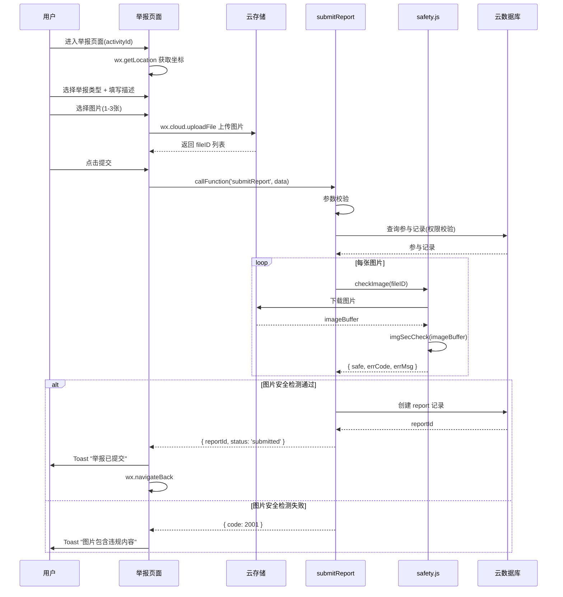

# 设计文档 - 内容安全与举报系统

## 概述

本设计文档描述"不鸽令"微信小程序内容安全审核、举报系统和社交解锁逻辑的完整实现方案，包含：

1. **`_shared/safety.js` 共享模块**：封装微信内容安全 API（文本 `msgSecCheck` + 图片 `imgSecCheck`），供多个云函数复用
2. **`checkTextSafety` 云函数**：独立可调用的文本安全检测入口
3. **`checkImageSafety` 云函数**：独立可调用的图片安全检测入口
4. **`submitReport` 云函数**：举报提交逻辑，含权限校验、图片安全检测、举报记录创建
5. **`pages/report/report` 举报页面**：前端举报表单，含类型选择、图片上传、LBS 定位
6. **`_shared/social.js` 共享模块**：社交解锁判断和倒计时计算纯函数
7. **活动详情页增强**：微信号解锁倒计时 UI

技术栈：微信云函数（Node.js）+ wx-server-sdk + 云数据库 + 云存储 + 微信小程序（WXML/WXSS/JS）。

依赖关系：
- Spec 1（project-scaffold）：`_shared/db.js`、`_shared/config.js`、`utils/api.js`、`utils/location.js`
- Spec 2（activity-crud）：活动和参与记录数据模型、`_shared/response.js`、`_shared/validator.js`
- Spec 6（credit-system）：`_shared/credit.js`（举报确认后信用分扣减，本 Spec 不直接调用，由后续审核流程触发）

## 架构

```mermaid
graph TD
    subgraph Frontend[小程序前端]
        RP[举报页面<br/>pages/report/report]
        AD[活动详情页增强<br/>pages/activity/detail]
        API[utils/api.js]
        LOC[utils/location.js]
    end

    subgraph CloudFunctions[云函数层]
        CTS[checkTextSafety]
        CIS[checkImageSafety]
        SR[submitReport]
    end

    subgraph Shared[共享模块 _shared/]
        SF[safety.js<br/>checkText / checkImage]
        SC[social.js<br/>shouldUnlockWechatId / getUnlockCountdown]
        DB[db.js]
        RSP[response.js]
        VLD[validator.js]
    end

    subgraph External[外部服务]
        MSG[msgSecCheck API]
        IMG[imgSecCheck API]
        CS[云存储]
    end

    subgraph Database[云数据库]
        RPT[(reports 集合)]
        PAR[(participations 集合)]
        ACT[(activities 集合)]
    end

    RP --> API
    RP --> LOC
    AD --> SC
    API --> CTS
    API --> CIS
    API --> SR

    CTS --> SF
    CTS --> RSP
    CIS --> SF
    CIS --> RSP
    SR --> SF
    SR --> DB
    SR --> RSP
    SR --> VLD

    SF --> MSG
    SF --> IMG
    SF --> CS

    SR --> RPT
    SR --> PAR
    SR --> ACT
end
```

### 举报提交流程时序图



### 关键设计决策

1. **safety.js 作为共享模块**：`checkText` 和 `checkImage` 被 createActivity（Spec 2）、submitReport 等多个云函数调用，放在 `_shared/` 下避免代码重复。checkTextSafety 和 checkImageSafety 云函数仅作为独立入口封装，内部调用 safety.js。
2. **图片先上传后检测**：用户在前端通过 `wx.cloud.uploadFile` 上传图片到云存储获取 fileID，submitReport 云函数再从云存储下载图片进行安全检测。这样避免在前端传输大体积 Buffer，且云函数内网下载速度快。
3. **social.js 纯函数设计**：`shouldUnlockWechatId` 和 `getUnlockCountdown` 均为纯函数（无副作用、无外部依赖），接受 `now` 参数而非内部获取时间，便于测试和复用。
4. **举报冻结结算的实现方式**：submitReport 本身不修改活动或参与记录状态。冻结效果通过 executeSplit（Spec 7）在执行分账前检查 reports 集合中是否存在 `submitted` 状态的举报来实现，保持模块间松耦合。
5. **前端图片上传与安全检测分离**：前端负责上传图片到云存储，后端负责安全检测。若检测不通过，图片已上传但举报不会创建，可通过定期清理任务删除孤立图片。

## 组件与接口

### _shared/safety.js 内容安全模块

```javascript
// cloudfunctions/_shared/safety.js
const cloud = require('wx-server-sdk')

/**
 * 文本安全检测
 * @param {string} text - 待检测文本
 * @returns {Promise<{ safe: boolean, errCode: number, errMsg: string }>}
 */
async function checkText(text) {
  try {
    const result = await cloud.openapi.security.msgSecCheck({ content: text })
    if (result.errCode === 0) {
      return { safe: true, errCode: 0, errMsg: 'ok' }
    }
    return { safe: false, errCode: result.errCode, errMsg: result.errMsg }
  } catch (err) {
    return { safe: false, errCode: -1, errMsg: '安全检测服务异常' }
  }
}

/**
 * 图片安全检测
 * @param {string} fileID - 云存储文件 ID
 * @returns {Promise<{ safe: boolean, errCode: number, errMsg: string }>}
 */
async function checkImage(fileID) {
  try {
    const res = await cloud.downloadFile({ fileID })
    const imageBuffer = res.fileContent
    const result = await cloud.openapi.security.imgSecCheck({
      media: { contentType: 'image/png', value: imageBuffer }
    })
    if (result.errCode === 0) {
      return { safe: true, errCode: 0, errMsg: 'ok' }
    }
    return { safe: false, errCode: result.errCode, errMsg: result.errMsg }
  } catch (err) {
    return { safe: false, errCode: -1, errMsg: '图片安全检测服务异常' }
  }
}

module.exports = { checkText, checkImage }
```

### _shared/social.js 社交解锁模块

```javascript
// cloudfunctions/_shared/social.js

const TWO_HOURS_MS = 2 * 60 * 60 * 1000

/**
 * 判断是否应解锁微信号
 * @param {string} participationStatus - 参与记录状态
 * @param {Date|string|number} meetTime - 活动见面时间
 * @param {Date|string|number} now - 当前时间
 * @returns {boolean}
 */
function shouldUnlockWechatId(participationStatus, meetTime, now) {
  if (participationStatus !== 'approved') return false
  const meetMs = new Date(meetTime).getTime()
  const nowMs = new Date(now).getTime()
  if (meetMs <= nowMs) return false // 活动已过期
  return (meetMs - nowMs) <= TWO_HOURS_MS
}

/**
 * 获取距解锁的剩余毫秒数
 * @param {Date|string|number} meetTime - 活动见面时间
 * @param {Date|string|number} now - 当前时间
 * @returns {number} 剩余毫秒数，0 表示已解锁或已过期
 */
function getUnlockCountdown(meetTime, now) {
  const meetMs = new Date(meetTime).getTime()
  const nowMs = new Date(now).getTime()
  if (meetMs <= nowMs) return 0 // 已过期
  const unlockTime = meetMs - TWO_HOURS_MS
  if (nowMs >= unlockTime) return 0 // 已解锁
  return unlockTime - nowMs
}

module.exports = { shouldUnlockWechatId, getUnlockCountdown, TWO_HOURS_MS }
```

### checkTextSafety 云函数

```javascript
// cloudfunctions/checkTextSafety/index.js
const cloud = require('wx-server-sdk')
cloud.init({ env: cloud.DYNAMIC_CURRENT_ENV })

const { checkText } = require('../_shared/safety')
const { successResponse, errorResponse } = require('../_shared/response')

exports.main = async (event, context) => {
  const { text } = event
  if (!text || typeof text !== 'string') {
    return errorResponse(1001, '参数 text 不能为空')
  }
  try {
    const result = await checkText(text)
    return successResponse(result)
  } catch (err) {
    return errorResponse(5001, err.message)
  }
}
```

### checkImageSafety 云函数

```javascript
// cloudfunctions/checkImageSafety/index.js
const cloud = require('wx-server-sdk')
cloud.init({ env: cloud.DYNAMIC_CURRENT_ENV })

const { checkImage } = require('../_shared/safety')
const { successResponse, errorResponse } = require('../_shared/response')

exports.main = async (event, context) => {
  const { fileID } = event
  if (!fileID || typeof fileID !== 'string') {
    return errorResponse(1001, '参数 fileID 不能为空')
  }
  try {
    const result = await checkImage(fileID)
    return successResponse(result)
  } catch (err) {
    return errorResponse(5001, err.message)
  }
}
```

### submitReport 云函数

```javascript
// cloudfunctions/submitReport/index.js
const cloud = require('wx-server-sdk')
cloud.init({ env: cloud.DYNAMIC_CURRENT_ENV })

const { getDb, COLLECTIONS } = require('../_shared/db')
const { checkImage } = require('../_shared/safety')
const { successResponse, errorResponse } = require('../_shared/response')
const { validateString, validateEnum } = require('../_shared/validator')

const REPORT_TYPES = ['initiator_absent', 'mismatch', 'illegal']

exports.main = async (event, context) => {
  const { OPENID } = cloud.getWXContext()
  const { activityId, type, description, images, latitude, longitude } = event
  const db = getDb()

  try {
    // 1. 参数校验
    if (!activityId || typeof activityId !== 'string') {
      return errorResponse(1001, 'activityId 不能为空')
    }
    const typeCheck = validateEnum(type, 'type', REPORT_TYPES)
    if (!typeCheck.valid) return errorResponse(1001, typeCheck.error)

    if (!Array.isArray(images) || images.length < 1 || images.length > 3) {
      return errorResponse(1001, '图片数量必须为 1-3 张')
    }
    if (typeof latitude !== 'number' || typeof longitude !== 'number') {
      return errorResponse(1001, '经纬度参数无效')
    }
    if (description !== undefined && description !== null) {
      if (typeof description !== 'string' || description.length > 200) {
        return errorResponse(1001, '描述最多 200 字符')
      }
    }

    // 2. 权限校验：调用者必须是该活动的 approved 参与者
    const participationResult = await db.collection(COLLECTIONS.PARTICIPATIONS)
      .where({ activityId, participantId: OPENID, status: 'approved' })
      .limit(1)
      .get()

    if (participationResult.data.length === 0) {
      return errorResponse(1002, '仅已通过审批的参与者可提交举报')
    }

    // 3. 图片安全检测
    for (const fileID of images) {
      const result = await checkImage(fileID)
      if (!result.safe) {
        return errorResponse(2001, '图片包含违规内容')
      }
    }

    // 4. 创建举报记录
    const reportData = {
      activityId,
      reporterId: OPENID,
      type,
      description: description || '',
      images,
      location: { latitude, longitude },
      status: 'submitted',
      createdAt: db.serverDate()
    }

    const addResult = await db.collection(COLLECTIONS.REPORTS).add({ data: reportData })

    return successResponse({
      reportId: addResult._id,
      status: 'submitted'
    })
  } catch (err) {
    return errorResponse(5001, err.message)
  }
}
```

### 举报页面

```javascript
// miniprogram/pages/report/report.js
const { callFunction } = require('../../utils/api')
const { getCurrentLocation } = require('../../utils/location')

Page({
  data: {
    activityId: '',
    reportType: '',
    description: '',
    descLength: 0,
    images: [],       // 本地临时路径（预览用）
    fileIDs: [],      // 云存储 fileID
    latitude: null,
    longitude: null,
    locationReady: false,
    submitting: false
  },

  onLoad(options) {
    this.setData({ activityId: options.activityId || '' })
    this.getLocation()
  },

  async getLocation() {
    try {
      const { latitude, longitude } = await getCurrentLocation()
      this.setData({ latitude, longitude, locationReady: true })
    } catch (err) {
      wx.showToast({ title: '请开启位置权限以提交举报', icon: 'none' })
    }
  },

  onTypeChange(e) {
    this.setData({ reportType: e.detail.value })
  },

  onDescInput(e) {
    this.setData({ description: e.detail.value, descLength: e.detail.value.length })
  },

  async chooseImage() {
    if (this.data.images.length >= 3) {
      wx.showToast({ title: '最多上传3张图片', icon: 'none' })
      return
    }
    const res = await wx.chooseImage({
      count: 3 - this.data.images.length,
      sizeType: ['compressed'],
      sourceType: ['camera', 'album']
    })
    const newImages = [...this.data.images, ...res.tempFilePaths].slice(0, 3)
    this.setData({ images: newImages })

    // 上传到云存储
    const uploadPromises = res.tempFilePaths.map(path =>
      wx.cloud.uploadFile({
        cloudPath: `reports/${Date.now()}_${Math.random().toString(36).slice(2)}.png`,
        filePath: path
      })
    )
    const results = await Promise.all(uploadPromises)
    const newFileIDs = [...this.data.fileIDs, ...results.map(r => r.fileID)].slice(0, 3)
    this.setData({ fileIDs: newFileIDs })
  },

  removeImage(e) {
    const idx = e.currentTarget.dataset.index
    const images = [...this.data.images]
    const fileIDs = [...this.data.fileIDs]
    images.splice(idx, 1)
    fileIDs.splice(idx, 1)
    this.setData({ images, fileIDs })
  },

  async submit() {
    // 前端校验
    if (!this.data.reportType) {
      wx.showToast({ title: '请选择举报类型', icon: 'none' })
      return
    }
    if (this.data.fileIDs.length < 1) {
      wx.showToast({ title: '请至少上传1张图片', icon: 'none' })
      return
    }
    if (!this.data.locationReady) {
      wx.showToast({ title: '位置信息获取中，请稍后', icon: 'none' })
      return
    }

    this.setData({ submitting: true })
    try {
      const res = await callFunction('submitReport', {
        activityId: this.data.activityId,
        type: this.data.reportType,
        description: this.data.description,
        images: this.data.fileIDs,
        latitude: this.data.latitude,
        longitude: this.data.longitude
      })

      if (res.code === 0) {
        wx.showToast({ title: '举报已提交', icon: 'success' })
        setTimeout(() => wx.navigateBack(), 1500)
      } else if (res.code === 2001) {
        wx.showToast({ title: '图片包含违规内容', icon: 'none' })
      } else {
        wx.showToast({ title: '举报提交失败，请重试', icon: 'none' })
      }
    } catch (err) {
      wx.showToast({ title: '举报提交失败，请重试', icon: 'none' })
    } finally {
      this.setData({ submitting: false })
    }
  }
})
```

### 活动详情页社交解锁增强

```javascript
// 在 pages/activity/detail/detail.js 中增加倒计时逻辑
// 引入 social.js（前端复制一份纯函数或通过云函数返回计算结果）

/**
 * 格式化倒计时毫秒为 "X小时X分钟" 文案
 * @param {number} ms - 剩余毫秒数
 * @returns {string}
 */
function formatCountdown(ms) {
  if (ms <= 0) return ''
  const totalMinutes = Math.ceil(ms / (60 * 1000))
  const hours = Math.floor(totalMinutes / 60)
  const minutes = totalMinutes % 60
  if (hours > 0 && minutes > 0) return `${hours}小时${minutes}分钟`
  if (hours > 0) return `${hours}小时`
  return `${minutes}分钟`
}

// 在 Page 中增加：
// data: { unlockCountdownText: '', wechatUnlocked: false }
// onShow 中启动定时器，每分钟更新倒计时
// 使用 getUnlockCountdown(meetTime, new Date()) 计算剩余时间
// 使用 formatCountdown 格式化为文案
```

## 数据模型

### reports 集合

| 字段 | 类型 | 必填 | 说明 |
|------|------|------|------|
| _id | string | 自动 | 举报记录 ID（云数据库自动生成） |
| activityId | string | 是 | 关联活动 ID |
| reporterId | string | 是 | 举报人 openId |
| type | string | 是 | 举报类型：`initiator_absent` / `mismatch` / `illegal` |
| description | string | 否 | 补充说明，最多 200 字符，默认空字符串 |
| images | array | 是 | 云存储 fileID 列表，1-3 项 |
| location | object | 是 | `{ latitude: number, longitude: number }` 举报时位置 |
| status | string | 是 | 举报状态：`submitted` / `reviewing` / `confirmed` / `rejected` |
| createdAt | Date | 是 | 创建时间（服务器时间戳） |

### participations 集合（本 Spec 仅读取）

| 字段 | 类型 | 说明 |
|------|------|------|
| activityId | string | 关联活动 ID |
| participantId | string | 参与者 openId |
| status | string | 参与状态，本 Spec 查询 `approved` |

### 数据库索引（建议新增）

| 集合 | 索引字段 | 索引类型 | 用途 |
|------|----------|----------|------|
| reports | activityId + status | 复合索引 | executeSplit 检查待处理举报、按活动查询举报 |
| reports | reporterId + createdAt | 复合索引 | 按举报人查询举报历史 |


## 正确性属性

*正确性属性是一种在系统所有有效执行中都应成立的特征或行为——本质上是关于系统应该做什么的形式化陈述。属性是人类可读规范与机器可验证正确性保证之间的桥梁。*

基于需求验收标准的分析，以下属性可通过属性基测试（Property-Based Testing）验证：

### Property 1: 安全检测返回格式一致性

*For any* 文本或图片安全检测调用（无论底层 API 返回成功、失败还是抛出异常），`checkText` 和 `checkImage` 的返回值应始终包含 `safe`（boolean）、`errCode`（number）、`errMsg`（string）三个字段，且类型正确。

**Validates: Requirements 1.1, 2.1**

### Property 2: 安全检测 errCode 到 safe 的映射正确性

*For any* 底层微信 API 返回的 errCode 值：当 errCode 为 0 时，`safe` 应为 `true`；当 errCode 为任意非 0 值时，`safe` 应为 `false` 且返回的 `errCode` 和 `errMsg` 应与底层 API 返回值一致。

**Validates: Requirements 1.3, 1.4, 2.4, 2.5**

### Property 3: submitReport 参数校验正确性

*For any* 参数组合，当所有字段满足约束条件（activityId 为非空字符串、type 为 `initiator_absent`/`mismatch`/`illegal` 之一、images 为 1-3 项数组、latitude 和 longitude 为数字、description 为空或不超过 200 字符的字符串）时校验应通过；当任一字段不满足约束时应返回错误码 1001。

**Validates: Requirements 3.2, 3.3**

### Property 4: submitReport 权限校验正确性

*For any* 调用者 openId 和活动 activityId 组合，当 participations 集合中不存在 `{ activityId, participantId: openId, status: 'approved' }` 的记录时，submitReport 应返回错误码 1002；当存在时应继续执行后续逻辑。

**Validates: Requirements 3.4, 3.5**

### Property 5: submitReport 图片安全门控

*For any* 图片 fileID 列表（1-3 项），若其中任一图片的 `checkImage` 返回 `safe: false`，submitReport 应返回错误码 2001 且不创建举报记录；若所有图片均返回 `safe: true`，应继续创建举报记录。

**Validates: Requirements 3.6, 3.7**

### Property 6: 举报记录创建完整性

*For any* 通过所有校验的合法举报请求，创建的 Report_Record 应包含所有必填字段（activityId、reporterId、type、images、location、status、createdAt），且 `status` 为 `submitted`、`reporterId` 为调用者 openId、`location` 包含 latitude 和 longitude。

**Validates: Requirements 3.8, 3.9, 6.1, 6.2**

### Property 7: shouldUnlockWechatId 解锁逻辑完整性

*For any* participationStatus（字符串）、meetTime（时间戳）和 now（时间戳）的组合，`shouldUnlockWechatId` 应满足：
- 当且仅当 `participationStatus === 'approved'` 且 `0 < meetTime - now <= 2小时` 时返回 `true`
- 当 `participationStatus !== 'approved'` 时返回 `false`
- 当 `meetTime - now > 2小时` 时返回 `false`
- 当 `meetTime <= now` 时返回 `false`

**Validates: Requirements 5.2, 5.3, 5.4, 5.5**

### Property 8: getUnlockCountdown 倒计时计算正确性

*For any* meetTime（时间戳）和 now（时间戳）的组合，`getUnlockCountdown` 应满足：
- 当 `meetTime - now > 2小时` 时，返回值等于 `meetTime - now - 2小时`（毫秒）
- 当 `0 < meetTime - now <= 2小时` 时，返回值为 0
- 当 `meetTime <= now` 时，返回值为 0
- 返回值始终 >= 0

**Validates: Requirements 5.7, 5.8, 5.9**

## 错误处理

### 统一错误码体系

| 错误码 | 含义 | 触发场景 |
|--------|------|----------|
| 0 | 成功 | 所有操作正常完成 |
| 1001 | 参数校验失败 | 必填参数缺失、类型错误、值超出范围 |
| 1002 | 权限不足 | 非 approved 参与者提交举报 |
| 2001 | 内容安全未通过 | 图片安全检测发现违规内容 |
| 5001 | 系统内部错误 | 数据库操作失败、微信 API 异常等 |

### 各模块错误处理策略

| 模块 | 错误场景 | 处理方式 |
|--------|----------|----------|
| safety.checkText | msgSecCheck 调用异常 | 返回 `{ safe: false, errCode: -1, errMsg: '安全检测服务异常' }`，不抛出异常 |
| safety.checkImage | 云存储下载失败 | 返回 `{ safe: false, errCode: -1, errMsg: '图片安全检测服务异常' }` |
| safety.checkImage | imgSecCheck 调用异常 | 返回 `{ safe: false, errCode: -1, errMsg: '图片安全检测服务异常' }` |
| checkTextSafety | text 参数为空 | 返回 `{ code: 1001, message: '参数 text 不能为空' }` |
| checkImageSafety | fileID 参数为空 | 返回 `{ code: 1001, message: '参数 fileID 不能为空' }` |
| submitReport | 参数校验失败 | 返回 `{ code: 1001, message: 具体原因 }` |
| submitReport | 非 approved 参与者 | 返回 `{ code: 1002, message: '仅已通过审批的参与者可提交举报' }` |
| submitReport | 图片安全检测不通过 | 返回 `{ code: 2001, message: '图片包含违规内容' }` |
| submitReport | 数据库写入失败 | 返回 `{ code: 5001, message: err.message }` |
| Report_Page | 获取位置失败 | 显示 Toast 提示，禁用提交按钮 |
| Report_Page | 图片上传失败 | 显示 Toast "图片上传失败" |
| Report_Page | submitReport 返回 2001 | 显示 Toast "图片包含违规内容" |
| Report_Page | submitReport 返回其他错误 | 显示 Toast "举报提交失败，请重试" |

### safety.js 模块错误处理策略

safety.js 作为共享模块，内部捕获所有异常并返回标准化的失败结果（`safe: false`），不向上抛出异常。这样调用方无需额外的 try-catch 处理安全检测失败的情况，简化调用逻辑。

## 测试策略

### 测试框架选择

- **单元测试**：Jest（与 Spec 1-7 保持一致）
- **属性基测试**：fast-check（JavaScript 生态最成熟的 PBT 库，与 Jest 无缝集成）
- **Mock 方案**：Jest 内置 mock 功能，用于模拟 `wx-server-sdk`、`cloud.openapi`、`cloud.downloadFile`、数据库操作

### 可测试模块拆分

为提高可测试性，核心业务逻辑拆分为纯函数：

| 模块 | 文件 | 可测试函数 |
|------|------|------------|
| 安全检测 | `_shared/safety.js` | `checkText(text)` — 需 mock cloud.openapi |
| 安全检测 | `_shared/safety.js` | `checkImage(fileID)` — 需 mock cloud.downloadFile + cloud.openapi |
| 社交解锁 | `_shared/social.js` | `shouldUnlockWechatId(status, meetTime, now)` — 纯函数，无需 mock |
| 倒计时 | `_shared/social.js` | `getUnlockCountdown(meetTime, now)` — 纯函数，无需 mock |
| 参数校验 | `submitReport/index.js` | 提取 `validateReportParams(params)` 纯函数 |
| 倒计时格式化 | `pages/activity/detail/detail.js` | `formatCountdown(ms)` — 纯函数 |

### 属性基测试配置

- 每个属性测试最少运行 100 次迭代
- 每个测试用注释标注对应的设计属性编号
- 标注格式：`Feature: content-safety-report, Property {N}: {属性标题}`

### 双重测试策略

- **单元测试**：验证具体示例（如 errCode=0 返回 safe:true）、边界情况（如 meetTime 恰好 2 小时、description 恰好 200 字符、images 数组恰好 0/1/3/4 项）和错误条件（如 API 异常、参数缺失）
- **属性基测试**：验证跨所有输入的通用属性（如安全检测返回格式、参数校验、解锁逻辑、倒计时计算）
- 两者互补，单元测试捕获具体 bug，属性测试验证通用正确性
