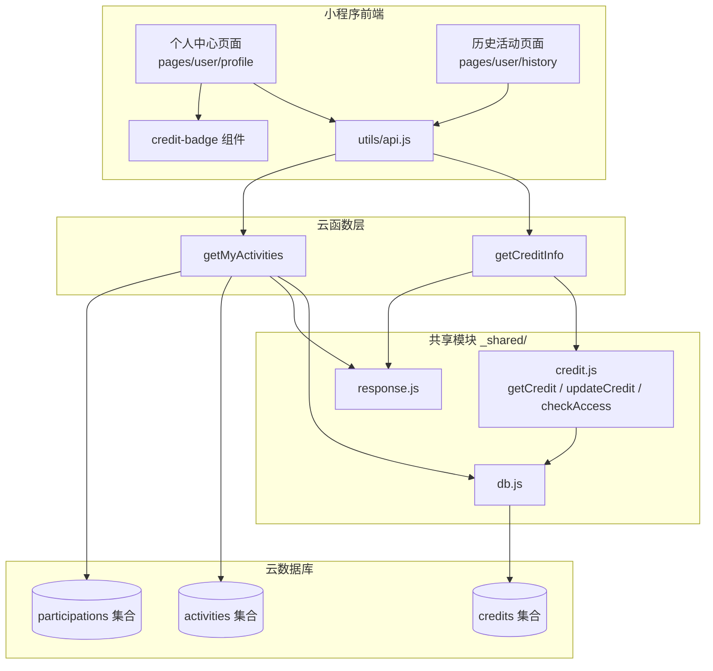

# 设计文档 - 信用分系统

## 概述

本设计文档描述"不鸽令"微信小程序信用分系统的完整实现方案。信用分系统是平台履约保障的核心机制，涵盖以下模块：

1. **`_shared/credit.js` 共享模块**：替换 Spec 1 的骨架代码，实现 `getCredit`、`updateCredit`、`checkAccess` 三个核心方法
2. **`getCreditInfo` 云函数**：面向前端的信用信息查询接口
3. **`getMyActivities` 云函数**：面向前端的活动历史查询接口
4. **`credit-badge` 组件**：信用分展示组件
5. **用户个人中心页面**：信用分概览和导航
6. **历史活动页面**：活动记录列表

技术栈：微信云函数（Node.js）+ wx-server-sdk + 云数据库 + 微信小程序（WXML/WXSS/JS）。

依赖 Spec 1 提供的 `_shared/db.js`（数据库实例和集合常量）、`utils/api.js`（云函数调用封装）、组件和页面骨架。依赖 Spec 2 提供的 `_shared/response.js`（统一响应格式）和活动数据模型。

## 架构



### 关键设计决策

1. **credit.js 作为共享模块**：`getCredit`、`updateCredit`、`checkAccess` 被多个云函数调用（getCreditInfo、createActivity、verifyQrToken、autoArbitrate 等），放在 `_shared/` 下通过相对路径引用，避免代码重复。
2. **自动初始化策略**：`getCredit` 在查询不到记录时自动创建初始记录（score=100），确保任何用户首次访问时都有信用数据，无需单独的注册流程。
3. **分数下限为 0**：`updateCredit` 中 `score` 最低为 0，不允许负分，简化业务逻辑。
4. **状态阈值即时计算**：每次 `updateCredit` 后立即根据新分数重新计算 `status`，确保状态与分数始终一致。
5. **getMyActivities 合并查询**：当 `role` 未指定时，分别查询发起人和参与者记录后合并排序，而非使用复杂的联合查询，保持逻辑清晰。
6. **组件纯展示**：`credit-badge` 仅接收 `score` 属性进行展示，不包含数据获取逻辑，由父页面负责数据加载。

## 组件与接口

### _shared/credit.js 模块

```javascript
const { getDb, COLLECTIONS } = require('./db')

/**
 * 获取用户信用分记录
 * 若不存在则自动创建初始记录
 * @param {string} openId - 用户 openId
 * @returns {Promise<{score: number, totalVerified: number, totalBreached: number, status: string}>}
 */
async function getCredit(openId) {
  // 1. 参数校验：openId 非空字符串
  // 2. 查询 credits 集合，_id = openId
  // 3. 若不存在，创建初始记录 { _id: openId, score: 100, totalVerified: 0, totalBreached: 0, status: 'active', updatedAt: now }
  // 4. 返回 { score, totalVerified, totalBreached, status }
}

/**
 * 更新用户信用分
 * @param {string} openId - 用户 openId
 * @param {number} delta - 分数变化量（正数加分，负数扣分）
 * @param {string} reason - 变更原因：'verified' | 'breached' | 'reported' | 'mutual_noshow'
 * @returns {Promise<{score: number, totalVerified: number, totalBreached: number, status: string, updatedAt: Date}>}
 */
async function updateCredit(openId, delta, reason) {
  // 1. 调用 getCredit(openId) 获取当前记录（确保记录存在）
  // 2. 计算新分数：newScore = Math.max(0, currentScore + delta)
  // 3. 构建更新对象：{ score: newScore, updatedAt: serverDate }
  // 4. 若 delta > 0 且 reason === 'verified'：update.totalVerified = db.command.inc(1)
  // 5. 若 delta < 0 且 reason === 'breached'：update.totalBreached = db.command.inc(1)
  // 6. 计算新状态：newScore < 60 → 'banned'，newScore < 80 → 'restricted'，否则 → 'active'
  // 7. update.status = newStatus
  // 8. 执行 db.collection(COLLECTIONS.CREDITS).doc(openId).update(update)
  // 9. 返回更新后的完整记录
}

/**
 * 检查用户平台访问权限
 * @param {string} openId - 用户 openId
 * @returns {Promise<{allowed: boolean, reason: string, score: number}>}
 */
async function checkAccess(openId) {
  // 1. 调用 getCredit(openId) 获取信用记录
  // 2. score < 60 → { allowed: false, reason: '信用分不足，禁止使用平台', score }
  // 3. score < 80 → { allowed: true, reason: '信用分较低，部分功能受限', score }
  // 4. score >= 80 → { allowed: true, reason: '', score }
}
```

### getCreditInfo 云函数

```javascript
// cloudfunctions/getCreditInfo/index.js
const cloud = require('wx-server-sdk')
cloud.init({ env: cloud.DYNAMIC_CURRENT_ENV })

const { getCredit } = require('../_shared/credit')
const { successResponse, errorResponse } = require('../_shared/response')

/**
 * 信用等级计算（纯函数，可独立测试）
 * @param {number} score - 信用分
 * @returns {string} - 等级描述
 */
function getCreditLevel(score) {
  if (score >= 100) return '信用极好'
  if (score >= 80) return '信用良好'
  if (score >= 60) return '信用一般'
  return '信用较差'
}

exports.main = async (event, context) => {
  const { OPENID } = cloud.getWXContext()
  try {
    const credit = await getCredit(OPENID)
    const level = getCreditLevel(credit.score)
    return successResponse({ ...credit, level })
  } catch (err) {
    return errorResponse(5001, err.message)
  }
}
```

### getMyActivities 云函数

```javascript
// cloudfunctions/getMyActivities/index.js
const cloud = require('wx-server-sdk')
cloud.init({ env: cloud.DYNAMIC_CURRENT_ENV })

const { getDb, COLLECTIONS } = require('../_shared/db')
const { successResponse, errorResponse } = require('../_shared/response')

exports.main = async (event, context) => {
  const { OPENID } = cloud.getWXContext()
  const { role, page = 1, pageSize = 20 } = event
  const db = getDb()

  try {
    let list = []
    let total = 0

    if (role === 'initiator') {
      // 查询发起人活动
      const result = await queryInitiatorActivities(db, OPENID, page, pageSize)
      list = result.list
      total = result.total
    } else if (role === 'participant') {
      // 查询参与者活动（先查 participations，再关联 activities）
      const result = await queryParticipantActivities(db, OPENID, page, pageSize)
      list = result.list
      total = result.total
    } else {
      // 合并查询
      const result = await queryAllActivities(db, OPENID, page, pageSize)
      list = result.list
      total = result.total
    }

    const hasMore = page * pageSize < total
    return successResponse({ list, total, hasMore })
  } catch (err) {
    return errorResponse(5001, err.message)
  }
}

/**
 * 查询用户发起的活动
 */
async function queryInitiatorActivities(db, openId, page, pageSize) {
  const countResult = await db.collection(COLLECTIONS.ACTIVITIES)
    .where({ initiatorId: openId })
    .count()

  const listResult = await db.collection(COLLECTIONS.ACTIVITIES)
    .where({ initiatorId: openId })
    .orderBy('createdAt', 'desc')
    .skip((page - 1) * pageSize)
    .limit(pageSize)
    .get()

  return { list: listResult.data, total: countResult.total }
}

/**
 * 查询用户参与的活动（含参与状态）
 */
async function queryParticipantActivities(db, openId, page, pageSize) {
  // 1. 查询 participations 中 participantId = openId 的记录
  // 2. 提取 activityId 列表
  // 3. 批量查询对应的 activities
  // 4. 合并参与状态到活动记录中
  // 5. 按 createdAt 降序排列
  const countResult = await db.collection(COLLECTIONS.PARTICIPATIONS)
    .where({ participantId: openId })
    .count()

  const participations = await db.collection(COLLECTIONS.PARTICIPATIONS)
    .where({ participantId: openId })
    .orderBy('createdAt', 'desc')
    .skip((page - 1) * pageSize)
    .limit(pageSize)
    .get()

  if (participations.data.length === 0) {
    return { list: [], total: countResult.total }
  }

  const activityIds = participations.data.map(p => p.activityId)
  const activities = await db.collection(COLLECTIONS.ACTIVITIES)
    .where({ _id: db.command.in(activityIds) })
    .get()

  const activityMap = {}
  activities.data.forEach(a => { activityMap[a._id] = a })

  const list = participations.data.map(p => ({
    ...activityMap[p.activityId],
    participationStatus: p.status
  })).filter(item => item._id)

  return { list, total: countResult.total }
}

/**
 * 合并查询发起人和参与者活动
 */
async function queryAllActivities(db, openId, page, pageSize) {
  // 分别查询两种角色的全部记录，合并后按 createdAt 降序排列，再分页
  const [initiatorResult, participantResult] = await Promise.all([
    db.collection(COLLECTIONS.ACTIVITIES)
      .where({ initiatorId: openId })
      .orderBy('createdAt', 'desc')
      .get(),
    queryParticipantActivitiesAll(db, openId)
  ])

  const allActivities = [...initiatorResult.data, ...participantResult]
  allActivities.sort((a, b) => {
    const timeA = a.createdAt ? new Date(a.createdAt).getTime() : 0
    const timeB = b.createdAt ? new Date(b.createdAt).getTime() : 0
    return timeB - timeA
  })

  // 去重（同一活动可能既是发起人又出现在参与记录中，但实际不可能报名自己的活动）
  const seen = new Set()
  const unique = allActivities.filter(a => {
    if (seen.has(a._id)) return false
    seen.add(a._id)
    return true
  })

  const total = unique.length
  const list = unique.slice((page - 1) * pageSize, page * pageSize)
  return { list, total }
}

/**
 * 查询用户参与的全部活动（不分页，用于合并查询）
 */
async function queryParticipantActivitiesAll(db, openId) {
  const participations = await db.collection(COLLECTIONS.PARTICIPATIONS)
    .where({ participantId: openId })
    .get()

  if (participations.data.length === 0) return []

  const activityIds = participations.data.map(p => p.activityId)
  const activities = await db.collection(COLLECTIONS.ACTIVITIES)
    .where({ _id: db.command.in(activityIds) })
    .get()

  const activityMap = {}
  activities.data.forEach(a => { activityMap[a._id] = a })

  return participations.data.map(p => ({
    ...activityMap[p.activityId],
    participationStatus: p.status
  })).filter(item => item._id)
}
```

### credit-badge 组件

```javascript
// miniprogram/components/credit-badge/credit-badge.js
Component({
  properties: {
    score: {
      type: Number,
      value: 0
    }
  },
  observers: {
    'score': function(score) {
      this.setData({ colorClass: getColorClass(score) })
    }
  },
  data: {
    colorClass: 'credit-primary'
  }
})

/**
 * 根据分数返回颜色 class（纯函数，可独立测试）
 * @param {number} score
 * @returns {string}
 */
function getColorClass(score) {
  if (score >= 100) return 'credit-success'
  if (score >= 80) return 'credit-primary'
  if (score >= 60) return 'credit-warning'
  return 'credit-danger'
}
```

```xml
<!-- miniprogram/components/credit-badge/credit-badge.wxml -->
<view class="credit-badge {{colorClass}}">
  契约分 {{score}}
</view>
```

```css
/* miniprogram/components/credit-badge/credit-badge.wxss */
.credit-badge {
  display: inline-block;
  font-size: 22rpx;
  font-weight: 500;
  padding: 4rpx 12rpx;
  border-radius: 8rpx;
}
.credit-success { color: #10B981; background: rgba(16, 185, 129, 0.1); }
.credit-primary { color: #FF6B35; background: rgba(255, 107, 53, 0.1); }
.credit-warning { color: #F59E0B; background: rgba(245, 158, 11, 0.1); }
.credit-danger { color: #EF4444; background: rgba(239, 68, 68, 0.1); }
```

### 个人中心页面

```javascript
// miniprogram/pages/user/profile/profile.js
const { callFunction } = require('../../../utils/api')

Page({
  data: {
    creditInfo: null,
    loading: true
  },
  onShow() {
    this.loadCreditInfo()
  },
  async loadCreditInfo() {
    this.setData({ loading: true })
    try {
      const res = await callFunction('getCreditInfo')
      this.setData({ creditInfo: res.data, loading: false })
    } catch (err) {
      this.setData({ loading: false })
      wx.showToast({ title: '加载失败', icon: 'none' })
    }
  },
  goToHistory(e) {
    const role = e.currentTarget.dataset.role
    wx.navigateTo({ url: `/pages/user/history/history?role=${role}` })
  },
  goToSettings() {
    wx.showToast({ title: '设置功能开发中', icon: 'none' })
  }
})
```

### 历史活动页面

```javascript
// miniprogram/pages/user/history/history.js
const { callFunction } = require('../../../utils/api')

Page({
  data: {
    role: '',
    list: [],
    total: 0,
    hasMore: false,
    page: 1,
    pageSize: 20,
    loading: true,
    isEmpty: false
  },
  onLoad(options) {
    this.setData({ role: options.role || '' })
    this.loadActivities()
  },
  async loadActivities() {
    this.setData({ loading: true })
    try {
      const res = await callFunction('getMyActivities', {
        role: this.data.role || undefined,
        page: this.data.page,
        pageSize: this.data.pageSize
      })
      const { list, total, hasMore } = res.data
      this.setData({
        list: this.data.page === 1 ? list : [...this.data.list, ...list],
        total,
        hasMore,
        loading: false,
        isEmpty: this.data.page === 1 && list.length === 0
      })
    } catch (err) {
      this.setData({ loading: false })
      wx.showToast({ title: '加载失败', icon: 'none' })
    }
  },
  onPullDownRefresh() {
    this.setData({ page: 1 })
    this.loadActivities().then(() => wx.stopPullDownRefresh())
  },
  onReachBottom() {
    if (!this.data.hasMore || this.data.loading) return
    this.setData({ page: this.data.page + 1 })
    this.loadActivities()
  }
})
```

## 数据模型

### credits 集合

| 字段 | 类型 | 说明 |
|------|------|------|
| _id | string | 用户 openId（作为主键） |
| score | number | 当前信用分（初始 100，最低 0） |
| totalVerified | number | 累计核销成功次数（初始 0） |
| totalBreached | number | 累计违约次数（初始 0） |
| status | string | 信用状态：`active`（≥80）/ `restricted`（60-79）/ `banned`（<60） |
| updatedAt | Date | 最后更新时间（服务器时间） |

### activities 集合（本 Spec 仅读取）

| 字段 | 类型 | 说明 |
|------|------|------|
| _id | string | 活动 ID |
| initiatorId | string | 发起人 openId |
| title | string | 活动主题 |
| status | string | 活动状态 |
| createdAt | Date | 创建时间 |

### participations 集合（本 Spec 仅读取）

| 字段 | 类型 | 说明 |
|------|------|------|
| _id | string | 参与记录 ID |
| activityId | string | 关联活动 ID |
| participantId | string | 参与者 openId |
| status | string | 参与状态 |
| createdAt | Date | 创建时间 |

### 数据库索引

| 集合 | 索引字段 | 索引类型 | 用途 |
|------|----------|----------|------|
| credits | _id | 主键（默认） | 按 openId 查询信用记录 |
| activities | initiatorId + createdAt | 复合索引 | getMyActivities 发起人查询 |
| participations | participantId + createdAt | 复合索引 | getMyActivities 参与者查询 |


## 正确性属性

*正确性属性是一种在系统所有有效执行中都应成立的特征或行为——本质上是关于系统应该做什么的形式化陈述。属性是人类可读规范与机器可验证正确性保证之间的桥梁。*

基于需求验收标准的分析，以下属性可通过属性基测试（Property-Based Testing）验证：

### Property 1: getCredit 自动初始化与返回一致性

*For any* 有效的 openId 字符串，调用 `getCredit(openId)` 应始终返回包含 `score`（number）、`totalVerified`（number）、`totalBreached`（number）、`status`（string）四个字段的对象。若该 openId 在 credits 集合中不存在记录，返回的对象应为 `{ score: 100, totalVerified: 0, totalBreached: 0, status: 'active' }`。

**Validates: Requirements 1.1, 1.2, 1.3**

### Property 2: updateCredit 分数计算正确性

*For any* 当前信用分 score（0-200 范围内的整数）和任意整数 delta，调用 `updateCredit` 后的新分数应等于 `Math.max(0, score + delta)`。分数永远不会为负数。

**Validates: Requirements 2.1, 2.2**

### Property 3: updateCredit 计数器递增正确性

*For any* delta 和 reason 组合：当 `delta > 0` 且 `reason === 'verified'` 时，`totalVerified` 应增加 1 且 `totalBreached` 不变；当 `delta < 0` 且 `reason === 'breached'` 时，`totalBreached` 应增加 1 且 `totalVerified` 不变；其他组合下两个计数器均不变。

**Validates: Requirements 2.3, 2.4**

### Property 4: 信用分到状态映射一致性

*For any* 信用分 score（非负整数），状态映射应满足：`score < 60` → `status === 'banned'`，`60 <= score < 80` → `status === 'restricted'`，`score >= 80` → `status === 'active'`。此映射在 `updateCredit` 的状态计算和 `checkAccess` 的返回结果中应保持一致。当 `status === 'banned'` 时 `checkAccess` 返回 `allowed: false`；当 `status === 'restricted'` 时返回 `allowed: true` 且 reason 非空；当 `status === 'active'` 时返回 `allowed: true` 且 reason 为空字符串。

**Validates: Requirements 2.5, 3.1, 3.2, 3.3**

### Property 5: 信用等级描述映射正确性

*For any* 信用分 score（非负整数），`getCreditLevel(score)` 应满足：`score >= 100` → `'信用极好'`，`80 <= score < 100` → `'信用良好'`，`60 <= score < 80` → `'信用一般'`，`score < 60` → `'信用较差'`。

**Validates: Requirements 4.3**

### Property 6: 发起人活动查询过滤正确性

*For any* 活动集合和调用者 openId，当 `role === 'initiator'` 时，`getMyActivities` 返回的每条活动记录的 `initiatorId` 应等于调用者的 openId。

**Validates: Requirements 5.2**

### Property 7: 参与者活动查询过滤与状态附带

*For any* 参与记录集合、活动集合和调用者 openId，当 `role === 'participant'` 时，`getMyActivities` 返回的每条记录应对应一条 `participantId` 等于调用者 openId 的参与记录，且每条记录应包含 `participationStatus` 字段。

**Validates: Requirements 5.3, 5.7**

### Property 8: 合并查询完整性

*For any* 活动集合、参与记录集合和调用者 openId，当 `role` 未指定时，`getMyActivities` 返回的活动集合应为发起人活动和参与者活动的并集（去重后）。

**Validates: Requirements 5.4**

### Property 9: 活动列表按创建时间降序排列

*For any* `getMyActivities` 返回的活动列表（长度 ≥ 2），列表中第 i 条记录的 `createdAt` 应大于等于第 i+1 条记录的 `createdAt`。

**Validates: Requirements 5.5**

### Property 10: 分页逻辑正确性

*For any* 总数据量 total、页码 page 和每页条数 pageSize，返回的数据条数应为 `min(pageSize, max(0, total - (page-1)*pageSize))`，`hasMore` 应等于 `page * pageSize < total`。

**Validates: Requirements 5.6**

### Property 11: 信用徽章颜色映射正确性

*For any* 信用分 score（非负整数），`getColorClass(score)` 应满足：`score >= 100` → `'credit-success'`，`80 <= score < 100` → `'credit-primary'`，`60 <= score < 80` → `'credit-warning'`，`score < 60` → `'credit-danger'`。

**Validates: Requirements 6.2, 6.3, 6.4, 6.5**

## 错误处理

### 统一错误码体系

| 错误码 | 含义 | 触发场景 |
|--------|------|----------|
| 0 | 成功 | 所有操作正常完成 |
| 1001 | 参数校验失败 | openId 为空、role 值非法 |
| 5001 | 系统内部错误 | 数据库操作失败、未预期异常 |

### 各模块错误处理策略

| 模块 | 错误场景 | 处理方式 |
|------|----------|----------|
| credit.getCredit | openId 为空或非字符串 | 抛出参数校验错误 |
| credit.getCredit | 数据库查询失败 | 向上抛出异常，由调用方处理 |
| credit.getCredit | 自动创建记录失败 | 向上抛出异常 |
| credit.updateCredit | 数据库更新失败 | 向上抛出异常 |
| getCreditInfo | getCredit 调用失败 | 返回 `{ code: 5001, message: err.message }` |
| getMyActivities | 数据库查询失败 | 返回 `{ code: 5001, message: err.message }` |
| Profile 页面 | getCreditInfo 调用失败 | 显示 Toast "加载失败"，保持页面可用 |
| History 页面 | getMyActivities 调用失败 | 显示 Toast "加载失败"，保持页面可用 |

### credit.js 模块错误传播策略

`credit.js` 作为共享模块，不捕获数据库异常，而是向上抛出，由调用方（云函数）统一处理并返回标准错误响应。这样保持模块职责单一，错误处理集中在云函数入口层。

## 测试策略

### 测试框架选择

- **单元测试**：Jest（与 Spec 1、Spec 2 保持一致）
- **属性基测试**：fast-check（JavaScript 生态最成熟的 PBT 库，与 Jest 无缝集成）
- **Mock 方案**：Jest 内置 mock 功能，用于模拟 `wx-server-sdk`、数据库操作

### 可测试模块拆分

为提高可测试性，将核心业务逻辑拆分为纯函数：

| 模块 | 文件 | 可测试纯函数 |
|------|------|------------|
| 分数计算 | `_shared/credit.js` | `calculateNewScore(currentScore, delta)` → `Math.max(0, currentScore + delta)` |
| 状态映射 | `_shared/credit.js` | `calculateStatus(score)` → `'active'` / `'restricted'` / `'banned'` |
| 等级描述 | `getCreditInfo/index.js` | `getCreditLevel(score)` → 等级文案 |
| 颜色映射 | `credit-badge/credit-badge.js` | `getColorClass(score)` → CSS class 名 |
| 分页计算 | `getMyActivities/index.js` | `hasMore = page * pageSize < total` |

### 属性基测试配置

- 每个属性测试最少运行 100 次迭代
- 每个测试用注释标注对应的设计属性编号
- 标注格式：`Feature: credit-system, Property {N}: {属性标题}`

### 双重测试策略

- **单元测试**：验证具体示例（如 score=100 初始值）、边界情况（如 score=0 时再扣分、score 恰好在阈值 60/80/100 上）和错误条件（如 openId 为空）
- **属性基测试**：验证跨所有输入的通用属性（如分数计算、状态映射、颜色映射、排序、分页）
- 两者互补，单元测试捕获具体 bug，属性测试验证通用正确性
