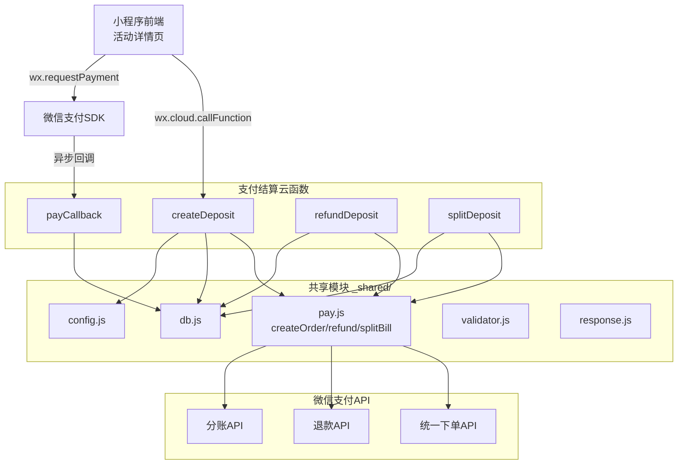
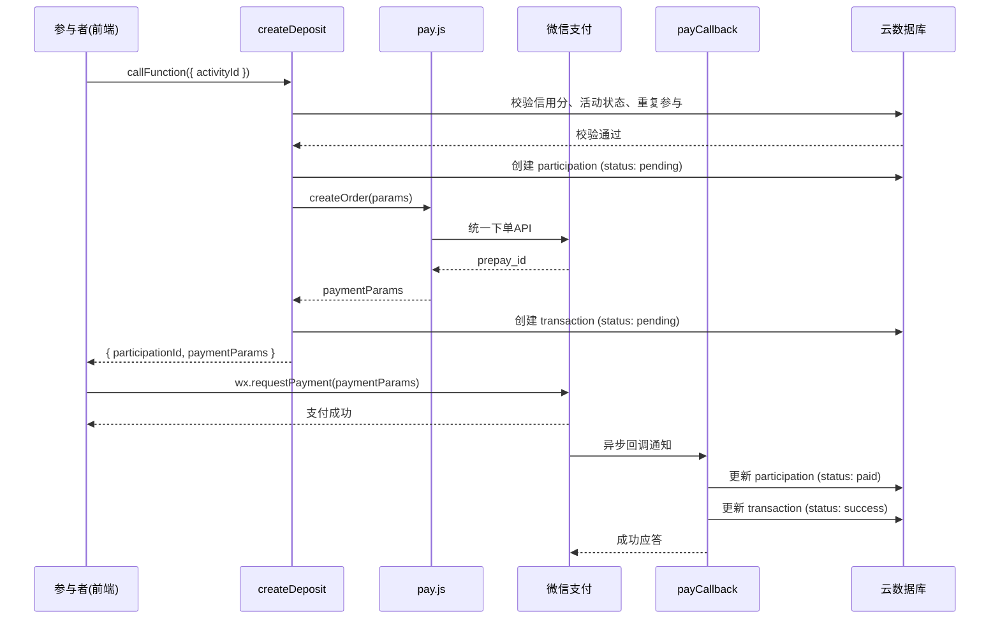
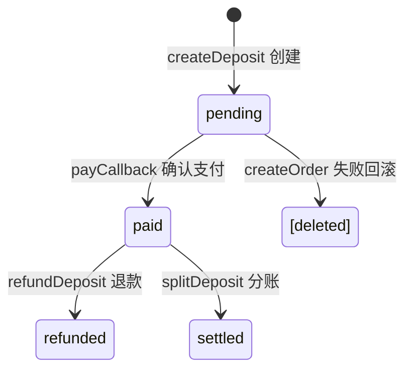

# 设计文档 - 支付结算系统

## 概述

本设计文档描述"不鸽令"微信小程序支付结算后端的完整实现方案，包含 `_shared/pay.js` 支付模块的完整实现、4 个支付相关云函数（createDeposit、payCallback、refundDeposit、splitDeposit），以及活动详情页的前端支付流程集成。

技术栈：微信云函数（Node.js）+ wx-server-sdk + 微信支付 API v3 + 云数据库。

依赖关系：
- Spec 1（project-scaffold）：`_shared/db.js`、`_shared/config.js`、`_shared/pay.js` 骨架
- Spec 2（activity-crud）：活动和参与记录数据模型、`_shared/validator.js`、`_shared/response.js`
- Spec 3（activity-pages）：活动详情页（集成支付按钮）

## 架构



### 支付流程时序图



### 关键设计决策

1. **参与记录初始状态为 pending**：createDeposit 创建参与记录时 status 设为 `pending`（非 `paid`），由 payCallback 确认支付后更新为 `paid`。这避免了乐观更新导致的数据不一致。
2. **金额全程使用分**：所有金额以整数"分"存储和计算，前端显示时除以 100 转为元，避免浮点精度问题。
3. **分账金额计算策略**：平台 30% 向下取整到分，发起人获得剩余金额（总额 - 平台金额），确保分账总额等于押金总额。
4. **退款和分账失败不回滚状态**：调用微信支付 API 失败时直接返回错误码，不修改已有记录状态，由调用方决定重试策略。
5. **payCallback 幂等处理**：回调中先检查参与记录当前状态，若已为 `paid` 则直接返回成功，避免重复处理。
6. **createDeposit 失败回滚**：若 pay.createOrder() 失败，删除已创建的参与记录和流水记录，保持数据一致性。

## 组件与接口

### _shared/pay.js 支付模块

替换 Spec 1 中的骨架实现，提供完整的微信支付封装：

```javascript
// cloudfunctions/_shared/pay.js
const crypto = require('crypto')
const https = require('https')
const fs = require('fs')
const { getConfig } = require('./config')

/**
 * 生成随机字符串
 * @param {number} length - 字符串长度
 * @returns {string}
 */
function generateNonceStr(length = 32) { }

/**
 * 生成微信支付签名
 * @param {object} params - 待签名参数
 * @param {string} apiKey - API密钥
 * @returns {string} MD5签名
 */
function generateSign(params, apiKey) { }

/**
 * 创建支付订单（统一下单）
 * @param {object} params
 * @param {string} params.openId - 用户openId
 * @param {string} params.outTradeNo - 商户订单号
 * @param {number} params.totalFee - 金额（分）
 * @param {string} params.description - 商品描述
 * @param {string} params.notifyUrl - 回调地址
 * @returns {Promise<{timeStamp, nonceStr, package, signType, paySign}>}
 */
async function createOrder({ openId, outTradeNo, totalFee, description, notifyUrl }) { }

/**
 * 发起退款
 * @param {object} params
 * @param {string} params.outTradeNo - 原商户订单号
 * @param {string} params.outRefundNo - 退款单号
 * @param {number} params.totalFee - 原订单金额（分）
 * @param {number} params.refundFee - 退款金额（分）
 * @returns {Promise<object>} 退款结果
 */
async function refund({ outTradeNo, outRefundNo, totalFee, refundFee }) { }

/**
 * 发起分账
 * @param {object} params
 * @param {string} params.transactionId - 微信支付订单号
 * @param {string} params.outOrderNo - 商户分账单号
 * @param {Array<{type, account, amount, description}>} params.receivers - 分账接收方
 * @returns {Promise<object>} 分账结果
 */
async function splitBill({ transactionId, outOrderNo, receivers }) { }

/**
 * 验证微信支付回调签名
 * @param {object} notification - 回调通知数据
 * @param {string} apiKey - API密钥
 * @returns {boolean} 签名是否合法
 */
function verifyCallbackSign(notification, apiKey) { }

module.exports = { createOrder, refund, splitBill, verifyCallbackSign, generateNonceStr }
```

### createDeposit 云函数

```javascript
// cloudfunctions/createDeposit/index.js
const cloud = require('wx-server-sdk')
cloud.init({ env: cloud.DYNAMIC_CURRENT_ENV })

const { getDb, COLLECTIONS } = require('../_shared/db')
const { getConfig } = require('../_shared/config')
const { createOrder } = require('../_shared/pay')
const { successResponse, errorResponse } = require('../_shared/response')

exports.main = async (event, context) => {
  const { OPENID: openId } = cloud.getWXContext()
  const { activityId } = event
  const db = getDb()

  // 1. 参数校验
  // 2. 查询信用分 → < 60 返回 2002
  // 3. 查询活动记录 → 不存在返回 1003
  // 4. 校验活动状态为 pending → 否则返回 1004
  // 5. 校验非发起人 → 否则返回 1004
  // 6. 校验未重复参与 → 否则返回 1004
  // 7. 生成 outTradeNo
  // 8. 创建 participation 记录 (status: pending)
  // 9. 调用 pay.createOrder() 获取支付参数
  // 10. 创建 transaction 记录 (type: deposit, status: pending)
  // 11. 返回 { participationId, paymentParams }
  // 异常: 若 createOrder 失败，删除 participation 和 transaction，返回 3001
}
```

**商户订单号生成策略**：

```javascript
function generateOutTradeNo() {
  const timestamp = Date.now().toString()
  const random = Math.random().toString(36).substring(2, 8)
  return `BGL${timestamp}${random}`
}
```

### payCallback 云函数

```javascript
// cloudfunctions/payCallback/index.js
const cloud = require('wx-server-sdk')
cloud.init({ env: cloud.DYNAMIC_CURRENT_ENV })

const { getDb, COLLECTIONS } = require('../_shared/db')
const { verifyCallbackSign } = require('../_shared/pay')
const { getConfig } = require('../_shared/config')

exports.main = async (event, context) => {
  // 1. 解析回调通知数据
  // 2. 验证签名 → 失败返回 FAIL
  // 3. 解析支付结果
  // 4. 若支付成功：
  //    a. 根据 out_trade_no 查找 transaction 记录
  //    b. 根据 transaction 找到 participation 记录
  //    c. 幂等检查：若 participation.status 已为 paid，直接返回 SUCCESS
  //    d. 更新 participation.status → paid，设置 paymentId
  //    e. 更新 transaction.status → success，设置 wxPayOrderId
  // 5. 若支付失败：
  //    a. 更新 transaction.status → failed
  // 6. 返回 SUCCESS 应答
}
```

**回调应答格式**：

```javascript
// 成功应答
return { errcode: 0, errmsg: 'SUCCESS' }

// 失败应答
return { errcode: -1, errmsg: 'FAIL' }
```

### refundDeposit 云函数

```javascript
// cloudfunctions/refundDeposit/index.js
exports.main = async (event, context) => {
  const { participationId } = event
  const db = getDb()

  // 1. 参数校验
  // 2. 查询 participation 记录 → 不存在返回 1003
  // 3. 查询关联的 deposit 类型且 success 状态的 transaction → 不存在返回 1004
  // 4. 生成 outRefundNo
  // 5. 调用 pay.refund() 发起全额退款
  // 6. 更新 participation.status → refunded
  // 7. 创建 refund 类型的 transaction 记录
  // 8. 返回成功
  // 异常: 若 refund 失败，返回 3002
}
```

### splitDeposit 云函数

```javascript
// cloudfunctions/splitDeposit/index.js
exports.main = async (event, context) => {
  const { participationId, activityId } = event
  const db = getDb()

  // 1. 参数校验
  // 2. 查询 participation 记录 → 不存在返回 1003
  // 3. 查询 activity 记录 → 不存在返回 1003
  // 4. 查询关联的 deposit 类型且 success 状态的 transaction → 不存在返回 1004
  // 5. 计算分账金额：
  //    platformAmount = Math.floor(depositAmount * 0.3)
  //    initiatorAmount = depositAmount - platformAmount
  // 6. 构建 receivers 数组
  // 7. 调用 pay.splitBill()
  // 8. 创建两条 transaction 记录 (split_platform + split_initiator)
  // 9. 更新 participation.status → settled
  // 10. 返回成功
  // 异常: 若 splitBill 失败，返回 3003
}
```

**分账金额计算**：

```javascript
function calculateSplitAmounts(depositAmount) {
  const platformAmount = Math.floor(depositAmount * 0.3)
  const initiatorAmount = depositAmount - platformAmount
  return { platformAmount, initiatorAmount }
}
```

### 前端支付流程（活动详情页集成）

在 Spec 3 的活动详情页 `pages/activity/detail/detail.js` 中新增支付逻辑：

```javascript
// pages/activity/detail/detail.js 新增方法

/**
 * 将分为单位的金额转换为元显示
 * @param {number} amountInCents - 金额（分）
 * @returns {string} 格式化后的金额字符串（如 "9.9"）
 */
function formatAmount(amountInCents) {
  return (amountInCents / 100).toFixed(1)
}

/**
 * 判断是否显示报名按钮
 * @param {object} activity - 活动记录
 * @param {string} openId - 当前用户openId
 * @param {object|null} myParticipation - 当前用户参与记录
 * @returns {boolean}
 */
function shouldShowPayButton(activity, openId, myParticipation) {
  return activity.status === 'pending'
    && activity.initiatorId !== openId
    && !myParticipation
}

/**
 * 处理报名支付
 */
async function handleDeposit() {
  // 1. 设置 loading 状态，禁用按钮
  // 2. 调用 createDeposit 云函数
  // 3. 成功后调用 wx.requestPayment(paymentParams)
  // 4. 支付成功：showToast("报名成功")，刷新页面
  // 5. 支付失败/取消：showToast 对应提示
  // 6. 错误处理：根据错误码显示对应提示
  // 7. 恢复按钮状态
}
```

## 数据模型

### participations 集合（本 Spec 写入字段）

| 字段 | 类型 | 说明 | 写入时机 |
|------|------|------|----------|
| _id | string | 参与记录 ID（自动生成） | createDeposit |
| activityId | string | 关联活动 ID | createDeposit |
| participantId | string | 参与者 openId | createDeposit |
| depositAmount | number | 支付金额（分） | createDeposit |
| paymentId | string | 微信支付订单号 | payCallback |
| status | string | 状态流转：`pending` → `paid` → `refunded`/`settled` | createDeposit/payCallback/refundDeposit/splitDeposit |
| createdAt | Date | 创建时间 | createDeposit |

**状态流转图**：



### transactions 集合

| 字段 | 类型 | 说明 | 写入时机 |
|------|------|------|----------|
| _id | string | 流水 ID（自动生成） | 各云函数 |
| activityId | string | 关联活动 ID | 各云函数 |
| participationId | string | 关联参与记录 ID | 各云函数 |
| type | string | `deposit`/`refund`/`split_platform`/`split_initiator` | 各云函数 |
| amount | number | 金额（分） | 各云函数 |
| outTradeNo | string | 商户订单号 | createDeposit |
| wxPayOrderId | string | 微信支付订单号 | payCallback |
| status | string | `pending`/`success`/`failed` | 各云函数 |
| createdAt | Date | 创建时间 | 各云函数 |

### activities 集合（本 Spec 仅读取）

读取字段：`_id`、`initiatorId`、`depositTier`、`status`

### credits 集合（本 Spec 仅读取）

读取字段：`_id`（openId）、`score`

### 数据库索引（新增）

| 集合 | 索引字段 | 索引类型 | 用途 |
|------|----------|----------|------|
| transactions | outTradeNo | 唯一索引 | payCallback 根据订单号查找流水 |
| transactions | participationId + type | 复合索引 | 退款/分账时查找关联的 deposit 流水 |


## 正确性属性

*正确性属性是一种在系统所有有效执行中都应成立的特征或行为——本质上是关于系统应该做什么的形式化陈述。属性是人类可读规范与机器可验证正确性保证之间的桥梁。*

### Property 1: 分账金额不变量

*For any* 押金金额（depositAmount 为 990/1990/2990/3990/4990 之一），计算得到的平台金额（`Math.floor(depositAmount * 0.3)`）与发起人金额（`depositAmount - platformAmount`）之和应严格等于原始押金金额，且平台金额 > 0，发起人金额 > 0。

**Validates: Requirements 5.7**

### Property 2: createDeposit 信用分校验

*For any* 用户信用分值，当信用分 < 60 时 createDeposit 应返回错误码 2002；当信用分 >= 60 时应继续执行后续逻辑（不因信用分被拒绝）。

**Validates: Requirements 2.5**

### Property 3: createDeposit 活动状态校验

*For any* 活动状态值（pending/confirmed/verified/expired/settled），当状态不为 `pending` 时 createDeposit 应返回错误码 1004；当状态为 `pending` 时应继续执行后续逻辑。

**Validates: Requirements 2.7**

### Property 4: createDeposit 自参与防护

*For any* 用户 openId 和活动 initiatorId 组合，当 openId 与 initiatorId 相同时 createDeposit 应返回错误码 1004；当不同时应继续执行后续逻辑。

**Validates: Requirements 2.8**

### Property 5: createDeposit 重复参与防护

*For any* 用户在某活动中已有的参与记录状态（paid/approved/verified/breached/settled），createDeposit 应返回错误码 1004；仅当用户无参与记录或仅有 `rejected` 状态的记录时，应允许继续。

**Validates: Requirements 2.9**

### Property 6: createDeposit 失败回滚

*For any* createDeposit 调用中 pay.createOrder() 失败的情况，调用完成后数据库中应不存在该次调用创建的 participation 记录和 transaction 记录（即回滚清理完成）。

**Validates: Requirements 2.16**

### Property 7: 商户订单号唯一性

*For any* 两次独立的订单号生成调用（generateOutTradeNo 或 generateOutRefundNo），生成的订单号应互不相同。

**Validates: Requirements 2.11, 4.6**

### Property 8: payCallback 签名验证

*For any* 回调通知数据和 API 密钥组合，使用正确密钥生成的签名应验证通过；使用错误密钥或篡改数据后的签名应验证失败。

**Validates: Requirements 3.1**

### Property 9: payCallback 状态同步更新

*For any* 支付成功的回调通知（包含有效的 out_trade_no），处理完成后对应的 participation 记录 status 应为 `paid`，对应的 transaction 记录 status 应为 `success`，且 transaction 的 wxPayOrderId 应被设置。

**Validates: Requirements 3.6, 3.7**

### Property 10: refundDeposit 全额退款

*For any* 合法的退款操作，调用 pay.refund() 时传入的 refundFee 应等于 totalFee（全额退款），且操作完成后 participation 的 status 应为 `refunded`，并存在一条 type 为 `refund` 的 transaction 记录。

**Validates: Requirements 4.7, 4.8, 4.9**

### Property 11: splitDeposit 完整操作

*For any* 合法的分账操作，操作完成后应存在两条新的 transaction 记录（type 分别为 `split_platform` 和 `split_initiator`），两条记录的 amount 之和等于原始押金金额，且 participation 的 status 应为 `settled`。

**Validates: Requirements 5.8, 5.9, 5.10**

### Property 12: 报名按钮显示条件

*For any* 活动状态、用户 openId、活动 initiatorId 和参与记录组合，报名按钮应仅在以下条件全部满足时显示：活动状态为 `pending`、用户非发起人、用户无现有参与记录。

**Validates: Requirements 6.1**

### Property 13: 金额格式化

*For any* 以分为单位的押金金额（正整数），格式化为元显示时应等于 `(amount / 100).toFixed(1)`，且格式化后再乘以 100 应能还原为原始金额（四舍五入到整数）。

**Validates: Requirements 6.1**

## 错误处理

### 统一错误码体系

| 错误码 | 含义 | 触发场景 |
|--------|------|----------|
| 0 | 成功 | 所有操作正常完成 |
| 1001 | 参数校验失败 | activityId/participationId 缺失或为空 |
| 1003 | 资源不存在 | 活动记录或参与记录不存在 |
| 1004 | 状态不允许 | 重复参与、自参与、活动非 pending、无可退款/分账记录 |
| 2002 | 信用分不足 | 信用分 < 60 |
| 3001 | 微信支付下单失败 | pay.createOrder() 调用失败 |
| 3002 | 微信退款失败 | pay.refund() 调用失败 |
| 3003 | 微信分账失败 | pay.splitBill() 调用失败 |
| 5001 | 系统内部错误 | 未预期的异常 |

### 各云函数错误处理策略

| 云函数 | 错误场景 | 处理方式 |
|--------|----------|----------|
| createDeposit | 信用分查询失败 | 返回 5001，记录错误日志 |
| createDeposit | pay.createOrder() 失败 | 回滚已创建的 participation 和 transaction 记录，返回 3001 |
| createDeposit | 数据库写入失败 | 返回 5001，记录错误日志 |
| payCallback | 签名验证失败 | 返回 FAIL 应答 |
| payCallback | 参与记录不存在 | 记录错误日志，返回 SUCCESS（避免微信重复通知） |
| payCallback | 数据库更新失败 | 返回 FAIL 应答（微信会重试） |
| refundDeposit | pay.refund() 失败 | 返回 3002，不修改 participation 状态 |
| splitDeposit | pay.splitBill() 失败 | 返回 3003，不修改 participation 状态 |

### 统一响应格式

复用 Spec 2 的 `_shared/response.js`：

```javascript
const { successResponse, errorResponse } = require('../_shared/response')
```

## 测试策略

### 测试框架选择

- **单元测试**：Jest（与 Spec 1、Spec 2 保持一致）
- **属性基测试**：fast-check（JavaScript 生态最成熟的 PBT 库）
- **Mock 方案**：Jest 内置 mock 功能，用于模拟 `wx-server-sdk`、微信支付 API、数据库操作

### 可测试模块拆分

为提高可测试性，将核心业务逻辑拆分为独立的纯函数：

| 模块 | 文件 | 可测试函数 |
|------|------|------------|
| 分账计算 | `_shared/pay.js` 或 splitDeposit 内部 | `calculateSplitAmounts(depositAmount)` |
| 签名生成/验证 | `_shared/pay.js` | `generateSign(params, apiKey)`, `verifyCallbackSign(notification, apiKey)` |
| 订单号生成 | `_shared/pay.js` 或各云函数内部 | `generateOutTradeNo()`, `generateOutRefundNo()` |
| 金额格式化 | 前端 utils | `formatAmount(amountInCents)` |
| 按钮显示逻辑 | 前端 utils | `shouldShowPayButton(activity, openId, myParticipation)` |

### 属性基测试配置

- 每个属性测试最少运行 100 次迭代
- 每个测试用注释标注对应的设计属性编号
- 标注格式：`Feature: payment-settlement, Property {N}: {属性标题}`

### 双重测试策略

- **单元测试**：验证具体示例（如特定错误码返回、特定金额的分账结果）、边界情况（如最小/最大押金档位）和错误条件（如资源不存在、API 调用失败）
- **属性基测试**：验证跨所有输入的通用属性（如分账金额不变量、信用分校验、状态校验、签名验证）
- 两者互补，单元测试捕获具体 bug，属性测试验证通用正确性
