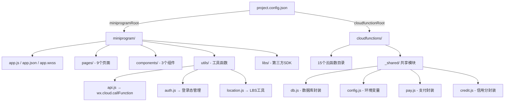

# 设计文档 - 项目脚手架初始化

## 概述

本设计文档描述"不鸽令"微信小程序项目脚手架的技术实现方案。脚手架的目标是创建完整的项目目录结构、全局样式系统、云开发初始化代码、工具函数封装和应用配置，为后续业务功能开发提供统一的基础框架。

技术栈：微信小程序（WXML + WXSS + JS）+ 云开发 CloudBase + 腾讯地图 SDK。

## 架构

项目采用微信小程序标准的前后端分离架构：

```
项目根目录/
├── miniprogram/          ← 小程序前端（页面、组件、工具、静态资源）
├── cloudfunctions/       ← 云函数后端（业务逻辑、共享模块）
└── project.config.json   ← 项目配置（连接前后端）
```



### 关键设计决策

1. **前后端目录分离**：`miniprogram/` 和 `cloudfunctions/` 在项目根目录平级，通过 `project.config.json` 关联，这是微信云开发的标准结构。
2. **共享模块采用相对路径引用**：云函数通过 `require('../_shared/db')` 引用共享模块，无需 npm 发布，简单直接。
3. **工具函数模块化**：`api.js`、`auth.js`、`location.js` 各司其职，避免单一大文件。
4. **CSS 变量方案**：使用 `page` 选择器定义 CSS 自定义属性（CSS Variables），所有页面和组件通过 `var()` 引用，便于主题统一和后续调整。

## 组件与接口

### 前端工具模块

#### API_Util (`miniprogram/utils/api.js`)

```javascript
/**
 * 统一云函数调用封装
 * @param {string} name - 云函数名称
 * @param {object} data - 传入参数
 * @param {object} options - 可选配置
 * @param {boolean} options.showLoading - 是否显示 loading，默认 false
 * @returns {Promise<object>} - 云函数返回的 result
 * @throws {object} - { code: string, message: string }
 */
function callFunction(name, data = {}, options = {}) { }
```

#### Auth_Util (`miniprogram/utils/auth.js`)

```javascript
/**
 * 登录并获取 openId
 * @returns {Promise<string>} - 用户 openId
 * @throws {object} - { code: string, message: string }
 */
function login() { }

/**
 * 获取 openId（优先缓存）
 * @returns {Promise<string>} - 用户 openId
 */
function getOpenId() { }
```

#### Location_Util (`miniprogram/utils/location.js`)

```javascript
/**
 * 获取当前位置
 * @returns {Promise<{latitude: number, longitude: number}>}
 * @throws {object} - { code: string, message: string }
 */
function getCurrentLocation() { }

/**
 * Haversine 公式计算两点距离
 * @param {number} lat1 - 纬度1
 * @param {number} lng1 - 经度1
 * @param {number} lat2 - 纬度2
 * @param {number} lng2 - 经度2
 * @returns {number} - 距离（米）
 */
function calculateDistance(lat1, lng1, lat2, lng2) { }

/**
 * 格式化距离为可读字符串
 * @param {number} meters - 距离（米）
 * @returns {string} - 如 "500m" 或 "1.2km"
 */
function formatDistance(meters) { }
```

### 云函数共享模块

#### db.js (`cloudfunctions/_shared/db.js`)

```javascript
const cloud = require('wx-server-sdk')

/**
 * 获取数据库实例
 * @returns {object} - 云数据库实例
 */
function getDb() { }

// 集合名称常量
const COLLECTIONS = {
  ACTIVITIES: 'activities',
  PARTICIPATIONS: 'participations',
  CREDITS: 'credits',
  TRANSACTIONS: 'transactions',
  REPORTS: 'reports'
}
```

#### config.js (`cloudfunctions/_shared/config.js`)

```javascript
/**
 * 读取环境变量
 * @param {string} key - 环境变量名
 * @returns {string} - 环境变量值
 * @throws {Error} - 环境变量未配置时抛出错误
 */
function getEnv(key) { }

// 预定义环境变量 key
const ENV_KEYS = {
  MCH_ID: 'WX_MCH_ID',
  API_KEY: 'WX_API_KEY',
  API_V3_KEY: 'WX_API_V3_KEY',
  NOTIFY_URL: 'WX_NOTIFY_URL',
  JWT_SECRET: 'JWT_SECRET'
}
```

#### pay.js (`cloudfunctions/_shared/pay.js`)

```javascript
/**
 * 创建支付订单（骨架）
 * @param {object} params - 订单参数
 * @returns {Promise<object>} - 支付参数
 */
async function createOrder(params) { /* TODO */ }

/**
 * 发起退款（骨架）
 * @param {object} params - 退款参数
 * @returns {Promise<object>} - 退款结果
 */
async function refund(params) { /* TODO */ }

/**
 * 执行分账（骨架）
 * @param {object} params - 分账参数
 * @returns {Promise<object>} - 分账结果
 */
async function splitBill(params) { /* TODO */ }
```

#### credit.js (`cloudfunctions/_shared/credit.js`)

```javascript
/**
 * 获取用户信用分（骨架）
 * @param {string} openId - 用户 openId
 * @returns {Promise<object>} - 信用信息
 */
async function getCredit(openId) { /* TODO */ }

/**
 * 更新信用分（骨架）
 * @param {string} openId - 用户 openId
 * @param {number} delta - 分数变化量
 * @param {string} reason - 变更原因
 * @returns {Promise<object>} - 更新结果
 */
async function updateCredit(openId, delta, reason) { /* TODO */ }

/**
 * 检查用户访问权限（骨架）
 * @param {string} openId - 用户 openId
 * @returns {Promise<{allowed: boolean, reason: string}>}
 */
async function checkAccess(openId) { /* TODO */ }
```

### 组件接口

三个公共组件在脚手架阶段仅创建骨架文件，不实现具体逻辑：

| 组件 | 用途 | 预期属性 |
|------|------|----------|
| `activity-card` | 活动列表卡片 | `activity` (Object) |
| `deposit-tag` | 鸽子费金额标签 | `amount` (Number) |
| `credit-badge` | 信用分徽章 | `score` (Number) |

## 数据模型

脚手架阶段不涉及数据库操作，但 `db.js` 中定义的集合名称常量对应以下数据模型（详见技术方案文档）：

| 集合 | 常量名 | 说明 |
|------|--------|------|
| `activities` | `COLLECTIONS.ACTIVITIES` | 活动表 |
| `participations` | `COLLECTIONS.PARTICIPATIONS` | 参与记录表 |
| `credits` | `COLLECTIONS.CREDITS` | 用户信用表 |
| `transactions` | `COLLECTIONS.TRANSACTIONS` | 资金流水表 |
| `reports` | `COLLECTIONS.REPORTS` | 举报记录表 |

### 应用配置数据结构

#### app.json 结构

```json
{
  "pages": [
    "pages/index/index",
    "pages/activity/create/create",
    "pages/activity/detail/detail",
    "pages/activity/manage/manage",
    "pages/verify/qrcode/qrcode",
    "pages/verify/scan/scan",
    "pages/user/profile/profile",
    "pages/user/history/history",
    "pages/report/report"
  ],
  "tabBar": {
    "color": "#6B7280",
    "selectedColor": "#FF6B35",
    "backgroundColor": "#FFFFFF",
    "list": [
      { "pagePath": "pages/index/index", "text": "首页" },
      { "pagePath": "pages/activity/create/create", "text": "发布" },
      { "pagePath": "pages/user/profile/profile", "text": "我的" }
    ]
  },
  "window": {
    "navigationBarBackgroundColor": "#FFFFFF",
    "navigationBarTextStyle": "black",
    "navigationBarTitleText": "不鸽令",
    "backgroundColor": "#F5F5F7"
  },
  "permission": {
    "scope.userLocation": {
      "desc": "用于展示附近活动和到场校验"
    }
  }
}
```

#### project.config.json 结构

```json
{
  "miniprogramRoot": "miniprogram/",
  "cloudfunctionRoot": "cloudfunctions/",
  "appid": "<YOUR_APPID>",
  "projectname": "不鸽令",
  "setting": {
    "urlCheck": true,
    "es6": true,
    "enhance": true,
    "postcss": true,
    "minified": true
  }
}
```

### 全局样式设计令牌

```css
page {
  /* 颜色 */
  --color-primary: #FF6B35;
  --color-secondary: #1A1A2E;
  --color-success: #10B981;
  --color-warning: #F59E0B;
  --color-danger: #EF4444;
  --color-bg: #F5F5F7;
  --color-card: #FFFFFF;
  --color-text-secondary: #6B7280;

  /* 字号 */
  --font-size-xl: 36rpx;
  --font-size-lg: 32rpx;
  --font-size-md: 28rpx;
  --font-size-sm: 24rpx;
  --font-size-xs: 22rpx;
  --font-size-price: 40rpx;

  /* 间距 */
  --spacing-page: 32rpx;
  --spacing-card-inner: 24rpx;
  --spacing-card-gap: 20rpx;

  /* 圆角 */
  --radius-card: 16rpx;
  --radius-btn: 12rpx;
  --radius-tag: 8rpx;
  --radius-input: 12rpx;
}
```


## 正确性属性

*正确性属性是一种在系统所有有效执行中都应成立的特征或行为——本质上是关于系统应该做什么的形式化陈述。属性是人类可读规范与机器可验证正确性保证之间的桥梁。*

基于需求验收标准的分析，以下属性可通过属性基测试（Property-Based Testing）验证：

### Property 1: 模块目录完整性

*For any* 小程序模块（页面或组件），其目录中应包含完整的文件集合：页面目录包含 `.js`、`.json`、`.wxml`、`.wxss` 四个文件，组件目录同样包含这四个文件。

**Validates: Requirements 1.2, 1.3**

### Property 2: 云函数目录完整性

*For any* 已定义的云函数，其目录中应包含 `index.js` 入口文件和 `package.json` 依赖配置文件。

**Validates: Requirements 2.1**

### Property 3: 设计令牌完整性

*For any* UI 规范中定义的设计令牌（颜色、字号、间距、圆角），全局样式表 `app.wxss` 中应包含对应的 CSS 变量定义，且变量值与规范一致。

**Validates: Requirements 3.1, 3.2, 3.3**

### Property 4: API 调用错误标准化

*For any* `wx.cloud.callFunction` 抛出的异常，`API_Util.callFunction` 应捕获该异常并返回包含 `code` 和 `message` 字段的标准化错误对象。

**Validates: Requirements 5.2**

### Property 5: 登录态缓存幂等性

*For any* 调用序列，`Auth_Util.getOpenId()` 首次调用应触发登录流程，后续调用应直接返回缓存值而不再触发登录，且所有调用返回相同的 openId。

**Validates: Requirements 6.2**

### Property 6: 登录失败错误标准化

*For any* 登录过程中发生的异常，`Auth_Util.login()` 应返回包含错误信息的标准化错误对象，且不中断应用运行。

**Validates: Requirements 6.3**

### Property 7: Haversine 距离计算正确性

*For any* 两组有效经纬度坐标，`Location_Util.calculateDistance()` 的计算结果应与 Haversine 公式的参考实现一致（误差不超过 1 米）。

**Validates: Requirements 7.2**

### Property 8: 距离格式化规则一致性

*For any* 非负距离值（米），`Location_Util.formatDistance()` 应遵循以下规则：小于 1000 米时返回 `"Xm"` 格式，大于等于 1000 米时返回 `"X.Xkm"` 格式。

**Validates: Requirements 7.3**

### Property 9: 页面路由完整性

*For any* 已定义的页面，`app.json` 的 `pages` 数组中应包含该页面的路由路径。

**Validates: Requirements 8.1**

### Property 10: 数据库集合常量完整性

*For any* 技术方案中定义的数据库集合，`db.js` 的 `COLLECTIONS` 对象中应包含对应的常量定义，且值与集合名称一致。

**Validates: Requirements 10.1**

### Property 11: 环境变量读取健壮性

*For any* 已定义的环境变量 key，当环境变量存在时 `config.getEnv()` 应返回正确的值；当环境变量不存在时应抛出明确的错误。

**Validates: Requirements 10.2**

## 错误处理

### 前端工具模块错误处理

| 模块 | 错误场景 | 处理方式 |
|------|----------|----------|
| API_Util | 云函数调用失败 | 捕获异常，返回 `{ code: 'CALL_FAILED', message: '...' }`，隐藏 loading |
| API_Util | 网络异常 | 捕获异常，返回 `{ code: 'NETWORK_ERROR', message: '网络异常，请重试' }` |
| Auth_Util | 登录失败 | 捕获异常，返回 `{ code: 'LOGIN_FAILED', message: '...' }`，不阻断应用 |
| Location_Util | 用户拒绝授权 | 返回 `{ code: 'AUTH_DENIED', message: '请在设置中开启位置权限' }` |
| Location_Util | 获取位置超时 | 返回 `{ code: 'LOCATION_TIMEOUT', message: '获取位置超时，请重试' }` |

### 云函数共享模块错误处理

| 模块 | 错误场景 | 处理方式 |
|------|----------|----------|
| config.js | 环境变量未配置 | 抛出 `Error('环境变量 ${key} 未配置')` |
| db.js | 数据库连接失败 | 由调用方云函数捕获处理 |
| pay.js / credit.js | 骨架方法被调用 | 抛出 `Error('TODO: 待实现')` |

## 测试策略

### 测试框架选择

- **单元测试**：Jest（适用于微信小程序 JS 模块的纯逻辑测试）
- **属性基测试**：fast-check（JavaScript 生态最成熟的 PBT 库，与 Jest 无缝集成）

### 测试范围

本脚手架 Spec 的可测试代码集中在工具函数和配置文件：

| 测试类型 | 测试目标 | 说明 |
|----------|----------|------|
| 属性基测试 | `calculateDistance()` | Haversine 公式正确性（Property 7） |
| 属性基测试 | `formatDistance()` | 格式化规则一致性（Property 8） |
| 属性基测试 | `callFunction()` 错误处理 | 错误标准化（Property 4） |
| 属性基测试 | `getOpenId()` 缓存行为 | 幂等性（Property 5） |
| 属性基测试 | `config.getEnv()` | 环境变量读取健壮性（Property 11） |
| 单元测试 | 文件结构验证 | 验证目录和文件是否完整（Property 1, 2, 3, 9, 10） |
| 单元测试 | 配置文件内容 | 验证 app.json、project.config.json 内容正确 |

### 属性基测试配置

- 每个属性测试最少运行 100 次迭代
- 每个测试用注释标注对应的设计属性编号
- 标注格式：`Feature: project-scaffold, Property {N}: {属性标题}`

### 双重测试策略

- **单元测试**：验证具体示例、边界情况和错误条件
- **属性基测试**：验证跨所有输入的通用属性
- 两者互补，单元测试捕获具体 bug，属性测试验证通用正确性
