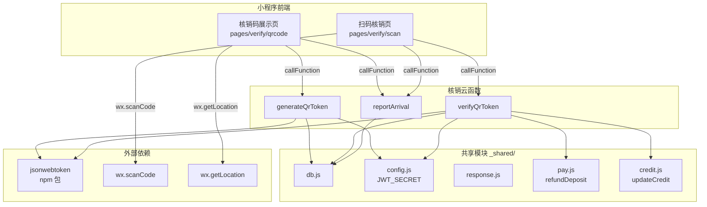
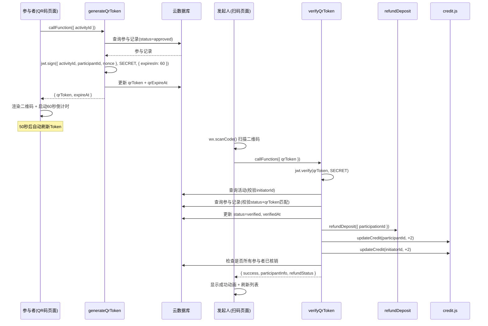
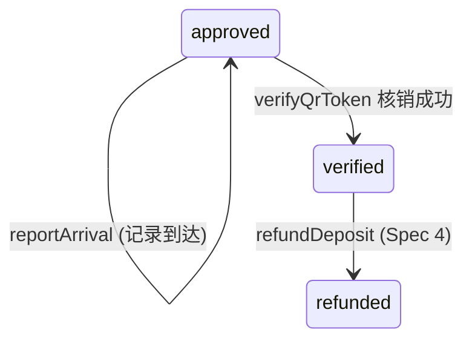

# 设计文档 - 核销码验证系统

## 概述

本设计文档描述"不鸽令"微信小程序核销码验证系统的完整实现方案，包含 3 个云函数（generateQrToken、verifyQrToken、reportArrival）和 2 个前端页面（核销码展示页、扫码核销页）。

核心安全机制：JWT Token + 60 秒有效期 + 服务端存储校验，确保核销码无法被截图复用或伪造。

技术栈：微信云函数（Node.js）+ jsonwebtoken + wx-server-sdk + 云数据库 + weapp-qrcode（前端 QR 码生成）。

依赖关系：
- Spec 1（project-scaffold）：`_shared/config.js`（JWT_SECRET）、`utils/api.js`、`utils/location.js`
- Spec 2（activity-crud）：活动和参与记录数据模型、`_shared/db.js`、`_shared/response.js`
- Spec 4（payment-settlement）：`_shared/pay.js`（refundDeposit）、`_shared/credit.js`（updateCredit）

## 架构



### 核销流程时序图



### 关键设计决策

1. **JWT Token 而非随机码**：JWT 自带签名验证和过期机制，无需额外的 Token 查找表。服务端额外存储 qrToken 用于防止旧 Token 被复用。
2. **60 秒有效期 + 前端 50 秒刷新**：留 10 秒缓冲确保 Token 在扫码时仍有效。前端在倒计时到 10 秒时自动刷新。
3. **单 Token 策略**：同一参与记录同时只有一个有效 Token，生成新 Token 时覆盖旧值，防止多设备同时出示。
4. **reportArrival 仅记录不判定**：到达记录仅存储时间和坐标，判定逻辑由 Spec 7（自动仲裁）负责，保持职责分离。
5. **核销后立即触发退款**：verifyQrToken 成功后同步调用 refundDeposit，确保参与者尽快收到退款通知。
6. **发起人到达记录存活动表**：发起人的 arrivedAt/arrivedLocation 存在 activity 记录中（非 participation），因为发起人没有 participation 记录。

## 组件与接口

### generateQrToken 云函数

```javascript
// cloudfunctions/generateQrToken/index.js
const cloud = require('wx-server-sdk')
const jwt = require('jsonwebtoken')
const crypto = require('crypto')
cloud.init({ env: cloud.DYNAMIC_CURRENT_ENV })

const { getDb, COLLECTIONS } = require('../_shared/db')
const { getConfig, ENV_KEYS } = require('../_shared/config')
const { successResponse, errorResponse } = require('../_shared/response')

exports.main = async (event, context) => {
  const { OPENID: openId } = cloud.getWXContext()
  const { activityId } = event
  const db = getDb()

  // 1. 参数校验: activityId 非空 → 否则 1001
  // 2. 查询参与记录: participantId=openId, activityId, status='approved' → 否则 1004
  // 3. 生成 nonce: crypto.randomBytes(16).toString('hex')
  // 4. 签发 JWT: jwt.sign({ activityId, participantId: openId, nonce }, JWT_SECRET, { expiresIn: 60 })
  // 5. 计算 expireAt: Date.now() + 60 * 1000
  // 6. 更新参与记录: { qrToken: token, qrExpireAt: expireAt }
  // 7. 返回 { qrToken, expireAt }
}
```

**package.json 依赖**：
```json
{
  "dependencies": {
    "wx-server-sdk": "~2.6.3",
    "jsonwebtoken": "^9.0.0"
  }
}
```

### verifyQrToken 云函数

```javascript
// cloudfunctions/verifyQrToken/index.js
const cloud = require('wx-server-sdk')
const jwt = require('jsonwebtoken')
cloud.init({ env: cloud.DYNAMIC_CURRENT_ENV })

const { getDb, COLLECTIONS } = require('../_shared/db')
const { getConfig, ENV_KEYS } = require('../_shared/config')
const { successResponse, errorResponse } = require('../_shared/response')

exports.main = async (event, context) => {
  const { OPENID: openId } = cloud.getWXContext()
  const { qrToken } = event
  const db = getDb()

  // 1. 参数校验: qrToken 非空 → 否则 1001
  // 2. JWT 验证: jwt.verify(qrToken, JWT_SECRET) → 失败返回 4001
  // 3. 提取 payload: { activityId, participantId }
  // 4. 查询活动: 校验 openId === activity.initiatorId → 否则 1002
  // 5. 查询参与记录: participantId + activityId, status='approved' → 否则 1004
  // 6. Token 匹配: participation.qrToken === qrToken → 否则 4001
  // 7. 更新参与记录: status='verified', verifiedAt=serverDate
  // 8. 触发退款: 调用 refundDeposit({ participationId })
  // 9. 更新信用分: updateCredit(participantId, +2), updateCredit(initiatorId, +2)
  // 10. 检查全部核销: 查询该活动所有 approved/verified 参与记录
  //     若全部 verified → 更新活动 status='verified'
  // 11. 返回 { success, participantInfo, refundStatus }
}
```

**refundDeposit 调用方式**：
```javascript
// 方式一：直接调用云函数
const refundResult = await cloud.callFunction({
  name: 'refundDeposit',
  data: { participationId: participation._id }
})

// 方式二：直接引用 _shared/pay.js（推荐，减少一次云函数调用开销）
const { refund } = require('../_shared/pay')
```

采用方式一（调用云函数），保持与 Spec 4 的接口一致性，且 refundDeposit 内部已包含完整的退款逻辑和流水记录。

### reportArrival 云函数

```javascript
// cloudfunctions/reportArrival/index.js
const cloud = require('wx-server-sdk')
cloud.init({ env: cloud.DYNAMIC_CURRENT_ENV })

const { getDb, COLLECTIONS } = require('../_shared/db')
const { successResponse, errorResponse } = require('../_shared/response')

/**
 * Haversine 公式计算两点间球面距离
 * @param {number} lat1 - 纬度1
 * @param {number} lon1 - 经度1
 * @param {number} lat2 - 纬度2
 * @param {number} lon2 - 经度2
 * @returns {number} 距离（米）
 */
function calculateDistance(lat1, lon1, lat2, lon2) {
  const R = 6371000 // 地球半径（米）
  const dLat = (lat2 - lat1) * Math.PI / 180
  const dLon = (lon2 - lon1) * Math.PI / 180
  const a = Math.sin(dLat / 2) ** 2 +
    Math.cos(lat1 * Math.PI / 180) * Math.cos(lat2 * Math.PI / 180) *
    Math.sin(dLon / 2) ** 2
  const c = 2 * Math.atan2(Math.sqrt(a), Math.sqrt(1 - a))
  return R * c
}

exports.main = async (event, context) => {
  const { OPENID: openId } = cloud.getWXContext()
  const { activityId, latitude, longitude } = event
  const db = getDb()

  // 1. 参数校验: activityId 非空, latitude/longitude 为有效数值 → 否则 1001
  // 2. 查询活动记录 → 不存在返回 1003
  // 3. 身份校验:
  //    a. openId === activity.initiatorId → 发起人
  //    b. 查询 participation(participantId=openId, activityId, status='approved') → 参与者
  //    c. 都不是 → 返回 1002
  // 4. 记录到达:
  //    a. 发起人 → 更新 activity: { arrivedAt, arrivedLocation: { latitude, longitude } }
  //    b. 参与者 → 更新 participation: { arrivedAt, arrivedLocation: { latitude, longitude } }
  // 5. 计算距离: calculateDistance(latitude, longitude, activity.location.latitude, activity.location.longitude)
  // 6. 返回 { success: true, distance }
}
```

**注意**：Spec 1 的 `utils/location.js` 已有 `calculateDistance` 前端实现。reportArrival 云函数中需要独立实现服务端版本（云函数无法引用小程序前端代码）。可将 Haversine 公式提取到 `_shared/` 中复用，但考虑到仅此一处使用，直接内联在云函数中更简洁。

### 核销码展示页（参与者）

```javascript
// pages/verify/qrcode/qrcode.js
const { callFunction } = require('../../../utils/api')

Page({
  data: {
    activityId: '',
    activityTitle: '',
    qrToken: '',
    countdown: 60,
    arrived: false,
    loading: true
  },

  // 定时器引用
  _countdownTimer: null,

  onLoad(options) {
    // 1. 获取 activityId
    // 2. 加载活动标题
    // 3. 调用 generateQrToken
    // 4. 渲染二维码
    // 5. 启动倒计时
  },

  onUnload() {
    // 清除定时器
    if (this._countdownTimer) clearInterval(this._countdownTimer)
  },

  // 生成/刷新核销码
  async refreshQrCode() {
    // 1. 调用 generateQrToken({ activityId })
    // 2. 更新 qrToken
    // 3. 使用 weapp-qrcode 渲染二维码到 canvas
    // 4. 重置倒计时为 60
  },

  // 倒计时逻辑
  startCountdown() {
    this._countdownTimer = setInterval(() => {
      const countdown = this.data.countdown - 1
      if (countdown <= 10 && countdown > 0) {
        // 到 10 秒时自动刷新
        if (countdown === 10) this.refreshQrCode()
      }
      if (countdown <= 0) {
        // 兜底：如果刷新失败，到 0 时再次尝试
        this.refreshQrCode()
      }
      this.setData({ countdown: Math.max(countdown, 0) })
    }, 1000)
  },

  // 报告到达
  async handleArrival() {
    // 1. wx.getLocation 获取坐标
    // 2. callFunction('reportArrival', { activityId, latitude, longitude })
    // 3. 成功后 setData({ arrived: true })
  }
})
```

**QR 码生成方案**：

使用 `weapp-qrcode` 库（轻量级，专为微信小程序设计）：
```javascript
import drawQrcode from '../../libs/weapp-qrcode.js'

drawQrcode({
  width: 200,
  height: 200,
  canvasId: 'qrCanvas',
  text: qrToken,
  callback: () => { /* 渲染完成 */ }
})
```

将 `weapp-qrcode.min.js` 放入 `miniprogram/libs/` 目录（Spec 1 已创建该目录）。

### 扫码核销页（发起人）

```javascript
// pages/verify/scan/scan.js
const { callFunction } = require('../../../utils/api')

Page({
  data: {
    activityId: '',
    participants: [],  // [{ _id, participantId, nickname, status, verifiedAt }]
    arrived: false,
    scanning: false
  },

  onLoad(options) {
    // 1. 获取 activityId
    // 2. 加载参与者列表
  },

  onShow() {
    // 刷新参与者列表（从其他页面返回时）
    this.loadParticipants()
  },

  // 加载参与者核销状态列表
  async loadParticipants() {
    // 查询该活动所有 approved/verified 状态的参与记录
    // 格式化为列表数据
  },

  // 启动扫码
  async handleScan() {
    // 1. wx.scanCode({ onlyFromCamera: false, scanType: ['qrCode'] })
    // 2. 获取 result.result (token 字符串)
    // 3. callFunction('verifyQrToken', { qrToken: result.result })
    // 4. 成功: 显示成功动画 + 刷新列表
    // 5. 失败: 根据错误码显示对应提示
  },

  // 报告到达（与核销码页面逻辑一致）
  async handleArrival() {
    // 同 qrcode 页面
  }
})
```

## 数据模型

### participations 集合（本 Spec 读写字段）

| 字段 | 类型 | 说明 | 读/写 | 操作时机 |
|------|------|------|-------|----------|
| _id | string | 参与记录 ID | 读 | - |
| activityId | string | 关联活动 ID | 读 | - |
| participantId | string | 参与者 openId | 读 | - |
| status | string | 状态 | 读/写 | verifyQrToken 更新为 `verified` |
| qrToken | string | 当前有效的核销码 Token | 写 | generateQrToken 写入 |
| qrExpireAt | number | Token 过期时间戳（毫秒） | 写 | generateQrToken 写入 |
| arrivedAt | Date | 到达时间 | 写 | reportArrival 写入 |
| arrivedLocation | object | `{ latitude, longitude }` | 写 | reportArrival 写入 |
| verifiedAt | Date | 核销时间 | 写 | verifyQrToken 写入 |

**状态流转（本 Spec 涉及）**：



### activities 集合（本 Spec 读写字段）

| 字段 | 类型 | 说明 | 读/写 | 操作时机 |
|------|------|------|-------|----------|
| _id | string | 活动 ID | 读 | - |
| initiatorId | string | 发起人 openId | 读 | verifyQrToken 校验身份 |
| title | string | 活动标题 | 读 | 前端展示 |
| location | object | `{ name, address, latitude, longitude }` | 读 | reportArrival 计算距离 |
| status | string | 活动状态 | 读/写 | verifyQrToken 可能更新为 `verified` |
| arrivedAt | Date | 发起人到达时间 | 写 | reportArrival（发起人） |
| arrivedLocation | object | `{ latitude, longitude }` | 写 | reportArrival（发起人） |


## 正确性属性

*正确性属性是一种在系统所有有效执行中都应成立的特征或行为——本质上是关于系统应该做什么的形式化陈述。属性是人类可读规范与机器可验证正确性保证之间的桥梁。*

### Property 1: JWT Token 往返一致性

*For any* 合法的 activityId 和 participantId 组合，使用 JWT_SECRET 签发 Token 后，再使用同一 JWT_SECRET 验证并解码，应能还原出相同的 activityId 和 participantId，且 Token 在 60 秒内有效。

**Validates: Requirements 1.6, 1.7, 2.4**

### Property 2: 单 Token 不变量

*For any* 参与记录，连续两次调用 generateQrToken 后，仅最后一次生成的 Token 应与参与记录中存储的 qrToken 一致；使用第一次生成的 Token 调用 verifyQrToken 应因 Token 不匹配而失败（返回 4001）。

**Validates: Requirements 1.8, 2.11, 2.12**

### Property 3: 参与状态门控

*For any* 参与记录状态值（paid/approved/verified/breached/refunded/settled），仅当状态为 `approved` 时 generateQrToken 应成功返回 Token；其他状态应返回错误码 1004。同理，verifyQrToken 仅当参与记录状态为 `approved` 时应继续核销流程。

**Validates: Requirements 1.5, 2.9, 2.10**

### Property 4: 发起人专属核销权

*For any* 用户 openId 和活动 initiatorId 组合，当 openId 与 initiatorId 不同时，verifyQrToken 应返回错误码 1002；当相同时应继续执行核销逻辑。

**Validates: Requirements 2.7, 2.8**

### Property 5: 核销成功状态转换

*For any* 成功的核销操作，操作完成后参与记录的 status 应为 `verified`，且 `verifiedAt` 字段应被设置为非空时间戳。

**Validates: Requirements 2.13**

### Property 6: 全员核销触发活动完成

*For any* 活动及其所有参与记录，当最后一个参与者被核销后（即所有参与记录状态均为 `verified`），活动的 status 应被更新为 `verified`；若仍有未核销的参与者，活动状态应保持不变。

**Validates: Requirements 2.17**

### Property 7: 到达记录权限校验

*For any* 调用者 openId、活动 initiatorId 和参与记录集合，当调用者既不是发起人也不存在状态为 `approved` 的参与记录时，reportArrival 应返回错误码 1002；当调用者是发起人或已通过的参与者时应成功记录。

**Validates: Requirements 3.6, 3.7**

### Property 8: 到达记录路由正确性

*For any* 成功的 reportArrival 调用，若调用者为参与者，则 arrivedAt 和 arrivedLocation 应写入参与记录（participation）；若调用者为发起人，则应写入活动记录（activity）。两种情况不应交叉写入。

**Validates: Requirements 3.8, 3.9**

### Property 9: Haversine 距离计算正确性

*For any* 两组经纬度坐标 (lat1, lon1) 和 (lat2, lon2)，calculateDistance 应满足：
- 距离 >= 0（非负性）
- calculateDistance(A, A) === 0（同点距离为零）
- calculateDistance(A, B) === calculateDistance(B, A)（对称性）

**Validates: Requirements 3.10**

### Property 10: 参与者状态格式化

*For any* 参与记录，当 status 为 `verified` 时格式化输出应包含 ✅ 和核销时间；当 status 为 `approved` 时格式化输出应包含 ⏳ 和"待核销"文案。

**Validates: Requirements 5.3**

### Property 11: 错误码映射完整性

*For any* verifyQrToken 返回的错误码（4001/1002/1004），前端错误映射函数应返回对应的中文提示文案，且不同错误码映射到不同的提示文案。

**Validates: Requirements 5.8, 5.9, 5.10**

## 错误处理

### 统一错误码体系

| 错误码 | 含义 | 触发场景 |
|--------|------|----------|
| 0 | 成功 | 所有操作正常完成 |
| 1001 | 参数校验失败 | activityId/qrToken/latitude/longitude 缺失或无效 |
| 1002 | 权限不足 | 非发起人尝试核销、非相关人员尝试报告到达 |
| 1003 | 资源不存在 | 活动记录不存在 |
| 1004 | 状态不允许 | 参与记录非 approved 状态 |
| 4001 | 核销码无效或已过期 | JWT 签名验证失败、Token 过期、Token 与存储值不匹配 |
| 5001 | 系统内部错误 | 未预期的异常 |

### 各云函数错误处理策略

| 云函数 | 错误场景 | 处理方式 |
|--------|----------|----------|
| generateQrToken | JWT 签发失败 | 返回 5001，记录错误日志 |
| generateQrToken | 数据库更新失败 | 返回 5001，记录错误日志 |
| verifyQrToken | JWT 验证失败（签名错误） | 返回 4001 |
| verifyQrToken | JWT 验证失败（Token 过期） | 返回 4001 |
| verifyQrToken | refundDeposit 调用失败 | 记录错误日志，仍返回核销成功（退款异步重试） |
| verifyQrToken | updateCredit 调用失败 | 记录错误日志，仍返回核销成功（信用分更新非关键路径） |
| reportArrival | wx.getLocation 授权失败 | 前端提示用户授权位置权限 |
| reportArrival | 数据库更新失败 | 返回 5001，记录错误日志 |

### 前端错误提示映射

```javascript
const ERROR_MESSAGES = {
  4001: '核销码无效或已过期，请让参与者刷新',
  1002: '仅活动发起人可核销',
  1004: '参与者状态异常',
  1001: '参数错误',
  5001: '系统繁忙，请稍后重试'
}
```

## 测试策略

### 测试框架选择

- **单元测试**：Jest（与 Spec 1-4 保持一致）
- **属性基测试**：fast-check（JavaScript 生态最成熟的 PBT 库）
- **Mock 方案**：Jest 内置 mock 功能，用于模拟 `wx-server-sdk`、`jsonwebtoken`、数据库操作

### 可测试模块拆分

| 模块 | 文件 | 可测试函数 |
|------|------|------------|
| JWT Token 生成/验证 | generateQrToken/verifyQrToken | Token 签发与验证逻辑 |
| Haversine 距离计算 | reportArrival 内部 | `calculateDistance(lat1, lon1, lat2, lon2)` |
| 参与者状态格式化 | scan 页面 | `formatParticipantStatus(participation)` |
| 错误码映射 | scan 页面 | `getErrorMessage(code)` |

### 属性基测试配置

- 每个属性测试最少运行 100 次迭代
- 每个测试用注释标注对应的设计属性编号
- 标注格式：`Feature: verification-qrcode, Property {N}: {属性标题}`

### 双重测试策略

- **单元测试**：验证具体示例（如特定错误码返回、特定坐标的距离计算）、边界情况（如 Token 恰好过期、经纬度边界值）和错误条件（如资源不存在、参数缺失）
- **属性基测试**：验证跨所有输入的通用属性（如 JWT 往返一致性、Haversine 对称性、状态门控、权限校验）
- 两者互补，单元测试捕获具体 bug，属性测试验证通用正确性
